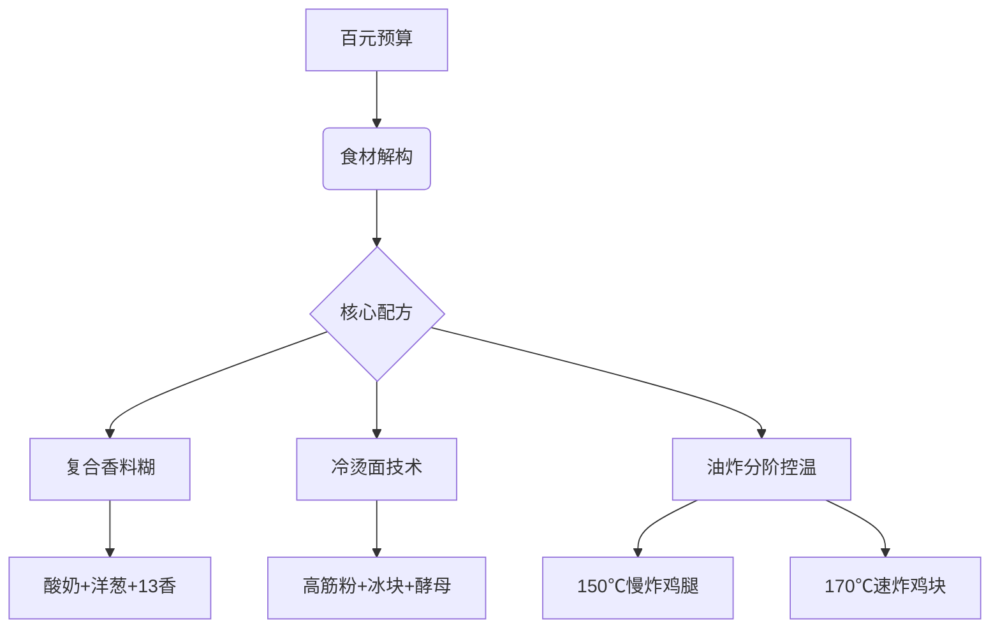
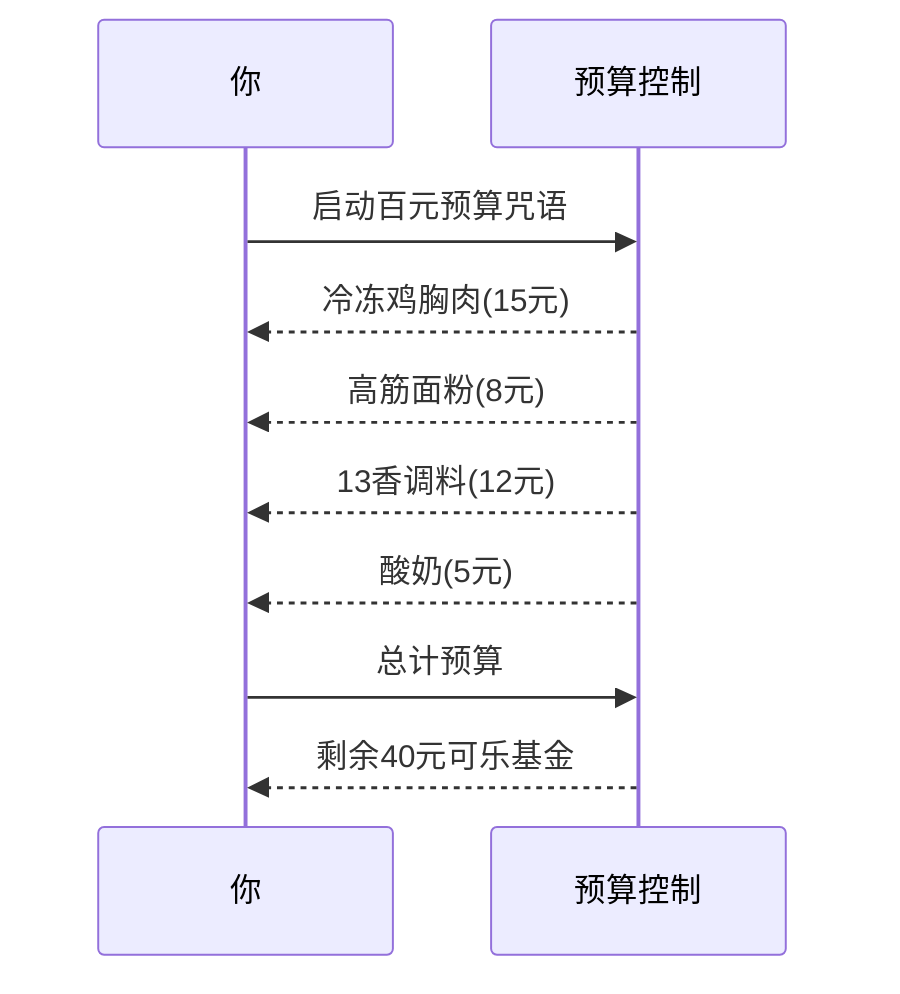

```yaml
tags:
  - 美食复刻
  - 预算料理
  - 快餐解构
url: "https://www.bilibili.com/video/BV1SHVG6XEDd/"
title: "百元复刻麦当劳全餐：从鸡腿堡到可乐的硬核复刻指南"
date: 2026-06-01
```

# 百元复刻麦当劳全餐：从鸡腿堡到可乐的硬核复刻指南


## 0. 原始资料
本地证据：[[2026-06-01_百元复刻麦当劳全餐心法_447394]]

## 1. 硬核复刻三重门


## 2. 预算炼金术


## 3. 小白补课区
- **复合香料糊**：快餐的灵魂密码，由酸奶、洋葱、蒜泥和13香混合而成，模拟工业化香精矩阵
- **冷烫面技术**：用冰块替代工业冷水，打造麦当劳面包特有的"工业感"质地
- **油炸分阶控温**：大件低温慢炸锁汁，小件高温速炸定型，完美复刻快餐酥脆度

## 4. 关键概念/事实整理
| 项目 | 工业版 | 家庭复刻版 | 成本对比 |
|------|--------|------------|----------|
| 面包 | 机械滚压 | 锅底蹭压法 | 0.8元/个 |
| 鸡块 | 乳酸菌腌制 | 酸奶腌料 | 1.2元/块 |
| 可乐 | 工业发酵 | 浆水宝发酵 | 3元/1.5L |
| 总成本 | ¥128 | ¥98 | 节省¥30 |

## 5. 炼金术彩蛋
- **鸡皮炼金术**：炸鸡边角料+洋葱炒制=黄金脆片
- **可乐玄学**：西瓜汁+酵母发酵=西瓜味可乐
- **味精哲学**：劣质感背后的掌控感才是终极美味

## 6. 修行建议
1. 购置"万能炸粉"调料盒（13香+烧烤粉+辣椒粉）
2. 尝试用冷冻鸡胸肉制作"工业级"鸡块
3. 用家庭发酵技术挑战"浆水宝可乐"

> **终极奥义**：快餐复刻不是为了省钱，而是用100元买回对生活的掌控感。当你能用40元做出双人套餐时，剩下的60元就是给自己的生活彩头。