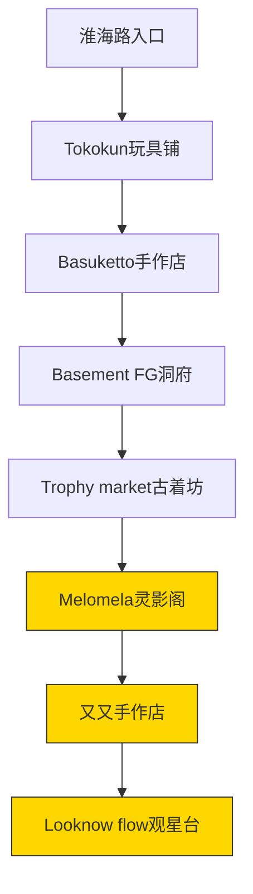
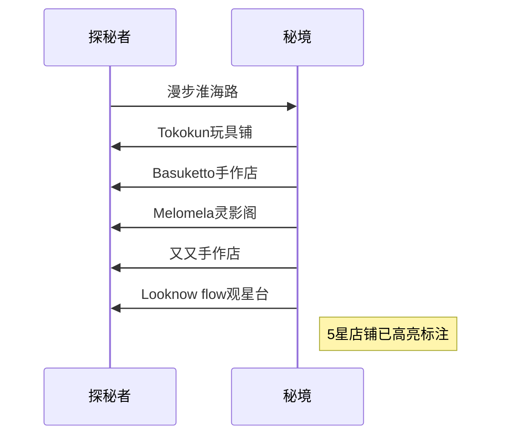

```yaml
tags:
  - 探店攻略
  - 上海淮海路
  - 手作店铺
url: "https://www.dianping.com/note/442707691_29"
title: "蛤蟆祥的淮海路秘境探险"
date: 2026-05-29
```

# 🐸蛤蟆祥的淮海路秘境探险：5家必打卡店铺大揭秘！

## 0. 原始资料
本地证据：[[2026-05-29_上海淮海路秘境探店手札_cc16ca]]

## 1. 探店路线图解


## 2. 店铺探秘地图


## 3. 小白补课区
**什么是"秘境探店"？**  
就像在城市迷宫里寻找隐藏关卡，每个店铺都是精心设计的场景，需要像解谜一样发现它们的特色。比如Tokokun玩具铺就像闯入童话城堡，Basement FG洞府则像误入地下宝藏库。

## 4. 关键店铺速查表
| 店铺名称 | 推荐指数 | 必看亮点 | 探店贴士 |
|---------|----------|----------|----------|
| Tokokun玩具铺 | ⭐⭐⭐⭐ | 玩具陈列如万花筒 | 周末需排队，建议错峰 |
| Basuketto手作店 | ⭐⭐⭐⭐ | 手作饰品博物馆 | 连锁店但每家风格不同 |
| Melomela灵影阁 | ⭐⭐⭐⭐⭐ | 韩式清冷美学 | 每个角落都是拍照圣地 |
| 又又手作店 | ⭐⭐⭐⭐⭐ | 金鱼鱼缸+DIY串珠 | 可体验制作专属饰品 |
| Looknow flow | ⭐⭐⭐⭐⭐ | Jellycat海洋 | 潮玩爱好者天堂 |

## 5. 探店心法
1. **秘境探测术**：注意巷弄深处的门牌号，店铺往往藏在转角
2. **时间管理**：避开周末10-12点的人流高峰
3. **穿搭建议**：穿舒适运动鞋，每个店铺平均停留15分钟
4. **拍照秘籍**：Melomela的镜面墙+Looknow的Jellycat墙是出片王炸组合

蛤蟆祥温馨提示：建议把5星店铺集中在上午探访，下午可以悠闲地在Basement FG洞府淘淘复古潮玩，让探店之旅像打游戏一样充满成就感！