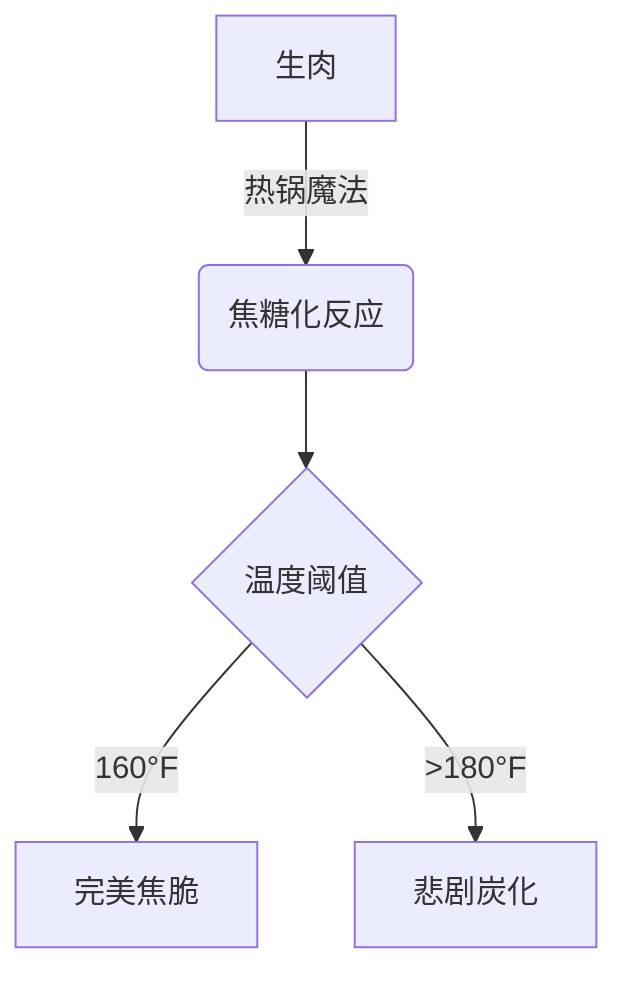
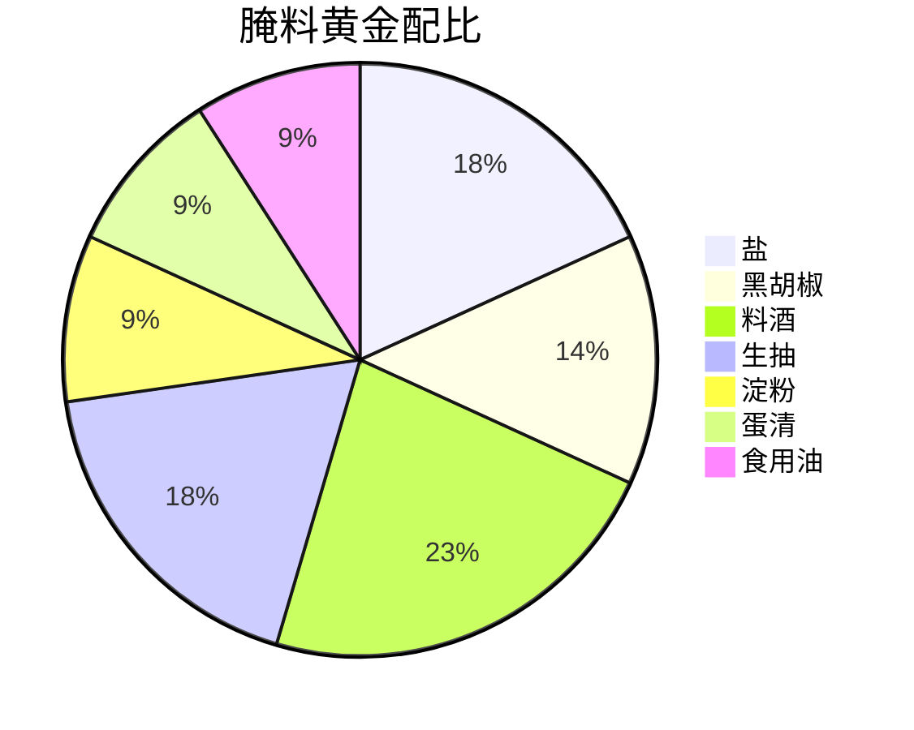

# 🔥厨房魔法师的私房秘籍：妈妈牌香煎里脊肉的美味真谛

## 0. 原始资料
本地证据：[[2026-06-01_妈妈牌香煎里脊肉的美味真谛_d6eef1]]

## 1. 美食界的「薛定谔的肉」
当里脊肉遇见热锅，就像量子物理中的叠加态——既可能是焦黑炭化，也可能是黄金脆皮。妈妈们总能用神秘手法让肉片在锅中完成「量子跃迁」，从生到熟的瞬间绽放出诱人的香气。



## 2. 妈妈的「三段式炼金术」
### 第一段：黄金比例腌料


### 第二段：热锅冷油的「冰火九重天」
1. **预热阶段**：锅烧至微微冒烟（温度约220°C）
2. **冷油下锅**：倒入少量食用油形成保护膜
3. **肉片入场**：保持30°斜角入锅，避免直接接触锅底

### 第三段：封汁的「量子纠缠」
```sequence
妈妈->锅: 倒入腌料
锅->肉片: 热传导
肉片->边缘: 焦糖化反应
妈妈->锅: 翻面
锅->肉片: 释放肉香
```

## 3. 小白补课区
### 什么是「封汁」？
就像给肉片穿了一层「液态铠甲」，通过淀粉和蛋清的「分子手拉手」，锁住肉汁不外逃。这个过程就像给肉片打了一层「水光针」，让每一口都鲜嫩多汁。

### 黄金比例的奥秘
- **盐**：唤醒味蕾的「闹钟」
- **料酒**：肉质嫩化的「软骨精」
- **淀粉**：锁水的「分子保鲜膜」

## 4. 关键概念/事实整理
| 概念         | 科学解释                          | 生活化比喻               |
|--------------|-----------------------------------|--------------------------|
| 焦糖化反应   | 糖分在高温下形成金黄色脆皮        | 肉片的「黄金战甲」       |
| 肌理方向     | 沿着肌肉纤维方向切片更嫩          | 给肉片「顺毛摸」         |
| 热锅冷油     | 高温形成保护膜，防止粘锅          | 给锅底铺「防粘纳米膜」   |
| 30°斜角入锅 | 减少热冲击，均匀受热              | 给肉片「优雅滑梯」       |

## 5. 妈妈的「反直觉」秘技
1. **逆向思维**：先用大火封住肉香，再用小火逼出肉汁
2. **时间魔法**：每面煎制时间精确到「心跳次数」（约30-40次）
3. **空间折叠**：用锅铲「画圆圈」按摩肉片，加速均匀受热

> 🌟 **终极心法**：煎肉就像谈恋爱，既要热情似火，又要温柔以待。火候是激情，手法是体贴，最后才能收获「外酥里嫩」的完美爱情。

## 6. 延伸思考
下次尝试时可以：
- 用不同香料创造「风味宇宙」（孜然=沙漠风情，迷迭香=地中海阳光）
- 尝试「双锅接力」：平底锅煎脆皮，电饭煲焖熟肉
- 记录「焦化时间」：用手机计时器探索完美焦脆点


> 🍽️ **终极彩蛋**：当你的里脊肉煎到「边缘微卷，中心颤动」时，恭喜！你已经解锁了「妈妈的味道」终极奥义。