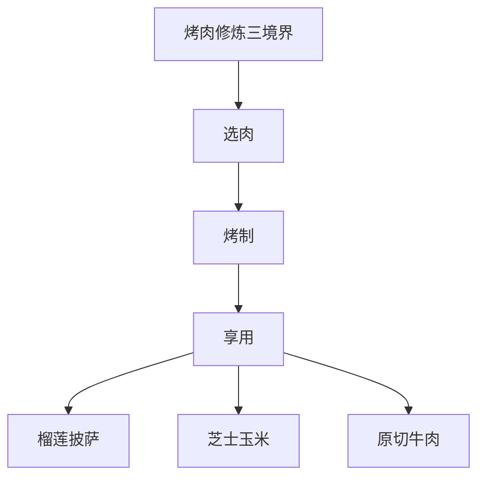
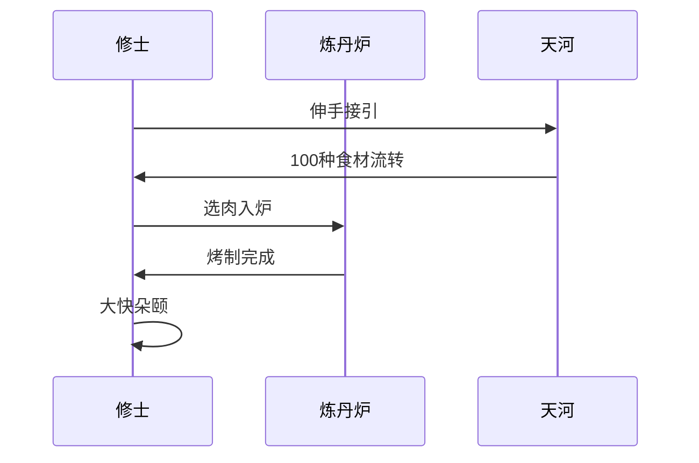
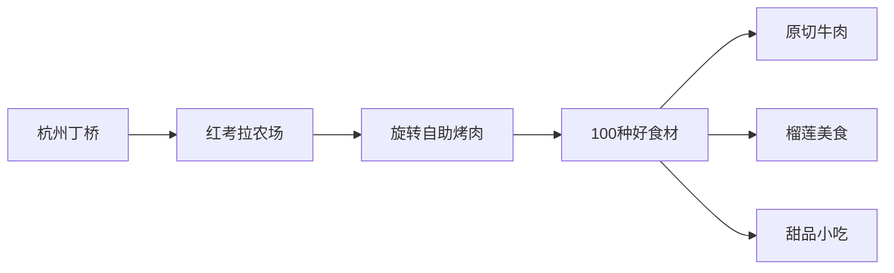

---
tags:
  - 杭州美食
  - 一人食
  - 烤肉自助
  - i人友好
  - 原切牛肉
  - 榴莲特色
url: "https://www.xiaohongshu.com/explore/6a1969bf0000000036032ed5?xsec_token=ABu_cmLAcDd9GHH-0-o7jOpH7MHRlcXQwHCjKFDTzzjYU=&xsec_source=pc_cfeed"
title: "杭州i人自助烤肉天花板"
date: 2026-06-01
---

# 杭州i人狂喜！旋转自助烤肉100种吃法大揭秘

## 🐸 蛤蟆祥的烤肉修炼秘籍

（伸个懒腰）呱呱呱！本蛤蟆最近在杭州丁桥发现了一处"烤肉修仙圣地"，简直是i人独享的快乐星球！100种食材在传送带上转圈，像极了《西游记》里王母娘娘的蟠桃宴，但这次主角是——肉！

## 🍖 修炼心法

### 🔥 原切无为法
- **M4级牛肉**：比《甄嬛传》里的熹贵妃还贵气的原切牛肉，烤制时会发出"滋滋"的欢唱
- **烤肉攻略**：建议先刷油再烤，像给肉片涂防晒霜一样温柔

### 🍈 榴莲破境丹
- **榴莲梅花肉**：当热带水果遇见红肉，像给榴莲披上铠甲
- **烤制时间**：4分钟（榴莲） vs 7分钟（虫草花拌牛肉），像给不同食材定制健身计划

### 🍕 百味归一境
从韩式泡面到鲜果荔枝，像在《舌尖上的中国》里开了个快闪店。特别推荐：
- **紫苏叶拼整切牛肉**：像给牛肉做了个清新SPA
- **澳西哥香烤鱿鱼**：海洋的馈赠在烤盘上跳舞

## 📸 修炼现场直击

## 🍽️ 修炼注意事项
1. **装备建议**：带双筷子（别用转盘上的！）
2. **修炼时间**：建议下午3点前抵达，避开"烤肉高峰"
3. **进阶技巧**：先吃榴莲披萨，最后来份华夫饼收尾

## 🧾 修炼地图

## 📚 修炼心得
> "一个人吃烤肉的快乐，是两个人吃烤肉的两倍快乐！" —— 某位i人修士的顿悟

## 🧭 修炼路线
1. **定位**：杭州·丁桥（具体位置建议在小红书原帖查证）
2. **预约**：建议提前查看是否需要排队
3. **周边**：可顺路探索丁桥其他美食据点

## 📎 修炼记录
- [ ] 查看最新排队情况
- [ ] 对比其他烤肉店评分
- [ ] 收集更多i人友好餐厅信息

## 📄 原始卷轴
[[2026-06-01_杭州i人自助烤肉天花板_c3996b]]