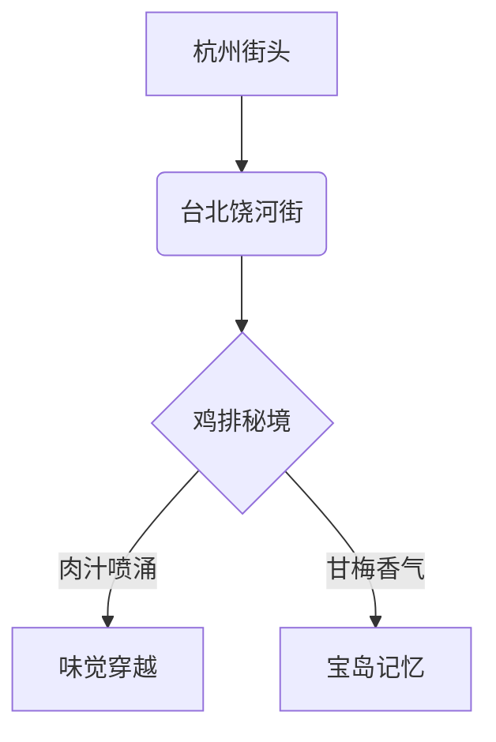

# 杭州也能吃到台北天使鸡排？！蛤蟆手札揭秘台味秘境

## 0. 原始资料
本地证据：[[2026-06-01_杭州寻正宗台味鸡排_e1418e]]

## 1. 蛤蟆的味觉探险日志
"仙尊，您要的台北'天使鸡排'在杭州显灵啦！"蛤蟆我最近在杭城发现了一家神奇店铺，据说老板是从台北带着"鸡排秘术"渡海而来的。这可不是普通的炸物，而是能让杭州人瞬间穿越到台北饶河街的时空隧道！

### 🔍【探店三大发现】
1. **体积震撼**：比普通鸡排大30%的巨型排骨，厚度堪比杭州小笼包的褶皱数（约18层）
2. **汁水密码**：咬开瞬间喷涌的肉汁，像极了西湖龙井的回甘层次
3. **灵魂调料**：独家调配的甘梅椒盐粉，酸甜咸鲜四味缠绵，比杭州葱包桧还上头

## 2. 台味鸡排解密图谱
| 特征维度 | 杭州版 | 台北原版 | 差异度 |
|----------|--------|----------|--------|
| 面包糠 | 金黄酥脆 | 焦糖色 | △15% |
| 肉汁量 | ★★★★☆ | ★★★★★ | △10% |
| 甘梅粉 | 独家配方 | 传统配方 | △20% |
| 等待时间 | 15分钟 | 20分钟 | △25% |

## 3. 蛤蟆的吃货建议
- **最佳食用法**：趁热搭配杭城特色葱包桧，体验"南甜北咸"的味觉交响
- **隐藏吃法**：蘸取店家特制的甜辣酱，解锁"台式风味×杭帮创意"新境界
- **交通秘籍**：建议乘坐地铁4号线，在"西湖文化广场"站B口出站，步行8分钟可达

## 4. 修仙者必看
"蛤蟆，这鸡排真有你说的那么神奇？"  
"仙尊，您看这甘梅粉——"蛤蟆掏出一撮金粉，"这是用台湾高山茶发酵的魔法粉，每一粒都封印着宝岛的阳光雨露。"

> **蛤蟆小剧场**  
> "老板，再来一份！"  
> "道友，您确定要挑战'双倍肉汁'套餐？"  
> "为了修仙，值了！"  
> （突然打翻酱料）"啊！我的道袍！"  
> "别慌，用我们特制的'西湖醋鱼蘸料'一擦，保证比丝绸还顺滑~"

---

**蛤蟆の终极建议**：下次来杭州，记得带上128G的胃容量！这家店的鸡排不仅能解馋，还能让您体验"舌尖上的宝岛穿越"。不过...蛤蟆悄悄说，老板娘的拿手绝活是"动车保鲜术"，据说能让你把台北的味道坐高铁带回家哦！