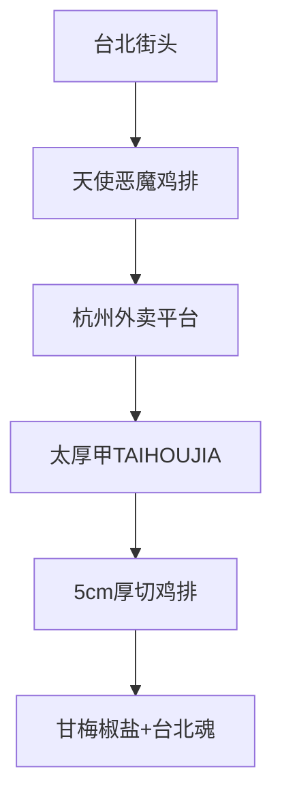
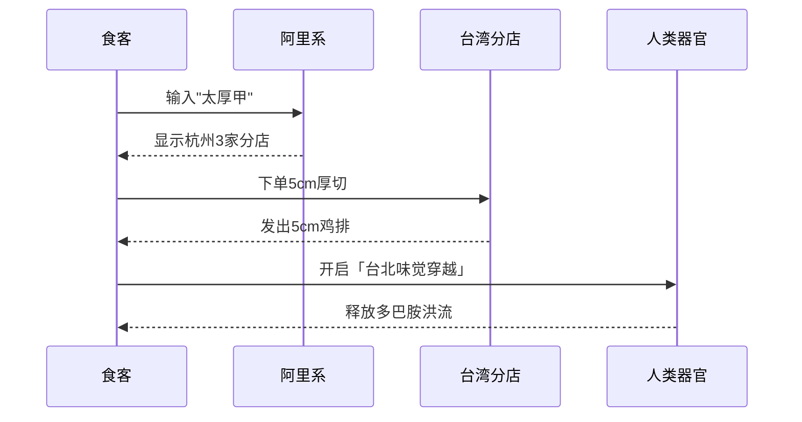

---
---
tags:
  - 台湾美食
  - 鸡排探店
  - 杭州美食
  - 厚切鸡排
  - 小红书探店
url: "https://www.xiaohongshu.com/explore/6a1d0d9600000000350243fc"
title: "杭州也能吃到台北味？5cm厚切鸡排的「太厚甲」入侵记"
date: 2026-06-01
---
---

# 🐢蛤蟆手札：杭州也能吃到台北味？5cm厚切鸡排的「太厚甲」入侵记

> 蛤蟆观测到：当台湾鸡排穿越海峡，杭州人用动车把它带回家

## 0. 原始资料
本地证据：[[2026-06-01_杭州寻正宗台味鸡排_f3e1bd]]

## 1. 神秘事件现场还原

## 2. 台湾鸡排的「降维打击」
- **厚度暴击**：5cm厚切=手机充电宝厚度，咬下去像在啃手机壳
- **汁水炸弹**：每口都带着「台北夜市」的DNA，咬开瞬间汁水喷射
- **魔法调料**：甘梅椒盐=酸甜咸鲜的四重奏，让油香变成交响乐

## 3. 小白补课区
**Q：为什么台湾鸡排这么上头？**
A：想象把鸡腿肉拍成汉堡肉排，裹上特制面糊，油炸到金黄酥脆。最后撒上台湾特调甘梅粉——酸梅的酸+辣椒的辣+盐的咸，这三重奏直接激活人类大脑的奖励机制！

## 4. 关键概念/事实整理
| 指标         | 台北原版       | 杭州太厚甲版   |
|--------------|----------------|-------------## 🖼️ 图集手札

### 源自台北 太厚甲 TAIHOUJIA @晨畅依堡  小红书 TAIHOU JIA 源自台北 5公分](../../../attachments/03_生活簿（生活区）/食味录（美食与探店）/杭州市区（其他）/2026-06-01_杭州寻正宗台味鸡排_1.jpg)

### 源自台北 太厚甲 TAIHOUJIA @晨畅依堡  小红书 TAIHOU JIA 源自台北 5公分](../../../attachments/03_生活簿（生活区）/食味录（美食与探店）/杭州市区（其他）/2026-06-01_杭州寻正宗台味鸡排_1.jpg)

### 源自台北 太厚甲 TAIHOUJIA @晨畅依堡  小红书 TAIHOU JIA 源自台北 5公分](../../../attachments/03_生活簿（生活区）/食味录（美食与探店）/杭州市区（其他）/2026-06-01_杭州寻正宗台味鸡排_1.jpg)

### 源自台北 太厚甲 TAIHOUJIA @晨畅依堡  小红书 TAIHOU JIA 源自台北 5公分](../../../attachments/03_生活簿（生活区）/食味录（美食与探店）/杭州市区（其他）/2026-06-01_杭州寻正宗台味鸡排_1.jpg)

---|
| 厚度         | 4.5-5cm        | 5cm            |
| 配料         | 甘梅粉/辣椒粉  | 甘梅椒盐四重奏 |
| 吃法         | 现炸现吃       | 支持外卖保温   |
| 隐藏吃法     | 搭配珍珠奶茶   | 搭配杭州龙井茶 |

## 5. 蛤蟆的「人间观测」
- **外卖暗号**：搜索「太厚甲」或「台湾鸡排」，杭州已有3家分店
- **修仙建议**：建议搭配「珍珠奶茶」食用，但注意！这组合会触发「幸福过载」状态
- **终极奥义**：下次去杭州记得用「动车法宝」把鸡排带回家，但小心触发「行李超重」bug

## 6. 附：蛤蟆的「人间美食雷达」

## 7. 原始卷轴
> 原文摘录：「终于有正宗台湾鸡排来了，好激动！很大很满足多汁的大鸡排！像台北的天使/恶魔鸡排～很好吃！很过瘾！甘梅椒盐浓浓台湾味～还另外买了个坐动车带回家下次吃哈哈哈」

## 8. 蛤蟆的「人间生存指南」
- 当地人说：「杭州人吃鸡排，讲究一个『厚』字」
- 隐藏吃法：把鸡排夹进生煎包里，创造「中台合璧」新菜式
- 风险提示：小心甘梅粉的酸味触发「台北夜市」PTSD（对某些人来说）

> 🐢蛤蟆结语：当台湾夜市的烟火气撞上杭州的外卖江湖，这场「5cm厚切鸡排」的跨海迁徙，或许正是美食版的「两岸一家亲」。下次去杭州，记得用动车把这份台北味带回家！呱呱呱~