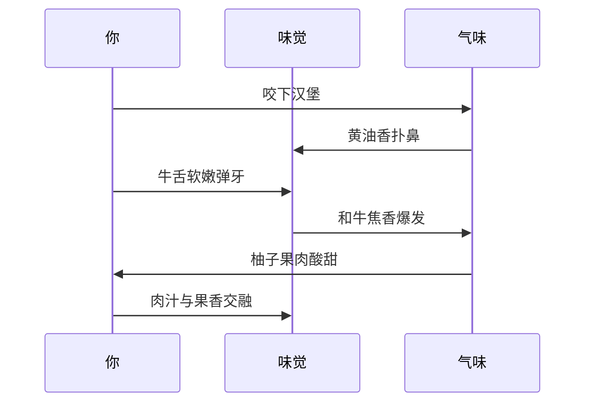
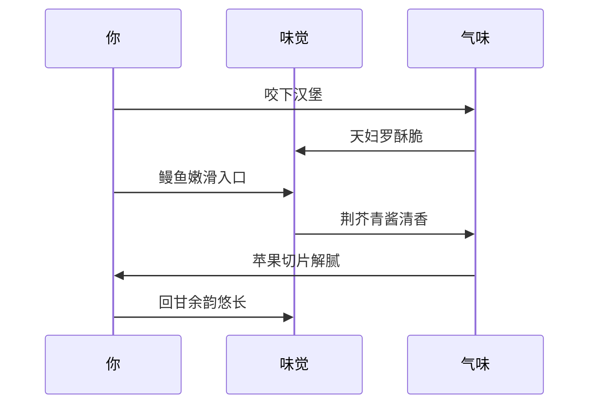
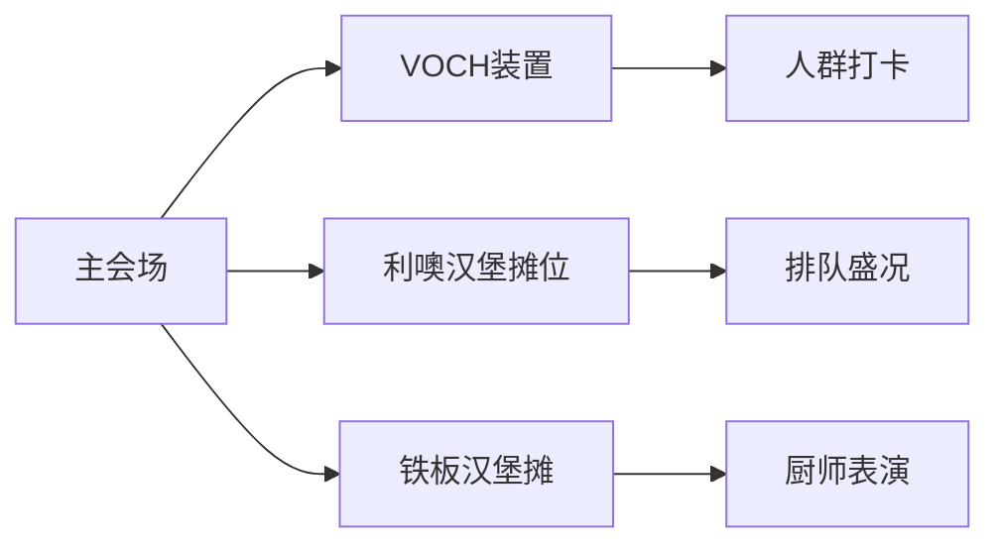
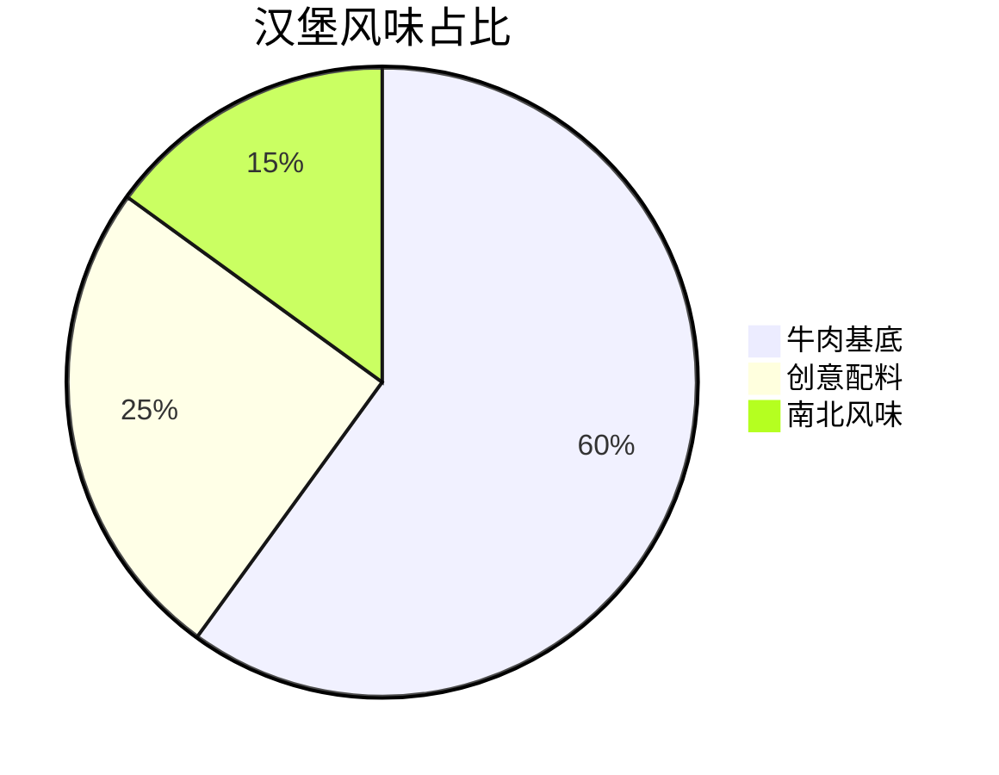

---
tags:
  - 杭州美食
  - 汉堡探店
  - 周末去哪儿
  - 汉堡节
  - 探店攻略
url: "https://www.xiaohongshu.com/explore/6a104108000000000803e14d?xsec_token=ABDZRGlHld77DJs8FmRBUxQHZu6txwNQdjNyvFmA6iwCA=&xsec_source=pc_cfeed"
title: "杭州汉堡节寻宝指南"
date: 2026-05-31
---

# 🍔 杭州汉堡节寻宝指南：南北风味汉堡大赏

## 🧭 0. 原始资料
本地证据：[[2026-05-31_杭州汉堡节寻宝指南_b8d91e]]

---

## 🧩 1. 汉堡节地图解密
```mermaid
graph TD
    A[杭州汉堡节] --> B[南方风味]
    A --> C[北方风味]
    B --> D[Leo利噢(宁波)]
    C --> E[稀有动机(郑州)]
    D --> F[红宝石柚子牛舌和牛堡]
    E --> G[荆芥青酱天妇罗星鳗堡]
```

---

## 🍽️ 2. 风味密码破译
### 南方风味：Leo利噢（宁波）


### 北方风味：稀有动机（郑州）


---

## 🧠 3. 小白补课区
**什么是汉堡节？**  
汉堡节是美食界的大型"武林大会"，各地汉堡大侠带着独门绝技来切磋。这次杭州专场就像美食版的"南北武林大会"，北方的豪放派和南方的细腻派同台竞技。

**为什么值得去？**  
1. **南北风味不用跑全国**：北方的酥脆+南方的鲜嫩，一次吃遍
2. **创意汉堡实验室**：柚子配牛肉？青酱配鳗鱼？脑洞大开
3. **吃货福利**：博主实测"闭眼点都不踩雷"

---

## 📋 4. 关键概念/事实整理
| 店铺名称       | 招牌汉堡                     | 核心风味密码                | 价格区间 |
|----------------|------------------------------|-----------------------------|----------|
| Leo利噢(宁波)  | 红宝石柚子牛舌和牛堡         | 牛舌软嫩+柚子果酸+和牛焦香 | ¥69.9    |
| 稀有动机(郑州) | 荆芥青酱天妇罗星鳗堡         | 鳗鱼嫩滑+青酱清香+苹果解腻 | ¥69.8    |

---

## 📸 5. 现场图鉴


---

## 🧙‍♂️ 6. 老饕私房话
- **最佳体验时间**：周末下午3-5点（避开人流高峰）
- **隐藏吃法**：点单时要求"加双份黄油"（博主私藏秘籍）
- **周边彩蛋**：在VOCH装置前拍照发小红书，可获赠限定汉堡贴纸

---

## 📌 7. 传送门
- **坐标**：杭州滨江龙湖天街
- **导航**：[高德地图定位](https://map.amap.com/)
- **建议搭配**：自带解腻小饼干（应对汉堡的浓郁风味）

---

## 📚 8. 吃货彩蛋
博主芝芝的探店日记里藏着一句彩蛋："2025是全能奖品质奖"，暗示这两家店在2025年汉堡节就已斩获大奖，品质有保障！

---

## 🎁 9. 汉堡脑袋必看


---

## 📌 10. 本地吃货小贴士
- **最佳CP**：搭配店家自制的柠檬苏打
- **隐藏菜单**：询问店员"老板推荐"
- **拍照技巧**：用汉堡比出"V"字，背景是VOCH装置最出片

## 🖼️ 图集手札


### Food plog、\*melancholy maple leaves、RAREVERSE®、布里欧修、浓郁青酱、整条星鳗、TODAY LIFE、HANGZHOU、利亚利亚牛肉饼、13566025083](../../../attachments/03_生活簿（生活区）/食味录（美食与探店）/杭州市区（其他）/2026-05-31_杭州汉堡节寻宝指南_15.jpg)


### Food plog、\*melancholy maple leaves、RAREVERSE®、布里欧修、浓郁青酱、整条星鳗、TODAY LIFE、HANGZHOU、利亚利亚牛肉饼、13566025083](../../../attachments/03_生活簿（生活区）/食味录（美食与探店）/杭州市区（其他）/2026-05-31_杭州汉堡节寻宝指南_15.jpg)


### Food plog、\*melancholy maple leaves、RAREVERSE®、布里欧修、浓郁青酱、整条星鳗、TODAY LIFE、HANGZHOU、利亚利亚牛肉饼、13566025083](../../../attachments/03_生活簿（生活区）/食味录（美食与探店）/杭州市区（其他）/2026-05-31_杭州汉堡节寻宝指南_15.jpg)


### Food plog、\*melancholy maple leaves、RAREVERSE®、布里欧修、浓郁青酱、整条星鳗、TODAY LIFE、HANGZHOU、利亚利亚牛肉饼、13566025083](../../../attachments/03_生活簿（生活区）/食味录（美食与探店）/杭州市区（其他）/2026-05-31_杭州汉堡节寻宝指南_15.jpg)


---

## 📖 11. 汉堡文化冷知识
你知道吗？汉堡的"堡"字其实是个误会！最早的hamburger其实是"汉堡牛肉饼"，因为来自德国汉堡市。直到1920年代才出现我们现在熟悉的面包夹肉形式。这次节庆里的创意汉堡，可以说是汉堡文化的"赛博朋克"进化版啦！