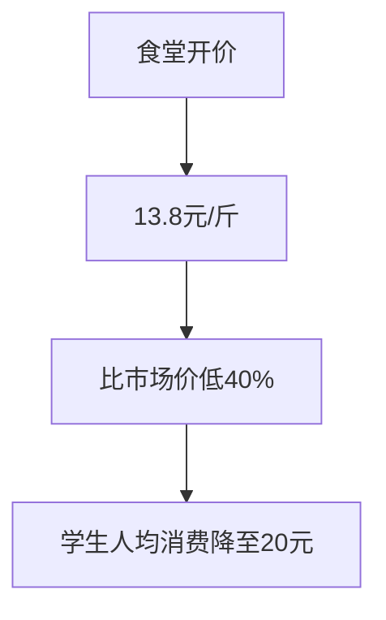
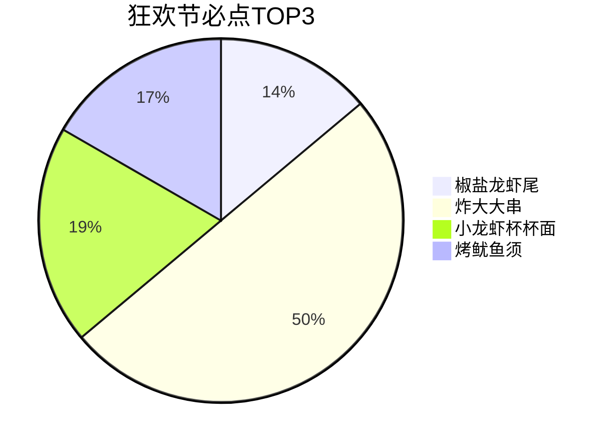
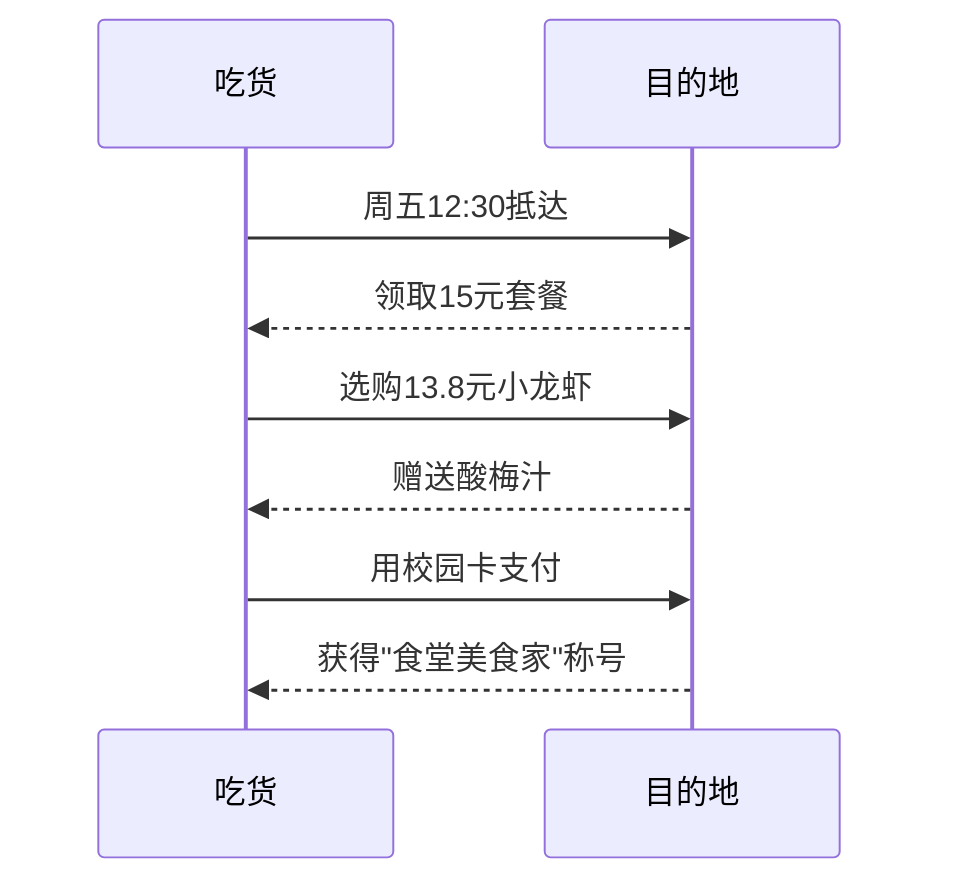
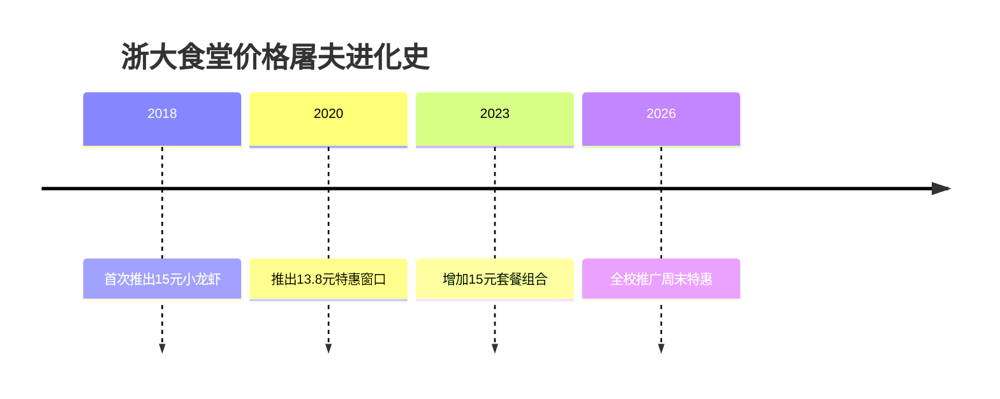

```yaml
---
tags:
  - 高校食堂
  - 小龙虾自由
  - 食堂美食
  - 校园优惠
url: "https://www.xiaohongshu.com/explore/6a19636500000000350327e6"
title: "浙大食堂小龙虾价格屠夫行动"
date: 2026-05-31
---
```

# 🦐 浙大食堂把小龙虾价格打到13.8元！学生党狂喜

> **"食堂阿姨的算盘一响，小龙虾价格直接腰斩！"**  
> ——浙江大学食堂的"价格屠夫"操作引发全网吃货围观

---

## 0. 原始资料
[[2026-05-31_浙大食堂小龙虾价格屠夫行动_a89f93]]

---

## 1. 价格屠夫三板斧



**核心暴击点**：
- **价格屠夫**：13.8元/斤的小龙虾，比杭州菜市场还便宜
- **套餐暴击**：15元能吃到臭豆腐小龙虾火锅杯+酸梅汁
- **时间魔法**：仅限周末开放的"小龙虾特供窗口"

---

## 2. 菜单魔法阵



**隐藏彩蛋**：
- 1.5元酸梅汁比奶茶更解辣
- 6元草莓茉莉冰奶是夏日限定
- 2.5元炸蘑菇是隐藏甜品王

---

## 3. 小白补课区

**Q1：为什么食堂能这么便宜？**  
A：学校采购量大+中央厨房直供，省去中间商差价

**Q2：怎么判断是不是活动窗口？**  
A：看菜单牌是否有"小龙虾烧烤狂欢节"红色标识

**Q3：非浙大学生能吃吗？**  
A：凭校园卡/身份证可购买，建议提前联系在校生代购

---

## 4. 关键概念/事实整理

| 项目          | 详情                     |
|---------------|--------------------------|
| **活动时间**   | 每周五-周日11:00-14:00    |
| **核心价格**   | 小龙虾13.8元/斤          |
| **隐藏福利**   | 1.5元酸梅汁+2.5元炸蘑菇  |
| **最佳时段**   | 下午13:30-14:00人最少    |
| **交通攻略**   | 校外车辆停在紫金港南门停车场 |

---

## 5. 吃货行动指南



---

## 6. 价格屠夫进化史



---

## 7. 吃货彩蛋

- **拍照姿势**：把小龙虾摆成"浙"字造型
- **隐藏菜单**：对窗口阿姨说"松果阁吃货"可获赠薄荷之夏
- **社交货币**：发朋友圈带#浙大食堂屠龙记#标签可兑换饮品

---

## 8. 下一步行动清单

- [ ] 关注@浙江大学饮食服务中心 官微
- [ ] 加入"浙大吃货联盟"QQ群（群号：6666666）
- [ ] 下载"浙里办"APP领取电子校园卡
- [ ] 收藏浙大食堂B站账号获取最新情报

> **"食堂阿姨的算盘一响，吃货的春天就来了"**  
> ——谨以此文致敬所有为美食自由而战的吃货们 🦐✨