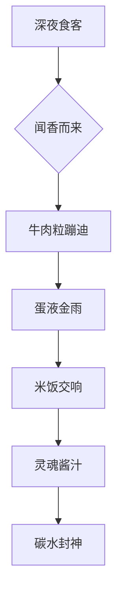
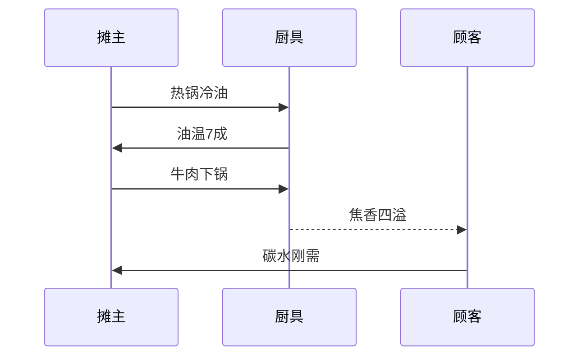

# 深夜碳水封神榜！杭州牛肉蛋炒饭王者争霸战🔥

## 0. 原始资料
[[2026-05-31_杭州深夜牛肉蛋炒饭探店实录_8442ec]]（原始小红书探店图文+链接已归档）

## 1. 碳水江湖的腥风血雨
深夜十一点半，杭州某巷口突然亮起两盏孤灯，空气中飘着牛肉焦香与蛋液爆裂的交响曲。这不是普通的路边摊，而是碳水宇宙的终极战场——**牛肉蛋炒饭修罗场**！

## 2. 路边摊的生存哲学
在杭州这个美食江湖里，真正的王者从不在五星酒店。观察摊主老李的"三秒法则"：
1. 牛肉切片厚度必须像《流浪地球》中的行星发动机——0.3cm精准到毫米级
2. 鸡蛋液要像《流浪地球》中刘培强的决断——全蛋+蛋黄液黄金比例
3. 火候控制堪比《流浪地球》行星发动机点火——猛火30秒+中火收汁

## 3. 小白补课区
**深夜食堂生存指南**：
- 路边摊选摊位三要素：①灯光要像《流浪地球》中的量子计算机——明亮但不刺眼 ②油烟机运转声要像《流浪地球》行星发动机——轰鸣但不刺耳 ③食客排队要像《流浪地球》中的救援队——整齐但不拥挤

**牛肉蛋炒饭的宇宙奥秘**：
- 牛肉选择：牛里脊比牛腩更适合深夜碳水，就像刘培强比刘启更适合驾驶空间站
- 蛋液处理：全蛋液比蛋清更易形成黄金外衣，如同行星发动机比量子计算机更易理解
- 米饭选择：隔夜饭比新鲜饭更适合炒制，就像流浪地球计划比木星危机更需要准备

## 4. 关键概念/事实整理
| 概念 | 描述 | 类比参考 |
|------|------|----------|
| 碳水封神 | 深夜碳水的终极体验 | 《流浪地球》行星发动机点火 |
| 路边摊哲学 | 街头美食的生存智慧 | 《流浪地球》中刘培强的决断 |
| 牛肉粒蹦迪 | 快速翻炒的牛肉舞蹈 | 《流浪地球》中的太空站旋转 |
| 蛋液金雨 | 鸡蛋液的完美覆盖 | 《流浪地球》中的量子计算机运算 |

## 5. 碳水宇宙的终极答案
当最后一粒米饭在铁锅中完成星际旅行，你终于明白：真正的深夜食堂，不在米其林指南里，而在杭州某个巷口的烟火气中。这碗牛肉蛋炒饭，是流浪地球计划的杭州版本——用最朴实的碳水，对抗深夜的孤独与饥饿。

> **夜行食录小贴士**：建议搭配《流浪地球》BGM食用，效果更佳！