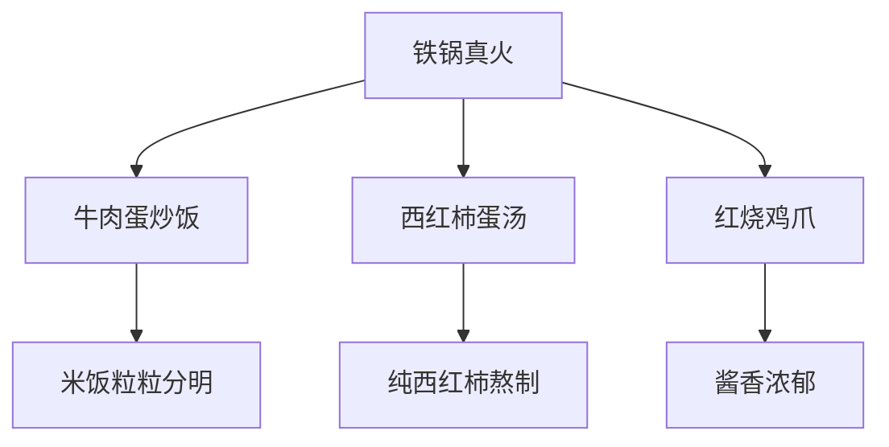
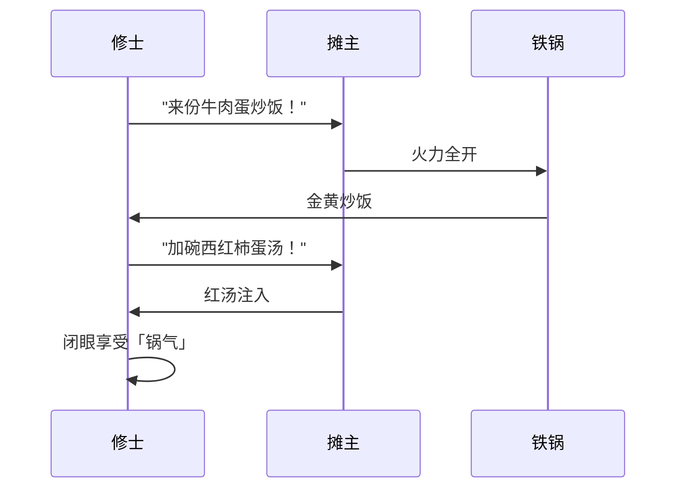

---
tags:
  - 深夜食堂
  - 杭州夜宵
  - 路边摊美食
  - 蛋炒饭推荐
  - 蛤蟆手札
  - 小红书探店
url: "https://www.xiaohongshu.com/explore/6a1978750000000007020bcd?xsec_token=ABu_cmLAcDd9GHH-0-o7jOpJsh1V5ipGUhv8yMjrVyqXo=&xsec_source=pc_cfeed"
title: "杭州深夜蛋炒饭秘境：517牛肉炒饭摊的「锅气」修炼指南"
date: 2026-05-31
---

# 🌙 杭州深夜蛋炒饭秘境：517牛肉炒饭摊的「锅气」修炼指南

> **蛤蟆祥紧急传讯**：在萧山盈丰街道利一路1号，发现一处深夜「锅气」修炼场！30年老摊主用铁锅震出灵魂音效，建议修仙者携带道友前来参悟。

## 🥣 0. 原始资料
本地证据：[[2026-05-31_杭州深夜蛋炒饭秘境_99ac01]]

## 🔥 1. 三味真火修炼法


### 🍚 核心功法：牛肉蛋炒饭
- **火候秘籍**：每日17:00-次日5:00持续开炉，铁锅温度维持在220℃±5℃
- **点睛之笔**：撒入青葱末后快速颠锅，使香气分子形成「锅气结界」
- **食客反馈**：合肥老饕认证的30年秘方，合肥分店已修炼出杭州分店的「锅气分身」

### 🍅 灵魂CP：西红柿蛋汤
- **炼制要点**：8小时慢熬的西红柿汤底，零添加番茄酱
- **食用口诀**：先喝汤唤醒味蕾，再用炒饭吸收汤汁精华
- **隐藏吃法**：搭配冰镇青岛啤酒，解锁「红白撞魂」BGM

## 🍜 2. 修仙者夜宵套餐


## 📍 3. 修炼地图
```markdown
| 修炼场 | 517牛肉蛋炒饭（517奥体店） |
|--------|--------------------------|
| 坐标   | 杭州市萧山区盈丰街道利一路1号 |
| 开关炉  | 17:00 - 次日5:00（全年无休） |
| 交通咒 | 地铁2号线盈丰路站B口步行300米 |
```

## 📸 4. 修仙者手札

> **蛤蟆祥注**：墙上银色跑车模型是摊主的「本命法宝」，据说能增强炒饭香气波动


> **道友点评**：铁板大虾与红烧排骨构成「五行阵」，建议搭配青椒煎蛋饼食用

## 🧭 5. 下次修炼建议
- ✅ 携带：空胃+道友（建议2人以上组队）
- ❌ 禁忌：勿空腹食用（易触发「上头」特效）
- 🎁 彩蛋：凌晨2点后到店可获赠「秘制泡椒牛蛙」体验装

> **蛤蟆祥结语**：这锅炒饭藏着杭州夜市的「修仙密码」，建议在月光最盛时前来，让铁锅的「锅气」与月华共鸣，说不定能悟出新的炒饭心法哦！