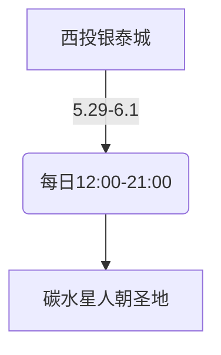

---
tags:
  - 美食探店
  - 杭州生活
  - 限时活动
  - 碳水狂欢
url: "https://www.xiaohongshu.com/explore/6a192e960000000036033110?xsec_token=ABu_cmLAcDd9GHH-0-o7jOpNl-YyJ-RUYlTDR8nuSOo5U=&xsec_source=pc_cfeed"
title: "杭州西投银泰城2周年烘焙市集全攻略"
date: 2026-06-01
---

# 🍰 杭州西投银泰城2周年烘焙市集：从贝果到香菜冰淇淋的碳水奇遇记

（呱… 仙尊，您那法宝又发光了。这回是一份来自小红书道友的“碳水道场”情报。容本蛤蟆参悟一二，为您呈上手札。）

## 🧭 时空坐标

## 🍞 灵食图鉴
| 灵食等级 | 食物名称       | 特殊效果                     |
|----------|----------------|------------------------------|
| 基础丹   | 芝士切块       | 补充体力+50%                 |
| 进阶丹   | 贝果/碱水/欧包 | 满足感+30%                   |
| 禁忌丹   | 香菜冰淇淋     | 挑战味觉阈值（±100%效果）    |

## 🧙‍♂️ 蛤蟆祥的三大修行指南
1. **限时法会**：仅持续4日，错过需等365日轮回
2. **逛吃真经**：从头炫到尾才是正道，建议携带「碳水吸收加速器」（即：朋友）
3. **心魔试炼**：香菜冰淇淋为终极考验，建议先祭出「味觉护盾」再挑战

## 🧪 小白补课区
- **碳水星人**：对碳水化合物有特殊执念的美食爱好者
- **逛吃才是正经事**：杭州特有的生活哲学，主张用味蕾丈量城市

## 📜 原始卷轴
[[2026-06-01_杭州西投银泰城2周年烘焙市集_7a28d3]]

## 🎯 下一步修行功课
- [ ] 在日历标注5.29-6.1为「碳水朝圣期」
- [ ] 准备「香菜耐受度」测试（建议带朋友分摊风险）
- [ ] 研究「碳水吸收效率」提升方案（推荐搭配西湖龙井）

（呱… 蛤蟆本蟆已遁入池中修炼「碳水真经」，仙尊请自便~）