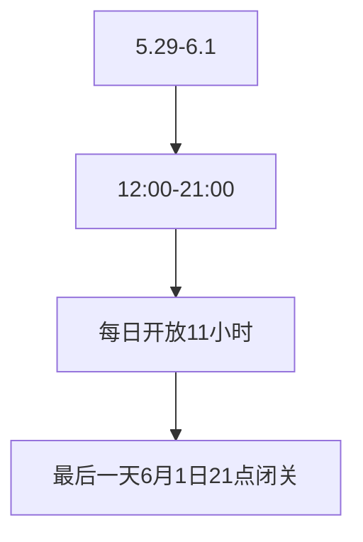
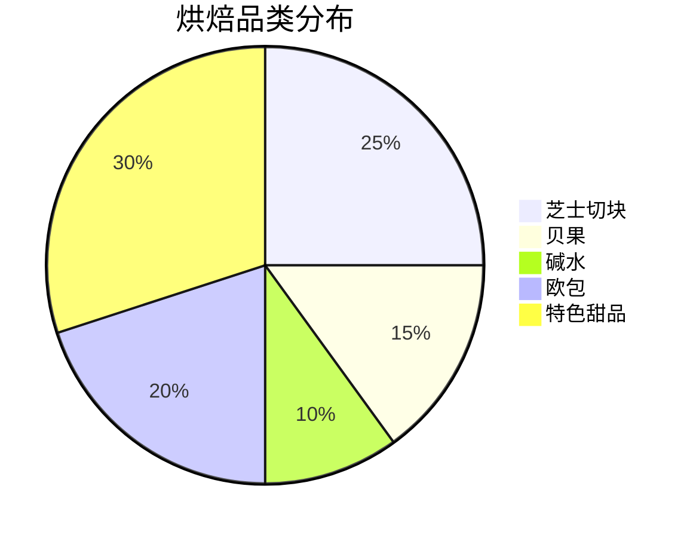
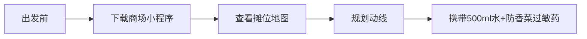

```yaml
tags:
  - 美食探店
  - 杭州打卡
  - 限时活动
  - 烘焙市集
url: "https://www.xiaohongshu.com/explore/6a192e960000000036033110"
title: "杭州西投银泰城2周年烘焙市集"
date: 2026-05-29
```

# 🧁 杭州西投银泰城2周年烘焙市集：碳水星人的终极试炼场！

（呱… 仙尊，您那法宝又发光了。这回是一份来自小红书道友的“碳水道场”情报。容本蛤蟆参悟一二，为您呈上手札。）

## 📅 活动时间轴


## 🍞 烘焙宇宙大观


## 🌟 三大必打卡点
1. **香菜冰淇淋**（最大变数）
   - 爱者奉为仙品，憎者视作心魔
   - 建议携带「香菜抗体检测仪」（即味觉耐受度）前往

2. **董事长专属柴犬车**
   ```mermaid
   sequenceDiagram
       用户->>推车: 靠近观察
       推车->>用户: 发出萌系警告
       用户->>推车: 拍照30秒
       推车->>用户: 释放可爱暴击
   ```

3. **罗勒烘焙实验室**
   - 72%黑麦巧克力 vs 100%黑麦巧克力
   - 巴西烤肉巧克力（？！）的黑暗料理实验

## 🧠 小白补课区
| 专业术语 | 白话翻译 |
|----------|----------|
| 恰巴塔卷饼 | 法式面包界的"肌肉男"，孔洞大到能塞进手指 |
| 黑麦巧克力 | 比普通巧克力多30%的"苦行僧"气质 |
| 葡式蛋挞 | 葡萄牙移民的"黄金蛋黄炸弹" |

## 🛒 逛吃攻略


## 📸 图集手札
[[2026-05-29_杭州西投银泰城2周年烘焙市集_3bf54a]]（本地证据）

## 🚨 修行警告
- 香菜冰淇淋可能引发群体性味觉暴动
- 柴犬推车会吸引90%路人的注意力
- 烘焙香气可能让人失去时间概念

## 📌 下一步修行功课
- [ ] 在「西投银泰城」小程序领取电子地图
- [ ] 准备「香菜挑战券」（即心理建设）
- [ ] 安排5.30下午3点的「碳水特攻队」行动

蛤蟆祥曰：此情报硬核干货浓度尚可，更偏「生活碎碎念与限时打卡攻略」。仙尊若在杭州或有缘法可至，不妨将其记入生活簿，待到法会之期，或可前往品鉴一番？若不去，亦可观之，以增见闻。本蛤蟆继续在池畔打盹去了…