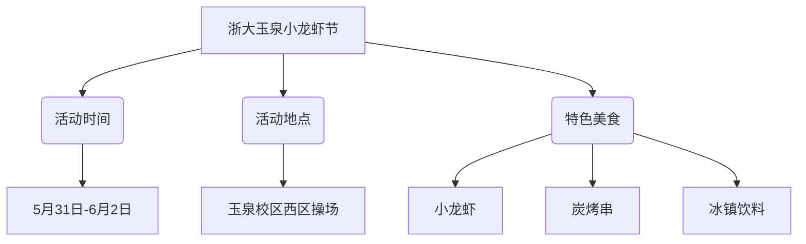
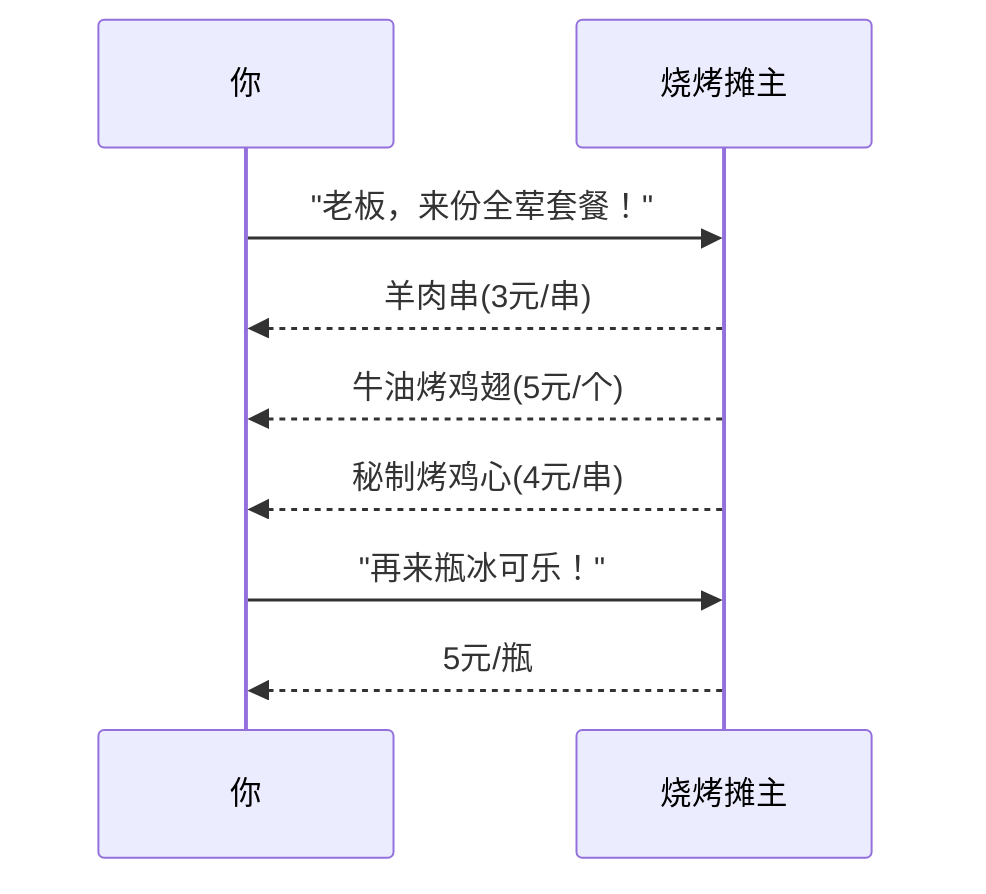

---
tags:
  - 校园美食
  - 性价比分析
  - 小龙虾节
  - 浙大美食
  - 食味录
url: "https://www.xiaohongshu.com/explore/6a16e7b70000000036033f5d"
title: "浙大玉泉小龙虾节：吃货的天堂，钱包的地狱？"
date: 2026-05-31
---

# 浙大玉泉小龙虾节：吃货的天堂，钱包的地狱？🦞🔥

## 0. 原始资料
本地证据：[[2026-05-31_浙大玉泉小龙虾节体验干货_dfe101]]

## 1. 活动速览

## 2. 吃货生存指南
### 🦞 龙虾三重奏
| 味道 | 价格 | 推荐指数 |
|------|------|----------|
| 十三香 | 25元/斤 | ⭐⭐⭐⭐ |
| 蒜泥味 | 28元/斤 | ⭐⭐⭐⭐⭐ |
| 麻辣味 | 30元/斤 | ⭐⭐⭐⭐ |

**隐藏吃法**：蘸取蒜泥小龙虾的汤汁拌饭，被本地学生称为"龙虾炒饭"，堪称本次活动的王炸CP！

### 🔥 烧烤生存法则

## 3. 小白补课区
- **校园美食节**：大学特有的移动式美食集会，比食堂菜品丰富10倍
- **性价比分析**：计算公式=（美味程度×排队时长）÷价格
- **吃货生存法则**：带够现金+空胃+防蚊喷雾（操场草丛多）

## 4. 关键概念/事实整理
| 项目 | 详情 |
|------|------|
| 活动时间 | 2026年5月31日-6月2日 |
| 最佳时段 | 18:00-20:00（避开蚊虫高峰） |
| 人均消费 | 40-60元（含饮料） |
| 特别提示 | 龙虾限量供应，建议17:30前到场 |
| 交通贴士 | 校外车辆禁止入内，建议地铁3号线至浙大站 |

## 5. 吃货哲学
"真正的美食体验不是吃掉多少，而是记住多少种味道。"——在龙虾节啃着鸡翅的哲学思考

**灵魂拷问**：当看到"蒜泥小龙虾免费加汤汁"的标语时，你是在享受美食，还是在进行一场关于贪婪与克制的自我博弈？