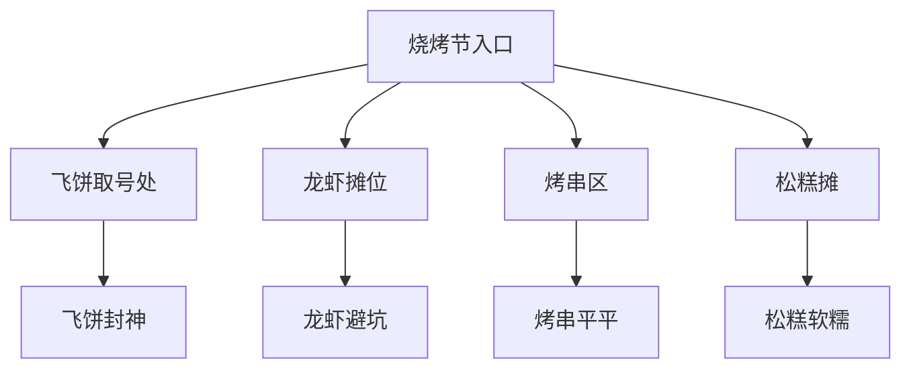
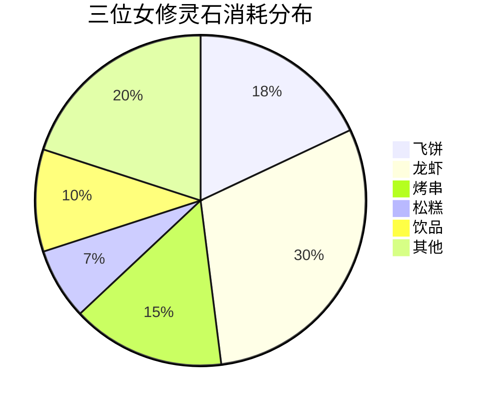

---
tags:
  - 校园美食
  - 烧烤节
  - 避坑指南
  - 性价比
  - 蛤蟆手札
url: "https://www.xiaohongshu.com/explore/6a16e7b70000000036033f5d?xsec_token=ABOp605o9SOCYvLsLeMo41PQSr5Fy7-r_dUBtfeed3Eus=&xsec_source=pc_cfeed"
title: "浙大玉泉烧烤节：飞饼封神，龙虾避坑指南！蛤蟆祥的烟火气修行手札"
date: 2026-05-31
---

# 🌟浙大玉泉烧烤节：飞饼封神，龙虾避坑指南！蛤蟆祥的烟火气修行手札

（*蛤蟆祥甩动长须，吐出一枚灵石*）仙尊请看！这卷《人间烟火修行录》记载着玉泉校区的"灵气集市"奇遇。三女修以20灵石换得八珍玉食，飞饼封神，龙虾避坑——且听我道来这场"凡尘烟火"的修行秘籍！

## 📜 0. 原始资料
[[2026-05-31_浙大玉泉烧烤节体验札记_8c08fd]]（原始灵石卷轴）

## 🧙‍♂️ 1. 灵气分布图

## 🍕 2. 修行要诀
### 🥇 飞饼封神术
> **灵石消耗**：6元/个  
> **修行心法**：先取号再逛摊，此乃全场MVP！香蕉菠萝双味齐发，外酥里糯，香甜四溢。  
> **避坑指南**：队伍如长龙，建议提前1小时到场！

### 🦞 龙虾避坑咒
> **灵石消耗**：人均15元  
> **修行心法**：蒜蓉为尊，其余口味平平。虾尾蔫软者慎尝！  
> **避坑指南**：奶油龙虾汤堪称"道心破碎"，建议直接跳过！

### 🍬 松糕补给术
> **灵石消耗**：7元/个  
> **修行心法**：豆沙夹心软糯可口，解馋良品。  
> **避坑指南**：糖分适中，甜度控友好！

## 🧾 3. 灵石账本

## 📝 4. 修行须知
- 🕒 **最佳修行时间**：17:00-17:30（老醋鸡爪售罄前）
- 🚶 **避坑路线**：先取飞饼号→逛其他摊位→最后取飞饼
- 💰 **灵石预算**：人均20元，性价比拉满！

## 🖼️ 5. 灵气图鉴

> 💡 **蛤蟆祥法眼解析**：此图可见灵气最盛处——飞饼摊前的香火鼎盛！

> 💡 **蛤蟆祥法眼解析**：现做飞饼的香气，能引得修士们排长队！

## 🧙‍♀️ 6. 修行感悟
（*蛤蟆祥拍打肚皮*）此番历练，方知人间烟火最是难得。飞饼之妙，龙虾之坑，皆是修行路上的必经考验。仙尊若往，切记：**凑热闹、尝鲜、省钱**三要诀，莫对珍馐有过高期许！

（*卷轴自动卷起，灵光闪烁*）修行手札已毕，仙尊是打算御剑前往，还是继续在此洞府摸鱼呀？蛤蟆祥的灵石可都攒着买飞饼呢…🦞✨