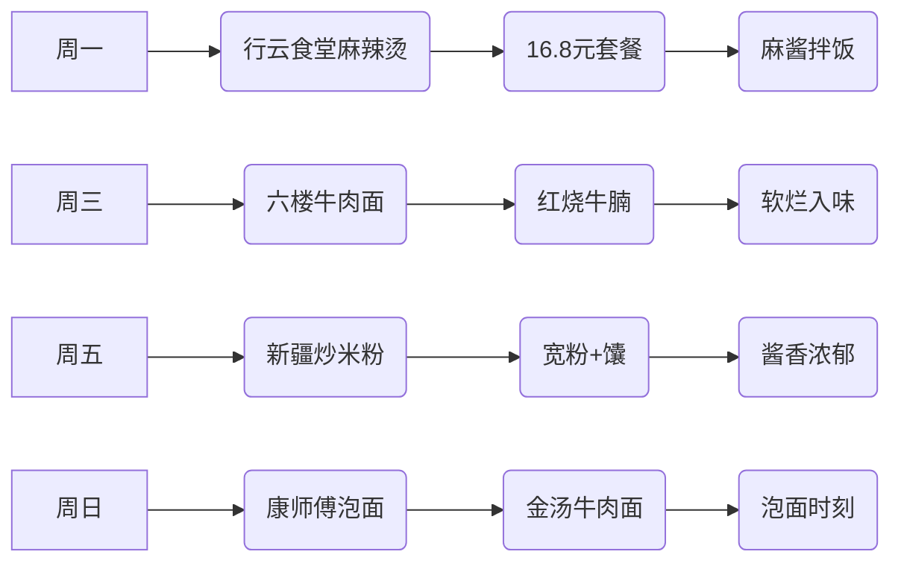
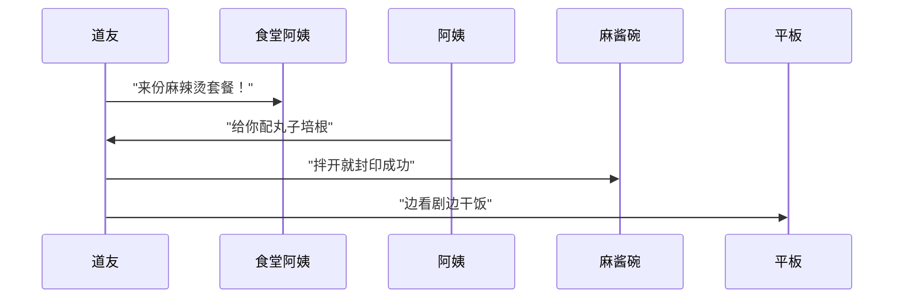

---
tags:
  - 校园美食
  - 浙江工商大学
  - 大学生活
  - 食堂探店
  - 摸鱼日常
url: "https://www.xiaohongshu.com/explore/6a150d4f000000003700fccc?xsec_token=ABazukUGa3SIkYYacBfjZ08Kx-Vg9l4ctyJEVQcYM3wBc=&xsec_source=pc_cfeed"
title: "浙工商食堂摸鱼干饭图鉴：一周吃出12种花样"
date: 2026-05-31
---

# 浙工商食堂摸鱼干饭图鉴：一周吃出12种花样

## 0. 原始资料
本地证据：[[2026-05-31_浙工商一周食记与摸鱼指南_251eea]]

## 1. 摸鱼干饭图鉴
（小蛤蟆从荷叶上翻滚着爬出来）"仙尊且看！这是下沙小道友的食堂修行录，每张图都藏着摸鱼干饭的玄机！"

### 🍜 食堂生存法则
1. **行云食堂**：麻辣烫套餐16.8元起，麻酱封印在碗底等你解锁
2. **六楼食堂**：牛肉面藏着红烧牛腩彩蛋，每周必吃
3. **新疆窗口**：宽粉+馕的黄金组合，酱香牛肉直冲天灵盖
4. **泡面时刻**：康师傅金汤牛肉面是摸鱼午休的终极奥义

### 📸 图鉴解析

## 2. 小白补课区
**Q：大学食堂怎么吃不腻？**
A：试试这招"三三制"：
1. 三天换一次窗口
2. 三次尝试不同套餐
3. 三周解锁隐藏菜单

**Q：如何发现食堂彩蛋？**
A：观察碗身文字（撸起袖子加油干）、碗底暗号（麻辣烫网红黏糊款）、窗口位置（六楼牛肉面）都是线索！

## 3. 关键概念/事实整理
| 食堂窗口 | 特色菜品 | 价格区间 | 摸鱼指数 |
|----------|----------|----------|----------|
| 行云食堂 | 麻辣烫套餐 | ¥16.8-22 | ⭐⭐⭐⭐ |
| 六楼食堂 | 牛肉面 | ¥8-12 | ⭐⭐⭐⭐⭐ |
| 新疆窗口 | 炒米粉+馕 | ¥15-18 | ⭐⭐⭐⭐ |
| 泡面专区 | 金汤牛肉面 | ¥5 | ⭐⭐⭐⭐⭐⭐ |

（小蛤蟆打了个饱嗝）"仙尊明鉴！这下沙小食堂的摸鱼干饭图鉴，可是藏着12种打开方式呢~" 🐸🍜