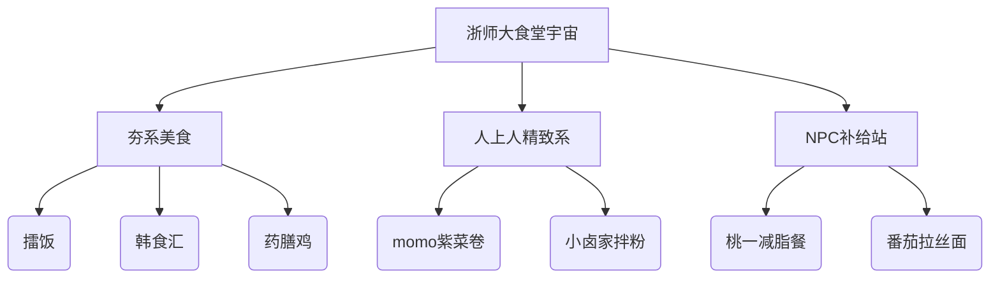
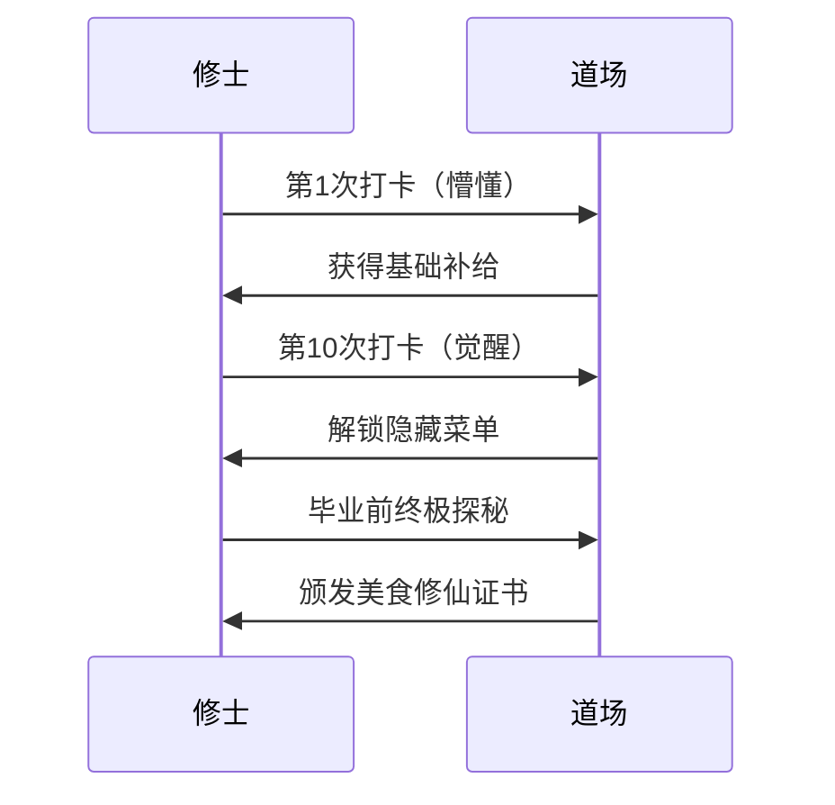
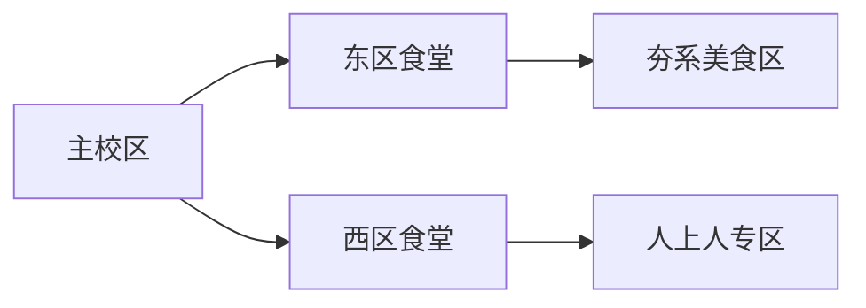

---
tags:
  - 食堂探秘
  - 校园美食
  - 浙师大美食
  - 修仙风格
  - 美食推荐
url: "https://www.xiaohongshu.com/explore/6a18129400000000350300f2"
title: "浙师大干饭修仙图鉴"
date: 2026-05-31
---

# 浙师大干饭修仙图鉴：食堂探秘与美食秘籍大公开！

## 0. 原始资料
本地证据：[[2026-05-31_浙师大干饭修仙图鉴_0bca93]]

## 1. 修仙食堂地图

## 2. 美食修炼心法
### 🧘‍♂️ "夯"字诀（硬核美食）
- **擂饭**：香干炒肉擂饭23.8元，第二碗半价！深碗装的米饭像武林秘籍般厚重
- **韩食汇**：肥牛锅+鸡爪三件套，韩剧女主同款套餐
- **药膳鸡**：养生系吃货的终极选择，吃完感觉能飞升

### 🌸 "人上人"心法（精致系）
- **momo紫菜卷**：6个卷饼5元，海草+肉松的神仙组合
- **小卤家拌粉**：9元的湘味拌粉，吃完想舔碗的节奏

### 🤖 "NPC"摸鱼（基础补给）
- **桃一减脂餐**：12元鸡胸肉紫米碗，健身党福音
- **番茄拉丝面**：10元的冷面，吃完记得备好胃药

## 3. 小白补课区
| 食堂秘籍 | 修炼等级 | 特殊技能 |
|----------|----------|----------|
| 擂饭     | ★★★★☆    | 量大管饱 |
| 紫菜卷   | ★★★☆☆    | 口感丰富 |
| 减脂餐   | ★★☆☆☆    | 低卡饱腹 |

## 4. 修仙进阶路线

## 5. 修仙者须知
- **最佳修炼时间**：11:30-12:00（避开排队）
- **秘籍获取技巧**：关注新开业窗口，第二碗半价
- **禁忌**：冷面易引发胃部不适，建议搭配姜茶

## 6. 修仙者证言
> "吃完擂饭感觉自己能单挑整个食堂！" —— 某位不愿透露姓名的修士

> "紫菜卷的海草是点睛之笔，吃完想给食堂主厨磕头！" —— 美食系女修士

## 7. 修仙地图坐标

## 8. 修仙者任务清单
- [ ] 解锁所有隐藏菜品
- [ ] 收集10种不同食堂印章
- [ ] 拍摄食堂美食vlog
- [ ] 制作毕业纪念美食手账

> 📌 **修仙者提示**：建议携带50元现金，部分窗口不支持移动支付哦！

## 9. 修仙者彩蛋
在食堂角落发现神秘"杏二小火锅"，据说只有连续打卡30天才能解锁！