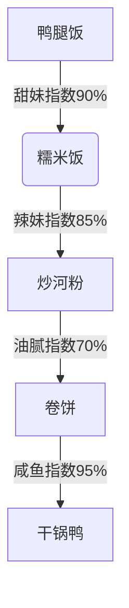
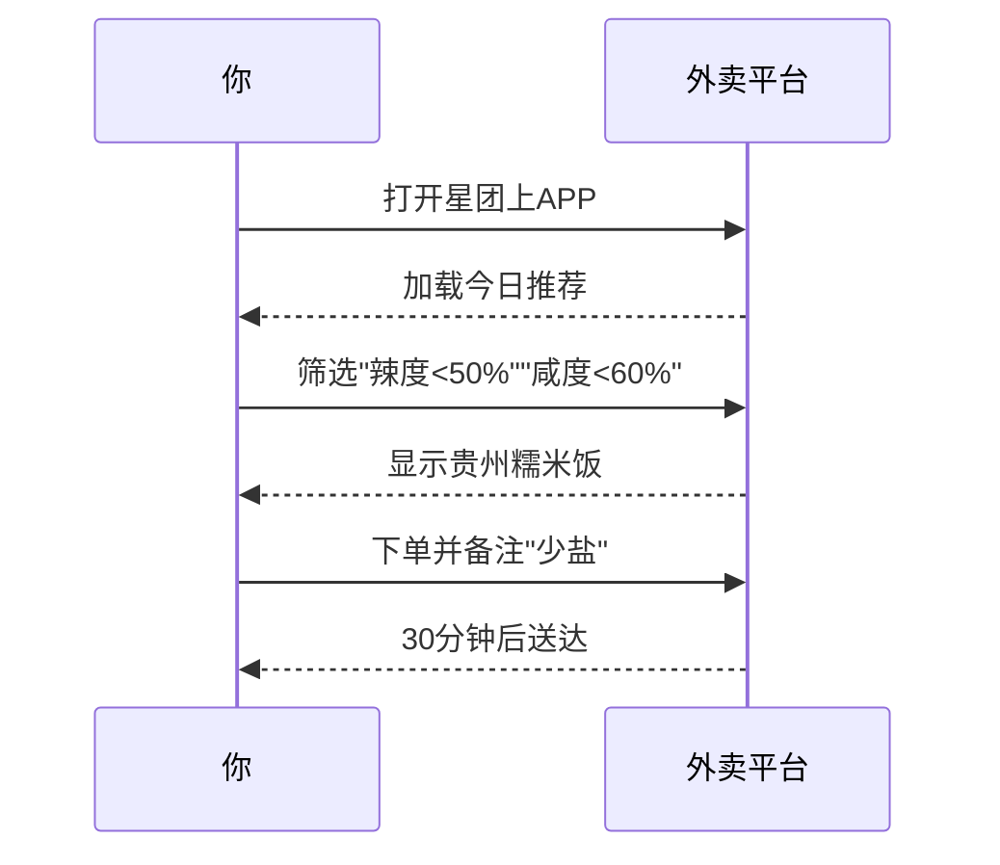

---
tags:
  - 美食探店
  - 学生食堂
  - 小红书爆款
  - 校外美食
url: "https://www.xiaohongshu.com/explore/6a1c53a4000000003503b2bd?xsec_token=ABTO1q-QeG2M5BWGEHAIKyJQH_ZFtaqzDBlQZBS8CZac8%3D&xsec_source=pc_cfeed"
title: "浙江理工科艺食堂大赏"
date: 2026-06-01
---

# 浙江理工科艺食堂大赏：鸭腿饭甜到掉牙？干锅鸭咸得离谱？学生党怒评外卖江湖

## 0. 原始资料
本地证据：[[2026-06-01_浙江理工科艺食堂大赏_a93926]]

## 1. 美食江湖风云榜

### 🍛 鸭腿饭：甜妹的致命诱惑
"甜甜的鸭腿饭像恋爱脑少女，第一口惊艳，第二口上头，第三口开始怀疑人生——这到底是饭还是糖水？"

### 🍚 贵州糯米饭：学霸的隐藏菜单
"在星团上点的糯米饭，像开盲盒一样刺激！软糯的糯米裹着腊肠，咸香中带着一丝神秘的贵州风情，简直是食堂里的隐藏BOSS。"

### 🍜 炒河粉：辣妹的快乐源泉
"这盘炒河粉像极了杭州的夏天——热辣滚烫！每一口都在挑战你的味蕾耐受度，但停不下来的手指会背叛理智。"

### 🥪 卷饼：油腻界的爱马仕
"卷饼师傅的手艺堪比魔术，但油量控制像在玩俄罗斯轮盘。建议搭配健胃消食片食用。"

### 🦆 干锅鸭：咸得像老咸鱼
"干锅鸭的咸度堪比海水，建议点餐时自带盐分检测仪。不过鸭肉处理得还算入味，勉强给个及格分。"

## 2. 吃货生存指南

## 3. 小白补课区
### 📚 术语解密
| 术语 | 解释 |
|------|------|
| 星团上 | 浙江理工大学专属外卖平台，像食堂的平行宇宙 |
| 专升本 | 大专生逆袭本科的战场，比食堂窗口更拥挤 |
| 科艺学院 | 科技与艺术的混血儿，美食也走跨界路线 |

## 4. 关键概念/事实整理
| 菜品 | 味道关键词 | 推荐指数 | 风险预警 |
|------|------------|----------|----------|
| 鸭腿饭 | 甜妹暴击 | ⭐⭐⭐☆ | 糖分超标 |
| 糯米饭 | 秘制酱香 | ⭐⭐⭐⭐⭐ | 价格刺客 |
| 炒河粉 | 热辣滚烫 | ⭐⭐⭐⭐ | 油量随机 |
| 卷饼 | 油腻美学 | ⭐⭐☆ | 卡路里炸弹 |
| 干锅鸭 | 咸鱼警告 | ⭐☆ | 盐分超标 |

> 🐸 蛤蟆手札：食堂江湖风云变幻，建议每周轮换菜品，像打游戏一样解锁新口味。记住——美食的真谛，不在完美，而在探索！