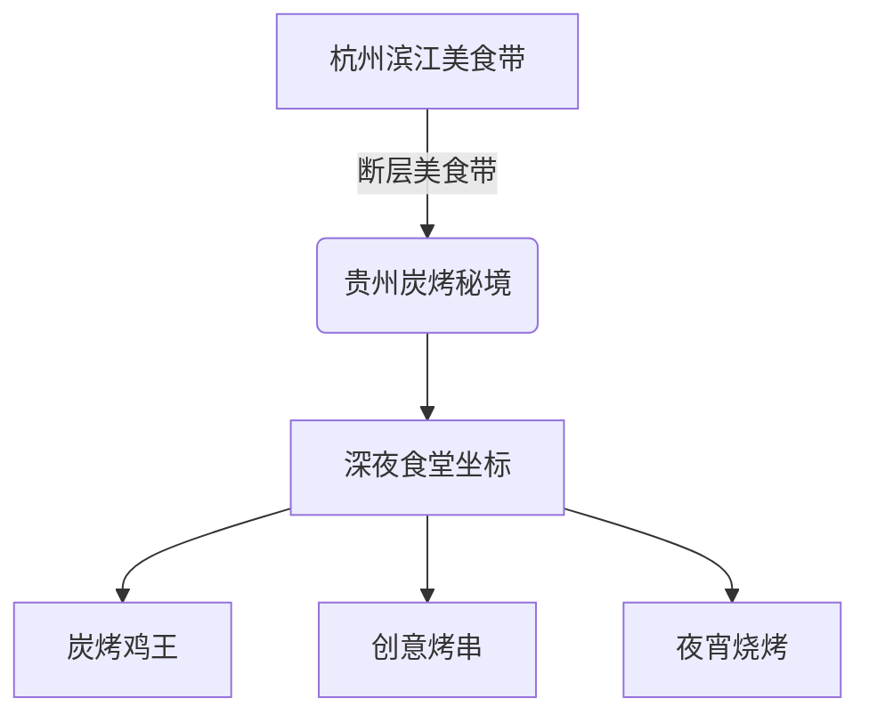
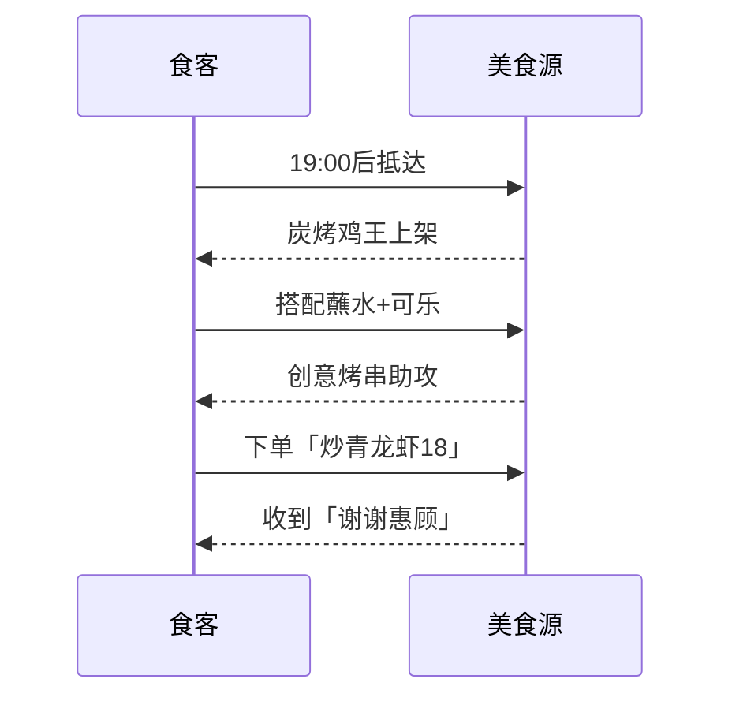

---
tags:
  - 杭州深夜食堂
  - 贵州风味
  - 炭烤秘籍
  - 小破店探秘
  - 蛤蟆手札
url: "https://www.xiaohongshu.com/explore/6a170b650000000008003d84?xsec_token=AB0Qm6_Nmg8wTDtRVts5rwIhy9z0ddkt2RSasXchv8piM=&xsec_source=pc_cfeed"
title: "深夜滨江断层：贵州炭烤鸡的「断层式」美味破防了！"
date: 2026-05-31
---

# 深夜滨江断层：贵州炭烤鸡的「断层式」美味破防了！  

## 🖼️ 图集手札

## ——杭州老饕私藏的「深夜断层美食带」解密

> 🐸蛤蟆手札警告：以下内容可能引发深夜下单冲动，请备好抗饿弹药！

---

## 0. 原始资料
本地证据：[[2026-05-31_深夜滨江断层贵州炭烤鸡探秘_e97702]]

## 🖼️ 图集手札

---

## 1. 地下美食雷达定位

---

## 2. 美食断层三定律
### 🔥 定律一：炭烤鸡的「地壳运动」
> **外焦里嫩的金身** + **贵州蘸水心法** = 美食界的「断层线」爆破

- **炭烤秘术**：贵州传统炭火淬炼，表皮形成焦糖脆壳
- **蘸水心法**：秘制蘸水直接「夯」进灵魂（辣度评级：🌶️🌶️🌶️🌶️）
- **食用指南**：建议搭配「可口可乐镇魂套餐」（见图6）

### 🌟 定律二：创意烤串的「板块碰撞」
| 奇幻组合 | 美食炼金术 |
|----------|------------|
| 炭烤黄蚬子 | 海鲜与炭火的量子纠缠 |
| 薯片胸口油 | 脆感与油脂的时空折叠 |
| 竹选牛肋条 | 肉质纤维的维度跃迁 |

### ⏳ 定律三：老店的「地质年轮」
> 「开了好多年」= 时间滤镜下的味道沉淀  
> （火候把控已达「化境」境界）

---

## 3. 探店小蛤蟆的「三不原则」
1. **不看门面看烟火气**：木桌+夜市摊位=真·老杭州味
2. **不看菜单看蘸水**：蘸水浓度决定灵魂浓度
3. **不看价格看分量**：深夜食堂的「性价比断层」（见图1订单单）

---

## 4. 深夜破防指南

---

## 5. 隐藏菜单破译
- **文字彩蛋**：「长春[模糊]烤鸡」可能是暗号
- **视觉密码**：「大吉」字样椅子=好运座位
- **时间密钥**：深夜时段解锁隐藏菜单

---

## 6. 下次修行清单
- [ ] 深夜10点准时抵达
- [ ] 带上抗辣弹药（见图4恒顺香醋）
- [ ] 预留「炒青龙虾」名额（见图9）

---

> 🐸蛤蟆手札结语：  
> 当贵州炭火遇见杭州夜色，这场「断层美食带」的量子纠缠，或许就是深夜食堂的终极奥义。下次月圆之夜，要不要跟着蛤蟆一起「断层破防」？
