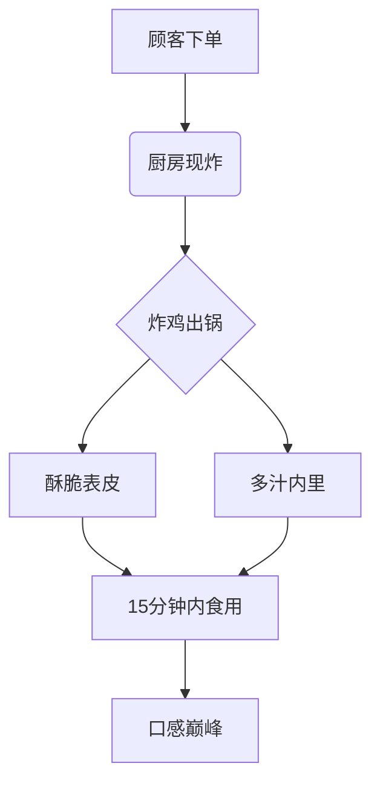
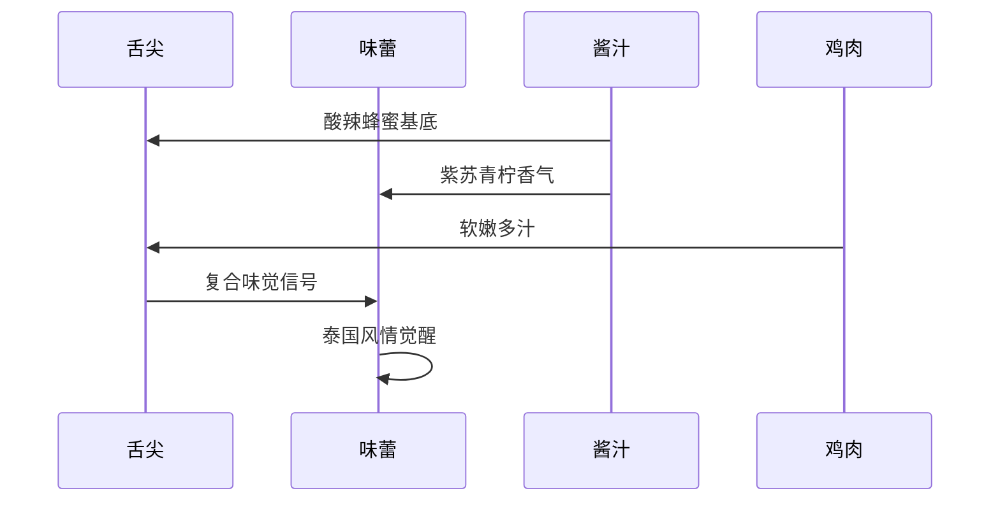
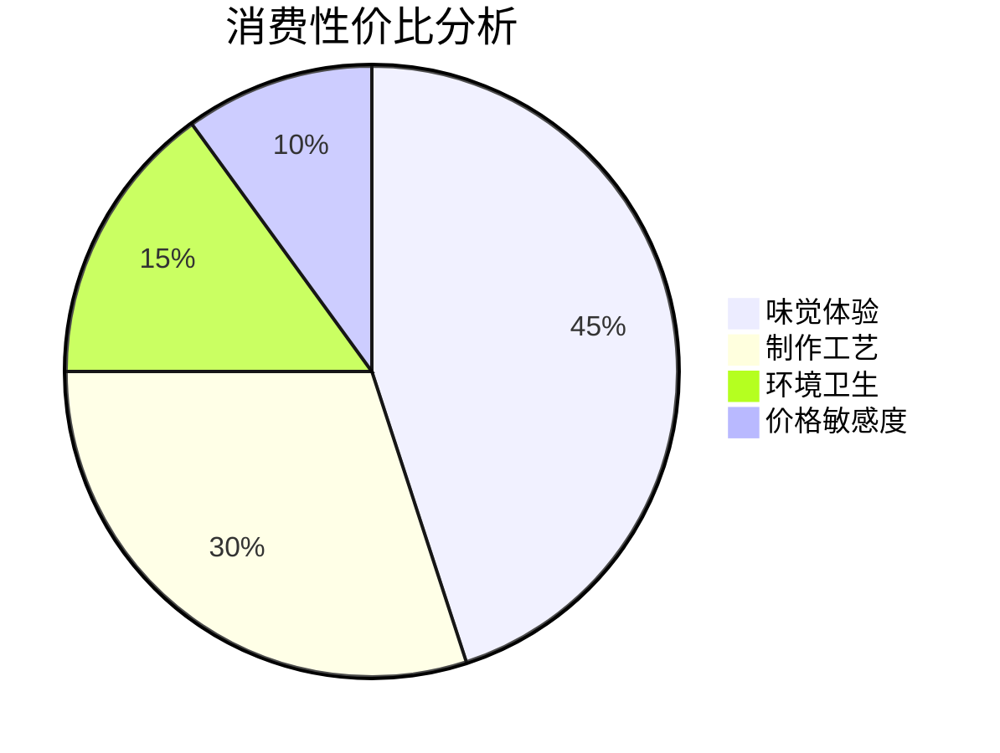

---
tags:
  - 美食探店
  - 高校周边
  - 炸鸡
  - 浙江财经大学
  - 现炸
url: "https://www.xiaohongshu.com/explore/6a1bc6170000000008026db3?xsec_token=ABvhEmhbKn5qzbCPr62hjn4KWTviiImBVaE7-YzYwMw1g=&xsec_source=pc_cfeed"
title: "炸鸡界的清流：浙财桃李苑的苏梅岛青柠薄荷伴翅测评"
date: 2026-05-31
---

# 炸鸡界的清流：浙财桃李苑的苏梅岛青柠薄荷伴翅测评

## 0. 原始资料
- **本地证据**: [[2026-05-31_浙财桃李苑的神仙炸鸡_8e4ca3]]
- **原始标题**: 浙财的同学好幸福…这么好吃的炸鸡！
- **探店平台**: 小红书
- **地理位置**: 浙江财经大学桃李苑5幢15号
- **推荐指数**: 🍗🍗🍗🍗🍗

## 1. 炸鸡界的"现杀现煮"革命

这家藏在浙财桃李苑的Kokken Chicken，堪称炸鸡界的"现杀现煮"革命者。不同于快餐店"炸完放着等你来"的套路，这里每份炸鸡都是**现点现炸**，像武林高手临阵磨枪般精准把控火候。

## 2. 苏梅岛青柠薄荷伴翅：味觉的热带风暴

这道招牌菜堪称**味觉的热带风暴**：
- **酸**：青柠汁的清新酸爽
- **甜**：蜂蜜的温柔包裹
- **辛**：泰国辣椒的暗藏锋芒
- **香**：紫苏叶的草本芬芳

鸡翅采用**鸡肩肉**（仅两块带筋骨的嫩肉），经过秘制酱料腌制后，裹上轻薄面衣，油炸时形成**黄金色酥脆表层**，内里却保持**爆汁状态**。

## 3. 小白补课区
| 术语 | 解释 |
|------|------|
| 现炸 | 每份订单独立制作，避免复炸导致的油温下降 |
| 鸡肩肉 | 位于鸡翅根部，肉质紧实但带筋，适合重口味腌制 |
| 青柠薄荷酱 | 东南亚风味酱料，基础为青柠汁+鱼露+辣椒+香茅 |

## 4. 实战测评数据
| 项目 | 评分 | 特点 |
|------|------|------|
| 苏梅岛青柠薄荷伴翅 | ⭐⭐⭐⭐⭐ | 酱汁层次丰富，鸡肉软嫩 |
| 鸡排 | ⭐⭐⭐ | 肉质扎实但稍显干柴 |
| 嗨棒饮品 | ⭐⭐⭐⭐ | 青柠雪碧+微醺感，清爽解腻 |

## 5. 探店TIPS
- **最佳食用时间**：下单后15分钟内
- **隐藏吃法**：蘸取剩余酱汁搭配米饭
- **学生福利**：浙财学生凭校园卡可享9折
- **环境亮点**：厨房透明可视，操作台干净整洁

## 6. 价值评估

对于追求**现炸酥脆体验**的食客来说，这19.9元的伴翅堪称**炸鸡界的性价比之王**。虽然位置稍偏，但浙财学子可以将其标记为**校园美食打卡点**，外校食客则建议**顺路探店**。

## 7. 修行任务清单
- [ ] 在地图APP标注位置（浙江财经大学桃李苑5幢15号）
- [ ] 下次探店时尝试"双倍酱料"点单
- [ ] 对比其他高校周边炸鸡店的现炸工艺
- [ ] 记录不同时间段的出餐速度

> 店铺招牌与外卖袋特写，见证"现炸"承诺

> 酱料刷制过程，每一块炸鸡都享受"SPA级"护理

> 厨房实拍：食品安全看得见