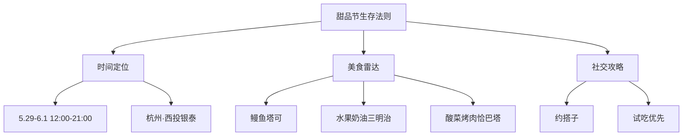
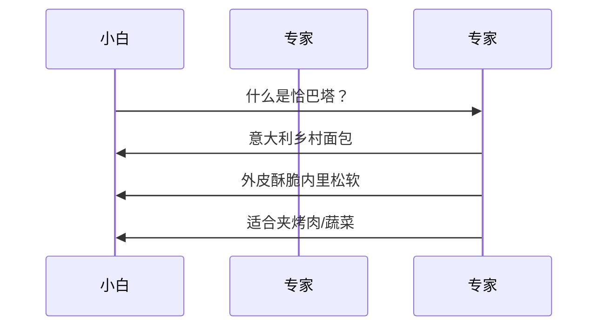
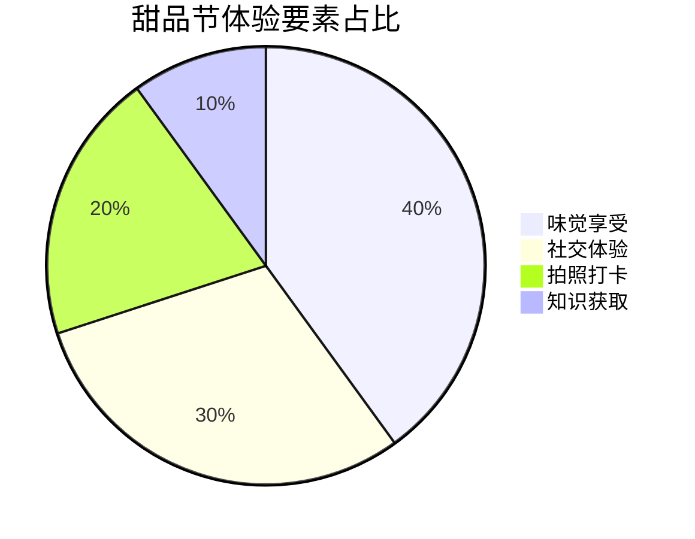
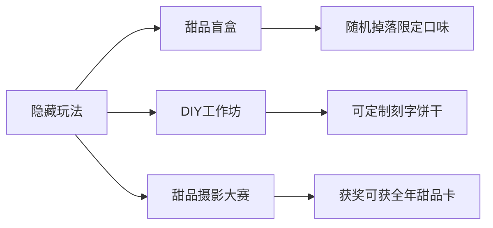

```yaml
tags:
  - 杭州美食
  - 甜品节攻略
  - 小红书探店
  - 美食活动
  - 生活札记
url: "https://www.xiaohongshu.com/explore/6a197112000000003503a418?xsec_token=ABu_cmLAcDd9GHH-0-o7jOpPe0Dh3tq3c2eo7dMu2iR5g=&xsec_source=pc_cfeed"
title: "甜品节逛吃小札：杭州西投银泰的甜蜜冒险"
date: 2026-06-01
```

# 甜品节逛吃小札：杭州西投银泰的甜蜜冒险

> 🐸「松果池畔的蛤蟆仙人正在用尾巴卷着蓝莓三明治，爪缝里还沾着塔可碎屑」  
> 「仙尊请看，这便是人间烟火气的具象化——甜咸交织的味觉烟花秀！」

## 0. 原始资料
[[2026-06-01_甜品节逛吃小札_449c1c]]（原始小红书图文笔记）

## 1. 甜品节生存指南



## 2. 美食雷达全开

### 🌟 三颗星推荐
| 甜点名称          | 魔法属性                  | 吃法建议                  |
|-------------------|---------------------------|---------------------------|
| 鳗鱼塔可          | 咸鲜暴击+酥脆外衣         | 搭配酸菜解腻更佳          |
| 水果奶油三明治    | 蓝莓炸弹+流心奶油         | 建议搭配店家特制果酱      |
| 酸菜烤肉恰巴塔    | 铁板牛肉+酸爽酸菜         | 建议搭配店家自制辣酱      |

### 🍬 两颗星推荐
- 八木家水果三明治（每日限量）
- 椿树下手工饼干（可定制刻字）
- 来米寿司塔可（隐藏菜单）

## 3. 小白补课区

### 什么是恰巴塔？


### 试吃心法
1. **先试后买**：每个摊位都有试吃，建议先尝3-5家再决定
2. **组合策略**：甜咸搭配（如塔可+水果三明治）
3. **时间管理**：避开14:00-16:00人流高峰

## 4. 逛吃心法



> 🐸「建议携带：」
> - 可折叠餐盘（方便现场试吃）
> - 防滑鞋（美食区地面易沾糖浆）
> - 256G胃容量（建议分3轮进食）

## 5. 仙尊彩蛋



> 🐸「温馨提示：」  
> 西投银泰停车场5月29-6月1日提供免费甜品节专属车位，建议自驾前往时提前预约！