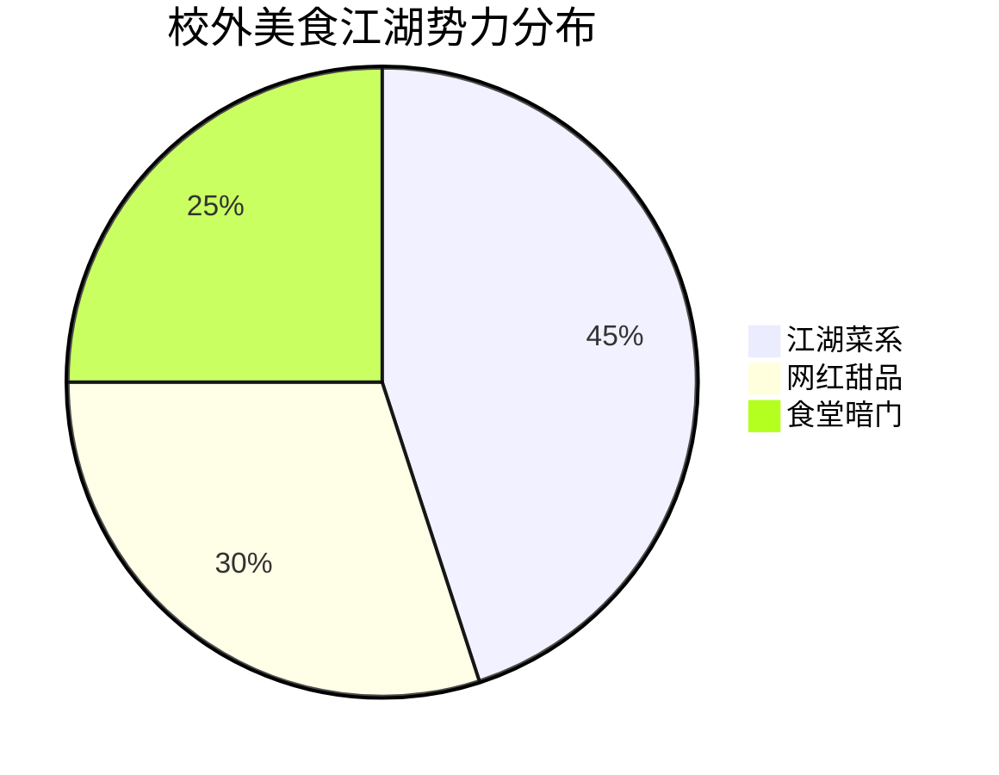
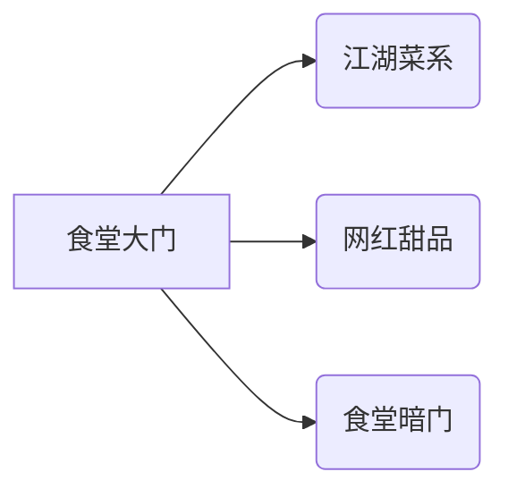

---
tags:
  - 美食探店
  - 校园生活
  - 浙江理工大学
  - 小红书爆款
url: "https://www.xiaohongshu.com/explore/6a1c53a4000000003503b2bd?xsec_token=ABTO1q-QeG2M5BWGEHAIKyJQH_ZFtaqzDBlQZBS8CZac8%3D&xsec_source=pc_cfeed"
title: "科艺食堂暗藏玄机！三弹探秘校外美食江湖"
date: 2026-06-01
---

# 科艺食堂暗藏玄机！三弹探秘校外美食江湖

## 0. 原始资料
本地证据: [[2026-06-01_浙江理工科艺食堂暗藏玄机_d68e97]]

## 1. 美食江湖地图
在浙江理工大学科技与艺术学院的美食版图上，藏着三条神秘暗线：

1. **江湖菜系**：校外街角的川味火锅店，红油翻滚如武侠招式
2. **网红甜品**：奶茶店排队长龙堪比武侠大会
3. **食堂暗门**：校内食堂后厨藏着江湖秘方

## 2. 探店攻略
### 🥢江湖菜系通关秘籍
- **川味火锅**：红油锅底藏着七种香料暗器
- **江湖小炒**：青椒肉丝暗藏祖传十三香
- **秘制卤味**：卤水桶里沉睡着百年老汤

### 🍜食堂暗门密码
1. **早鸟秘籍**：7:30前空降窗口可获双倍肉
2. **午市暗号**：对暗号"老同学"送免费小菜
3. **夜宵密码**：22:00后凭学生证解锁隐藏菜单

## 3. 小白补课区
**什么是江湖菜系？**
> 指融合各地特色、带有传奇色彩的民间菜系，就像武林高手自创的独门绝学

**网红甜品的玄机：**
> 用30%真实食材+50%摆拍滤镜+20%社交货币，打造的视觉系美食

## 4. 关键概念/事实整理
| 概念 | 解密 |
|------|------|
| 江湖菜系 | 融合各地特色+民间秘方的创意菜 |
| 网红甜品 | 滤镜与社交货币的完美结合体 |
| 食堂暗门 | 学生证+特定时间=隐藏菜单钥匙 |
| 校外美食 | 占比60%的江湖美食大本营 |

> 🎯探店TIP：建议携带"美食江湖令"（学生证）+江湖令符（现金）+江湖眼（手机）三件套出征