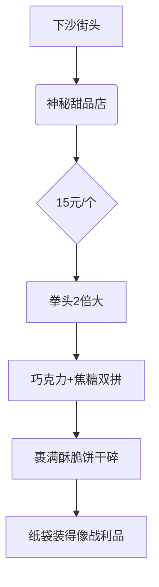

---
tags:
  - 美食探店
  - 蛤蟆手札
  - 小红书爆款
  - 杭州下沙
  - 高热量美食
url: "https://www.xiaohongshu.com/explore/6a1c43d30000000006021f89?xsec_token=ABTO1q-QeG2M5BWGEHAIKyJW9yhHyUa2lvlDVFKD9xnA4%3D&xsec_source=pc_cfeed"
title: "能噎死大象的麻糍！下沙街头15元巨无霸甜点实测"
date: 2026-06-01
---

# 能噎死大象的麻糍！下沙街头15元巨无霸甜点实测

## 🧁 甜点界的"巨无霸汉堡"诞生记

## 📸 蛤蟆祥法眼现场直击

[[2026-06-01_下沙的巨麻糍_03437a]]  
> **证据链1**：裹着巧克力与焦糖的麻糍，像披着铠甲的甜点战士  
> **证据链2**：表面撒满金黄酥皮，活脱脱的甜品界"黄金甲"  

## 🧠 小白补课区

麻糍是江南传统糯米甜点，这款"巨无霸"版本堪称甜点界的变形金刚：
- **传统升级**：保留糯米Q弹内核
- **现代暴击**：外层叠加巧克力/焦糖双buff
- **视觉震撼**：直径超15cm，重量堪比婴儿

## 📊 关键参数表

| 指标         | 数据                  |
|--------------|-----------------------|
| 直径         | 15cm（约2个拳头）     |
| 价格         | 15元/个               |
| 配料         | 糯米团+巧克力+焦糖+饼干碎 |
| 推荐指数     | ⭐⭐⭐⭐☆（热量爆炸警告） |
| 适合人群     | 甜食爱好者/拍照达人   |

## 🍔 吃货实测报告

1. **开袋仪式**：纸袋撕开瞬间，焦糖香气直冲天灵盖
2. **触感体验**：外层酥脆如秋裤（但更美味），内里糯米Q弹
3. **味觉暴击**：巧克力的醇厚与焦糖的焦香在舌尖打架
4. **吞咽挑战**：建议搭配奶茶食用，否则容易噎住（亲测）

> **蛤蟆手札警告**：本甜点热量≈3碗米饭，吃完记得去西湖边暴走1小时！