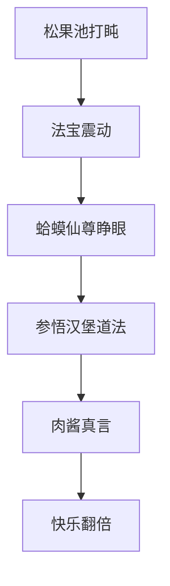
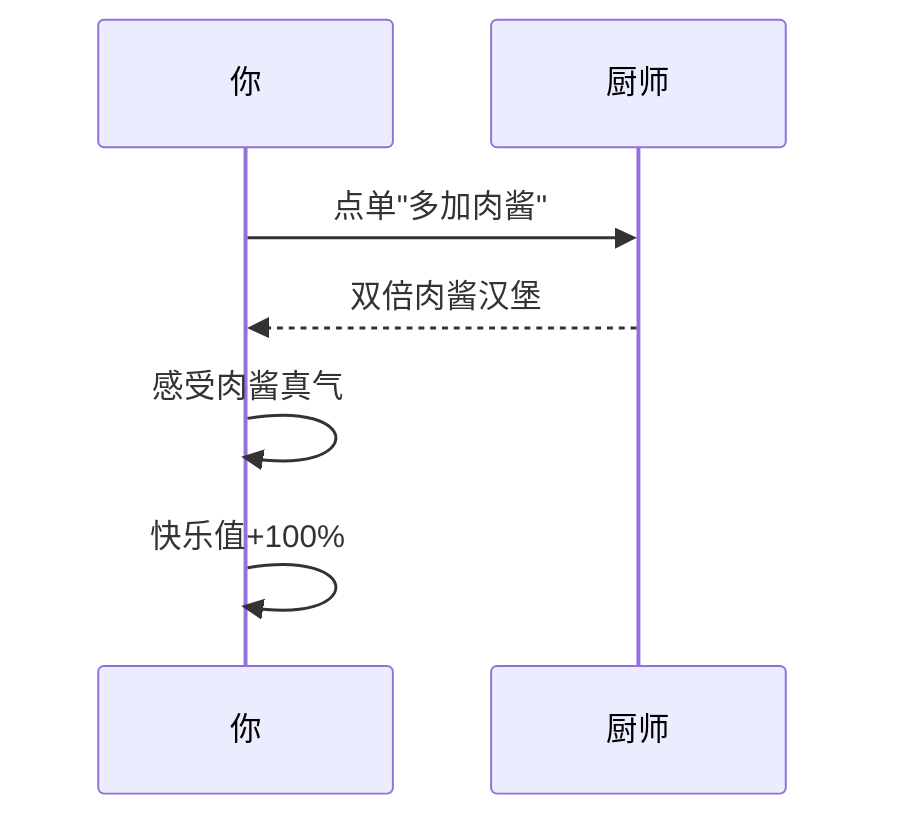
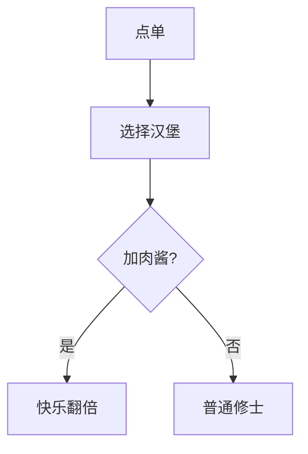

---
tags:
  - 美食哲学
  - 必胜客
  - 生活态度
  - 肉酱秘籍
  - 厚待自己
url: "https://www.xiaohongshu.com/explore/6a11e4550000000035026ccb"
title: "蛤蟆仙尊的汉堡顿悟"
date: 2026-05-31
---

# 蛤蟆仙尊的汉堡顿悟：肉酱多加一勺，快乐翻倍！

## 0. 原始资料
本地证据：[[2026-05-31_蛤蟆仙尊的汉堡顿悟_67098b]]

## 1. 蛤蟆仙尊的修仙手札

（*从松果池边的龟壳里探出脑袋，眨巴眨巴眼睛*）  
"仙尊莫怪，本蛤蟆昨夜参悟凡间美食，竟在必胜客汉堡中悟出大道！这肉酱啊，就像修士的灵力，加得越多，越能打通任督二脉——啊不是，是打通味蕾经脉！"

### 🍔 三大修仙心法

1. **破执念咒**  
   "谁说必胜客只能点披萨？"蛤蟆仙尊一拍池边石："这汉堡就像修仙界的隐藏副本！突破认知迷障，才能发现凡间美食的真谛。"

2. **肉酱真言**  
   "记住！**多加肉酱**是必胜客汉堡的终极心法！"（*用爪子在池边刻下符文*）  
   - 肉酱=灵力精华  
   - 生菜=清心诀  
   - 汉堡胚=筑基丹  

3. **厚待真经**  
   "点单时默念#厚待自己的堡"，蛤蟆仙尊神秘一笑："这咒语能让修士瞬间获得'值得被宠爱'的修心境界。"

## 2. 凡人修炼指南

## 3. 小白补课区

| 修仙术语 | 凡人翻译 |
|----------|----------|
| 肉酱真气 | 浓郁酱汁 |
| 破执念 | 打破固有认知 |
| 厚待咒 | 自我宠爱心法 |

## 4. 关键概念/事实整理

| 心法 | 修炼要点 | 修炼效果 |
|------|----------|----------|
| 破执念 | 不拘泥品牌固有印象 | 发现隐藏美食 |
| 肉酱真言 | 要求双倍肉酱 | 味蕾大爆炸 |
| 厚待咒 | 默念#厚待自己 | 心情愉悦+100% |

（*心满意足地缩回龟壳*）  
"仙尊若想参悟此道，不妨择日亲赴必胜客，实践本蛤蟆传授的肉酱心法。记住——"（*突然探出脑袋*）"肉酱要加到连池边的锦鲤都馋哭为止！" 🐟✨