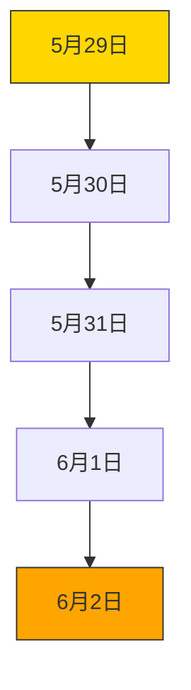
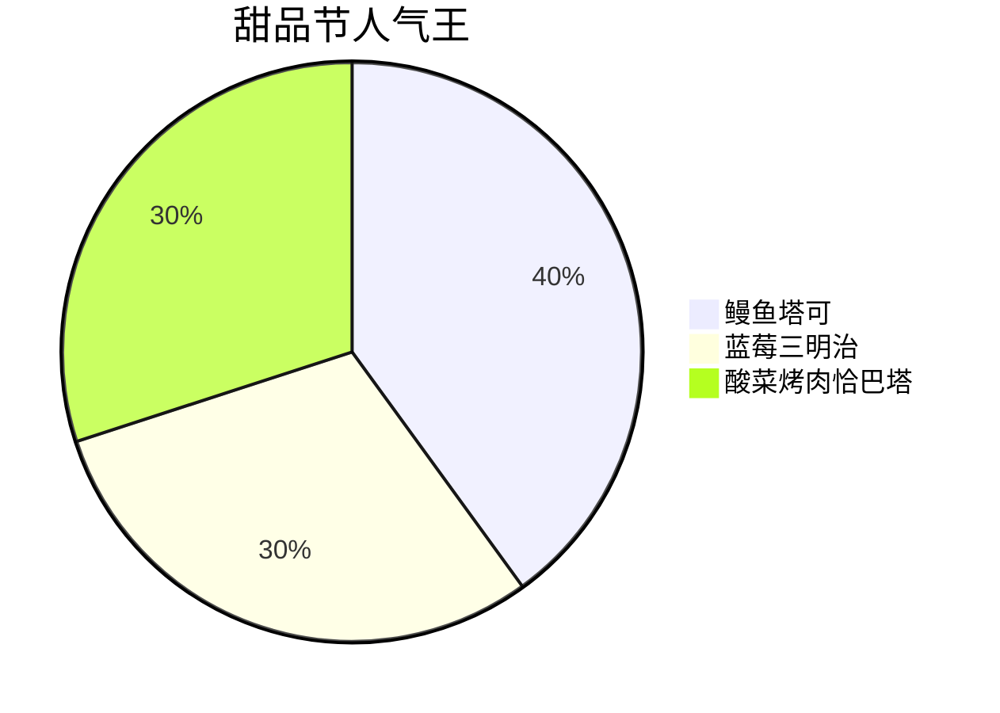
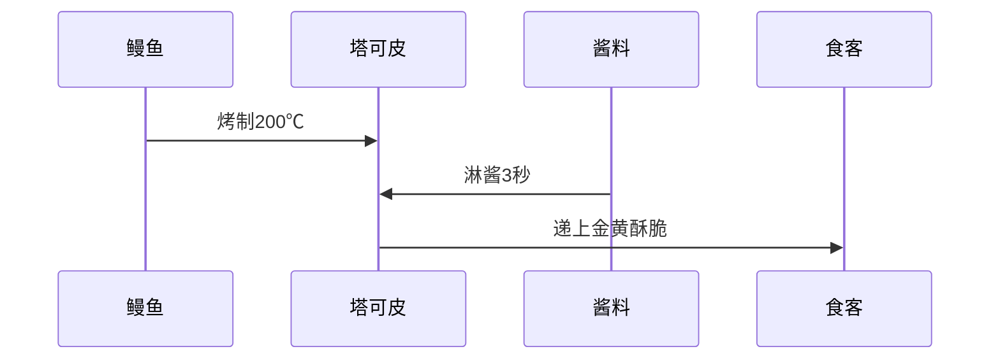
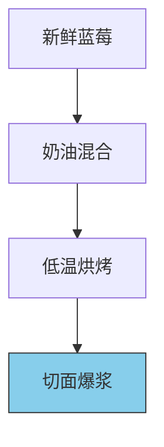

---
tags:
  - 杭州美食
  - 甜品节
  - 美食探店
  - 周末活动
  - 小红书推荐
url: "https://www.xiaohongshu.com/explore/6a197112000000003503a418"
title: "杭州甜品节：鳗鱼塔可与蓝莓三明治的甜蜜冒险"
date: 2026-06-01
---

# 🍩杭州甜品节：鳗鱼塔可与蓝莓三明治的甜蜜冒险

（*松果池畔传来蛤蟆的咕噜声*）  
"呱呱！本蛤蟆刚从西投银泰的甜品节归来，爪子里还沾着蓝莓酱呢！今天要带你们解锁杭州最甜的5天——5.29-6.1的烘焙甜品节攻略！"

## 🗓️ 0. 活动时间线

## 🍔 1. 必吃三巨头

### 🌮 鳗鱼塔可的魔法配方

### 🫐 蓝莓三明治的爆浆奥秘

## 📍 2. 探店地图

## 📸 3. 图集手札

> **蛤蟆法眼解析**：  
> 摊位招牌写着"生活够卷"，鳗鱼铺得比西湖还满！

> **文字识别**：  
> "蓝莓多到爆炸"——这不是夸张，是事实！

## 🧠 4. 小白补课区
- **恰巴塔**：意大利面包，外脆内软的魔法面包
- **塔可**：墨西哥美食，用玉米饼包裹食材的万能容器
- **烘焙甜品节**：集合全球甜品的美食嘉年华

## 📋 5. 关键信息整理
| 项目 | 内容 |
|------|---## 🖼️ 图集手札

### - 棕色纸袋：**刘讲究**、**嘎嘎香** - 白色纸袋：**ello**、**ad & Cake** - 饮品杯：**很谷田**、**Every coun**（部分） - 汉堡内包装纸：**ST**、**allenge in**（部分） （注：控制在30字内，提取覆盖主要可见，含不完整部分标注。）](../../../attachments/03_生活簿（生活区）/食味录（美食与探店）/西湖区/2026-06-01_甜品节逛吃小札_2.jpg)

### - 棕色纸袋：**刘讲究**、**嘎嘎香** - 白色纸袋：**ello**、**ad & Cake** - 饮品杯：**很谷田**、**Every coun**（部分） - 汉堡内包装纸：**ST**、**allenge in**（部分） （注：控制在30字内，提取覆盖主要可见，含不完整部分标注。）](../../../attachments/03_生活簿（生活区）/食味录（美食与探店）/西湖区/2026-06-01_甜品节逛吃小札_2.jpg)

### - 棕色纸袋：**刘讲究**、**嘎嘎香** - 白色纸袋：**ello**、**ad & Cake** - 饮品杯：**很谷田**、**Every coun**（部分） - 汉堡内包装纸：**ST**、**allenge in**（部分） （注：控制在30字内，提取覆盖主要可见，含不完整部分标注。）](../../../attachments/03_生活簿（生活区）/食味录（美食与探店）/西湖区/2026-06-01_甜品节逛吃小札_2.jpg)

### - 棕色纸袋：**刘讲究**、**嘎嘎香** - 白色纸袋：**ello**、**ad & Cake** - 饮品杯：**很谷田**、**Every coun**（部分） - 汉堡内包装纸：**ST**、**allenge in**（部分） （注：控制在30字内，提取覆盖主要可见，含不完整部分标注。）](../../../attachments/03_生活簿（生活区）/食味录（美食与探店）/西湖区/2026-06-01_甜品节逛吃小札_2.jpg)

---|
| 活动时间 | 5.29-6.1 12:00-21:00 |
| 主办地点 | 杭州西投银泰 |
| 推荐指数 | ⭐⭐⭐⭐⭐ |
| 试吃政策 | 全场免费试吃 |
| 交通建议 | 地铁2号线西投银泰站D口 |

## 📌 6. 本地证据
- [[2026-06-01_杭州甜品节美食攻略_369ecb]]（原始证据文件）

（*蛤蟆祥打了个饱嗝*）  
"本蛤蟆宣布：这可能是杭州最值得打卡的甜品节！下次带搭子来，记得先冲鳗鱼塔可摊位——那里排队的人比西湖断桥还长！" 🐸