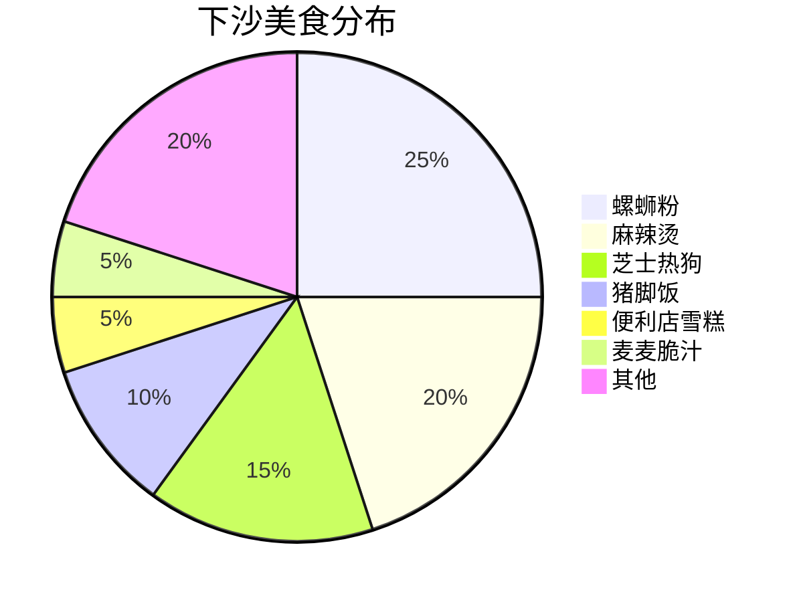
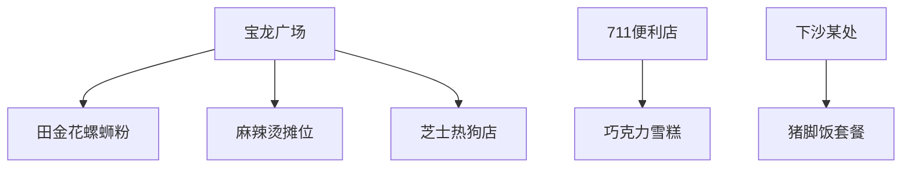
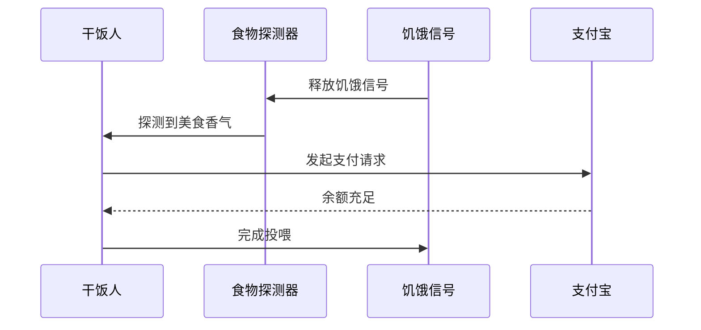

# 下沙一周干饭图鉴：女大学生的嘴停不下来！

## 🌟 一周干饭KPI爆表实录

```mermaid
progress
title 干饭进度
section 七日美食马拉松
Day1: 30%, #f97794
Day2: 60%, #f97794
Day3: 90%, #f97794
Day4: 100%, #f97794
Day5: 100%, #f97794
Day6: 100%, #f97794
Day7: 100%, #f97794
```

这个女大学生的嘴巴就像永动机，上周在下沙干饭KPI直接拉满！从宝龙广场到711便利店，从螺蛳粉到芝士热狗棒，记录了18张让人流口水的美食现场。

## 🍜 下沙美食雷达图



## 📍 下沙美食地图速览



## 📸 美食现场直击

### 🐍 螺蛳粉王者登场

> "猪脚软糯到能用筷子夹断！没有猪骚味的螺蛳粉才是真·宝藏"

### 🧀 芝士热狗拉丝现场

> 洞洞鞋踩在木板地上，手里的芝士热狗棒能拉出三米长丝！

### 🥤 便利店雪糕特写

> 711的巧克力雪糕，女大学生说："这价格能让我放弃减肥！"

## 🍽️ 干饭人行为图鉴



## 📌 干饭人必看Tips

| 隐藏美食 | 推荐指数 | 避坑指南 |
|---------|----------|-------## 🖼️ 图集手札


### - 小红书正文：**加料区有好多好多 下次一定试试别的！** - 价格牌（部分）：**……2/串 ……2/串 海带结……2/串 脆豆腐……4/个 鹌鹑蛋……4/串 千叶豆腐……2/串 肉……2/串 皮……**](../../../attachments/03_生活簿（生活区）/食味录（美食与探店）/钱塘区（下沙）/2026-05-30_下沙一周干饭图鉴_2.jpg)


### - 小红书正文：**加料区有好多好多 下次一定试试别的！** - 价格牌（部分）：**……2/串 ……2/串 海带结……2/串 脆豆腐……4/个 鹌鹑蛋……4/串 千叶豆腐……2/串 肉……2/串 皮……**](../../../attachments/03_生活簿（生活区）/食味录（美食与探店）/钱塘区（下沙）/2026-05-30_下沙一周干饭图鉴_2.jpg)


### - 小红书正文：**加料区有好多好多 下次一定试试别的！** - 价格牌（部分）：**……2/串 ……2/串 海带结……2/串 脆豆腐……4/个 鹌鹑蛋……4/串 千叶豆腐……2/串 肉……2/串 皮……**](../../../attachments/03_生活簿（生活区）/食味录（美食与探店）/钱塘区（下沙）/2026-05-30_下沙一周干饭图鉴_2.jpg)


### - 小红书正文：**加料区有好多好多 下次一定试试别的！** - 价格牌（部分）：**……2/串 ……2/串 海带结……2/串 脆豆腐……4/个 鹌鹑蛋……4/串 千叶豆腐……2/串 肉……2/串 皮……**](../../../attachments/03_生活簿（生活区）/食味录（美食与探店）/钱塘区（下沙）/2026-05-30_下沙一周干饭图鉴_2.jpg)


---|
| 田金花螺蛳粉 | ⭐⭐⭐⭐ | 加肥肠会更香但容易腻 |
| 宝龙麻辣烫 | ⭐⭐⭐⭐⭐ | 加料区有惊喜 |
| 芝士热狗 | ⭐⭐⭐ | 趁热吃才拉丝 |
| 711雪糕 | ⭐⭐ | 建议搭配奶茶 |
| 猪脚饭套餐 | ⭐⭐⭐⭐ | 搭配可乐更佳 |

## 📁 原始资料库
- [[2026-05-30_下沙一周干饭图鉴_f0502e]]