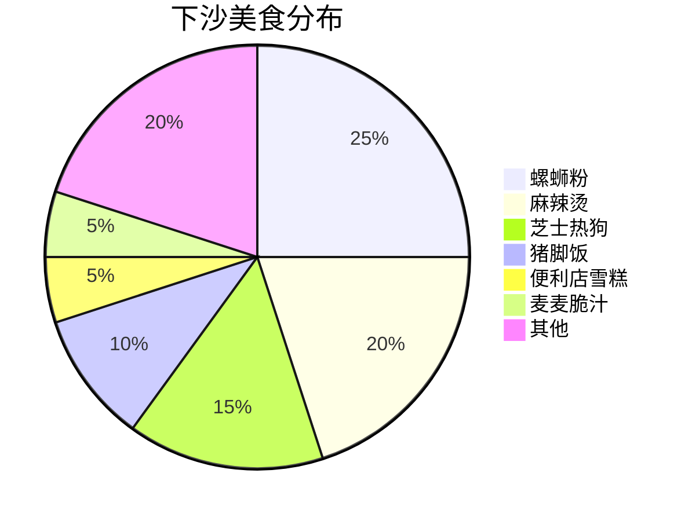
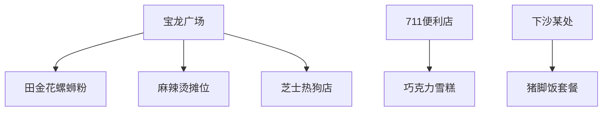
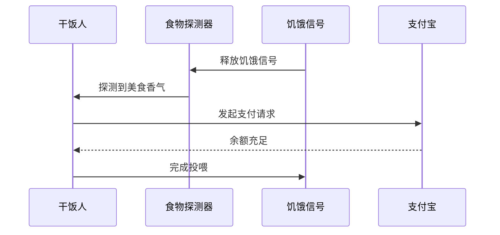

# 下沙一周干饭图鉴：女大学生的嘴停不下来！

## 🌟 一周干饭KPI爆表实录

### 📊 一周干饭进度
| 天数 | 进度 | 状态 |
| :--- | :---: | :--- |
| **Day 1** | 30% | 🟢 稳步起跑 |
| **Day 2** | 60% | 🟢 渐入佳境 |
| **Day 3** | 90% | 🔴 战力飙升 |
| **Day 4** | 100% | 🔥 满血通关 |
| **Day 5** | 100% | 🔥 满血通关 |
| **Day 6** | 100% | 🔥 满血通关 |
| **Day 7** | 100% | 🔥 满血通关 |

这个女大学生的嘴巴就像永动机，上周在下沙干饭KPI直接拉满！从宝龙广场到711便利店，从螺蛳粉到芝士热狗棒，记录了18张让人流口水的美食现场。

## 🍜 下沙美食雷达图

## 📍 下沙美食地图速览

### 🐍 螺蛳粉王者登场
> "猪脚软糯到能用筷子夹断！没有猪骚味的螺蛳粉才是真·宝藏"

### 🧀 芝士热狗拉丝现场
> 洞洞鞋踩在木板地上，手里的芝士热狗棒能拉出三米长丝！

### 🥤 便利店雪糕特写
> 711的巧克力雪糕，女大学生说："这价格能让我放弃减肥！"

## 🍽️ 干饭人行为图鉴

## 📌 干饭人必看Tips

| 隐藏美食 | 推荐指数 | 避坑指南 |
|---------|----------|----------|
| 田金花螺蛳粉 | ⭐⭐⭐⭐ | 加肥肠会更香但容易腻 |
| 宝龙麻辣烫 | ⭐⭐⭐⭐⭐ | 加料区有惊喜 |
| 芝士热狗 | ⭐⭐⭐ | 趁热吃才拉丝 |
| 711雪糕 | ⭐⭐ | 建议搭配奶茶 |
| 猪脚饭套餐 | ⭐⭐⭐⭐ | 搭配可乐更佳 |

## 📁 原始资料库
- [[2026-05-30_下沙一周干饭图鉴_f0502e]]

## 🖼️ 图集手札

