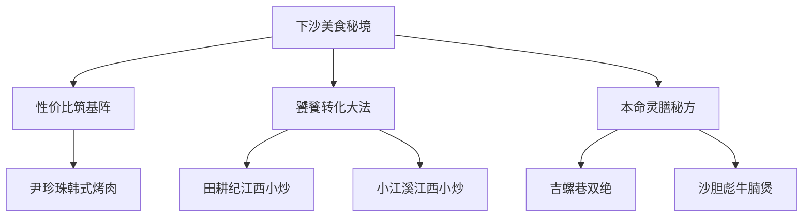
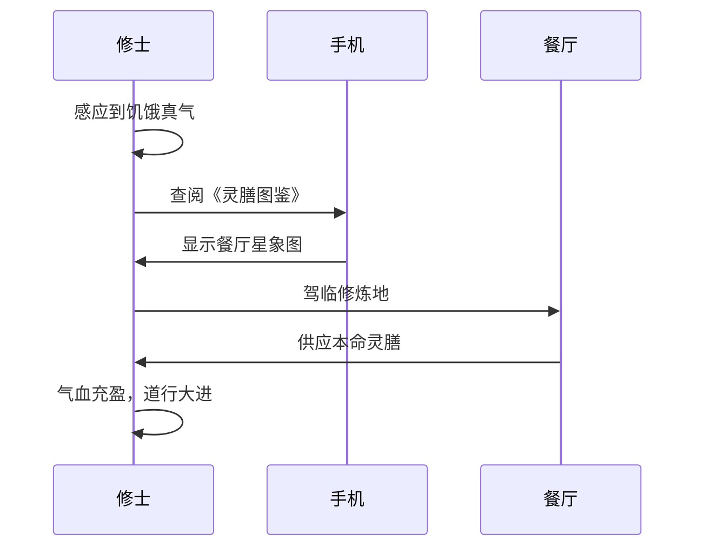
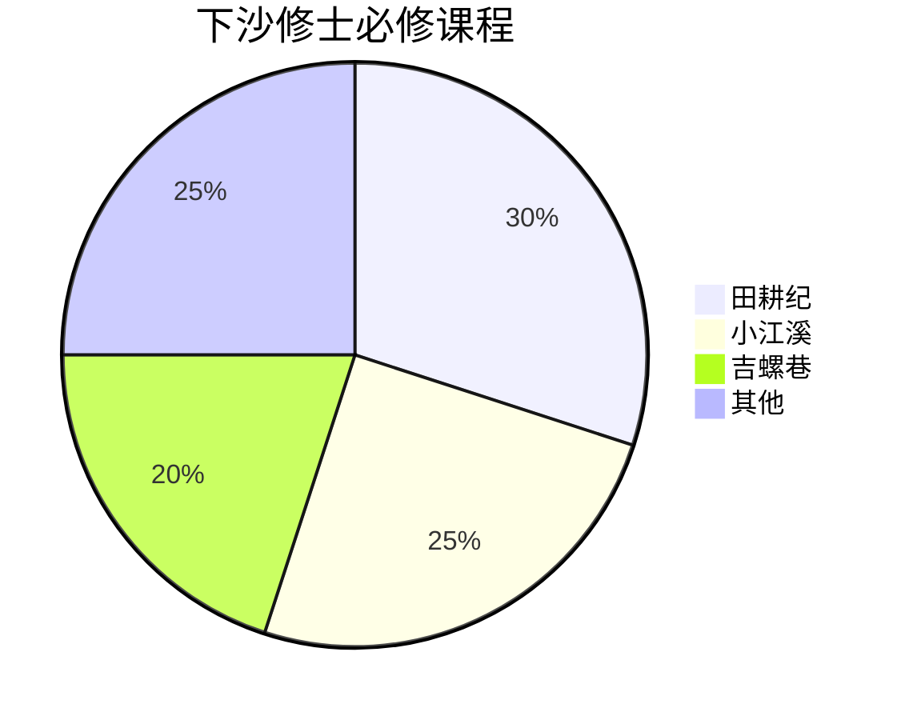

# 🧙‍♂️下沙修士的灵膳修炼地图：大学生食堂隐藏副本全攻略

## 🖼️ 图集手札

## 🌟 0. 原始资料
本地证据：[[2026-05-31_下沙修士复食灵膳图鉴_a2e243]]

## 🧭 1. 修炼路线总览

## 🧙‍♂️ 2. 修士修炼心法
### 🪙性价比筑基阵
> **修炼口诀**：灵石不花白不花，胃袋充盈道行加！

- **尹珍珠韩式烤肉**：人均30+的自助烤肉，肉质虽非上品但胜在量足，适合刚入修仙的菜鸟修士
- **萨莉亚意式餐厅**：西式快餐界的"灵石兑换所"，披萨意面任选，花小钱办大事

### 🍲饕餮转化大法
> **修炼要诀**：以小炒为引，激发饕餮真火！

- **田耕纪江西小炒**：辣度可调的"五行火灵气"，小炒肉配米饭堪比修仙界的回灵丹
- **小江溪江西小炒**：招牌小炒肉自带"聚灵阵"效果，建议搭配免费加热服务使用

### 🐉本命灵膳秘方
> **修炼秘籍**：找到你的本命灵膳，修炼事半功倍！

| 餐厅 | 本命灵膳 | 修炼效果 |
|------|----------|----------|
| 吉螺巷 | 虎皮猪蹄+螺蛳粉 | 酸辣鲜香，打通任督二脉 |
| 沙胆彪 | 牛腩煲 | 汤底醇厚，补气养血 |
| 重庆沸腾鱼乡 | 水煮鱼 | 麻辣鲜香，激发战意 |

## 📜 3. 修士进阶指南

## 🗺️ 4. 修炼地星象图

## 📸 5. 灵膳图鉴（精选）

> **修炼提示**：辣度可调的江西小炒，建议新手从"小火"开始

> **修炼提示**：牛腩煲需配合免费涮菜服务，效果更佳

## 📝 6. 修士修炼备忘录
- [ ] 携带《灵膳图鉴》前往田耕纪，验证"小炒肉聚灵阵"
- [ ] 在吉螺巷尝试"虎皮猪蹄+螺蛳粉"的无敌组合技
- [ ] 记录各餐厅的灵气浓度（辣度/分量/性价比）

> **修炼箴言**：修士不打无准备之仗，下沙美食秘境等你来探！