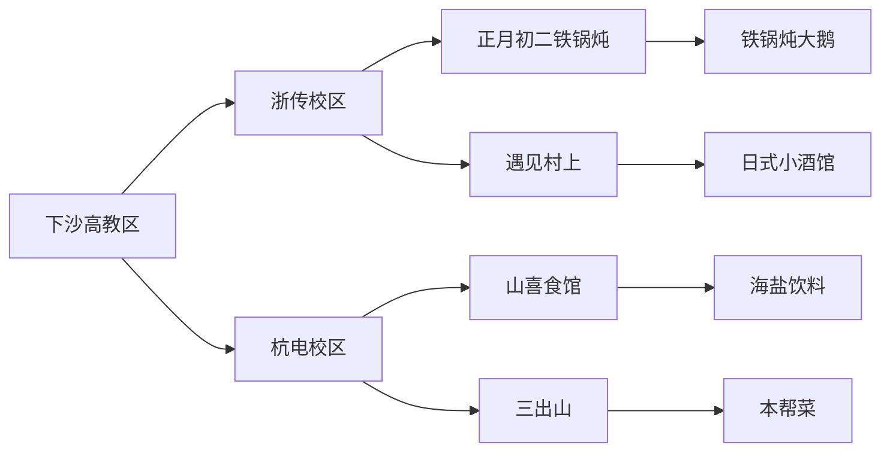

---
tags:
  - 下沙美食
  - 高校探店
  - 烧烤推荐
  - 杭州吃货地图
url: "https://www.xiaohongshu.com/explore/6a0d6a7a000000003601fc2f?xsec_token=AB2lYsfAOEyu_JsyFc5JIzZUrKSwK8xWUwQ7gxZQK_iGg=&xsec_source=pc_cfeed"
title: "下沙女大深夜觅食攻略"
date: 2026-05-31
---

# 🍻下沙女大深夜觅食攻略：烧烤局+探店秘籍全公开🔥

## 🧾0. 原始资料
本地证据：[[2026-05-31_下沙女大美食探店实录_3f1184]]

## 🖼️ 图集手札

<div style="display: none;">


</div>

## 🗺️1. 下沙美食版图解密


## 🍽️2. 烧烤局社交指南
```mermaid
sequenceDiagram
用户->>社交平台：发布"有人跟我一起吃烧烤吗？"
思考->>用户：没人就不吃了
用户->>内心OS：这波反向钓鱼太绝了！
朋友->>用户：收到烧烤局邀请
用户->>朋友：附赠沪上阿姨西瓜冰茶
```

## 📚3. 小白补课区
- **下沙**：杭州高校聚集区，聚集浙传/杭电等高校
- **铁锅炖**：东北菜特色，大鹅配菜炖煮，适合多人分享
- **日式小酒馆**：遇见村上提供居酒屋风格简餐
- **本帮菜**：三出山主打上海传统风味

## 📊4. 关键店铺速查表
| 店铺名称       | 特色菜品              | 推荐指数 | 适合场景         |
|----------------|-----------------------|----------|------------------|
| 正月初二       | 铁锅炖大鹅            | ⭐⭐⭐⭐⭐   | 团建/聚会        |
| 山喜食馆       | 海盐饮料+辣卤拼盘     | ⭐⭐⭐⭐    | 午餐/宵夜        |
| 遇见村上       | 烤串+清酒            | ⭐⭐⭐⭐⭐   | 情侣约会         |
| 三出山         | 红烧肉+蟹粉豆腐       | ⭐⭐⭐⭐    | 家庭聚餐         |
| 面包会有的     | 欧包+咖啡            | ⭐⭐⭐⭐    | 早餐/下午茶      |

## 📌5. 探店生存法则
1. **摸鱼-奋斗辩证法**：吃喝后必须补习功课（博主血泪史）
2. **社交货币储备**：烧烤邀约=社交关系润滑剂
3. **美食雷达校准**：关注#下沙美食 #大学生吃喝 等话题

## 🎯6. 下一步行动清单
- [ ] 拜访正月初二铁锅炖，体验东北味
- [ ] 约饭山喜食馆，解锁辣卤拼盘
- [ ] 发起烧烤局，测试反向钓鱼成功率
- [ ] 收藏遇见村上，备选约会圣地

> 💡 **探店玄学提示**：当库存告罄时，记得及时切换"学习戒定"模式，毕竟美食与学业需要阴阳平衡！
