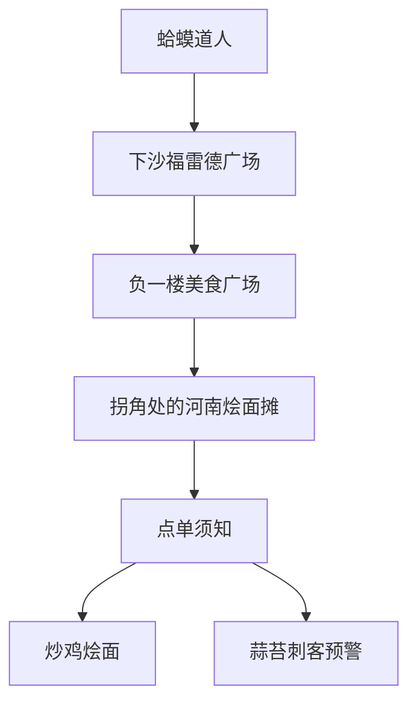

---
tags:
  - 美食探店
  - 河南风味
  - 下沙美食
  - 炒鸡烩面
  - 避坑指南
url: "https://www.xiaohongshu.com/explore/6a19493b00000000070251b6?xsec_token=ABu_cmLAcDd9GHH-0-o7jOpMJiEDdHqRCEU28G27VzQLk=&xsec_source=pc_cfeed"
title: "蛤蟆手札：下沙福雷德广场的炒鸡烩面，鲜到天灵盖起飞！"
date: 2026-05-31
---

# 蛤蟆手札：下沙福雷德广场的炒鸡烩面，鲜到天灵盖起飞！

## 🖼️ 图集手札

<div style="display: none;">


</div>

## 🧙‍♂️ 修行者须知
> 本手札由松果阁探店长老「蛤蟆道人」亲测，专治馋虫发作！



## 🍜 本命美食参悟录

### 1. 鲜鸡现炒，直击天灵盖
- **核心法器**：河南手扯烩面 + 新鲜炒鸡
- **修炼秘法**：鸡肉选用当日宰杀的活鸡，蒜苔必须是老板后院自种的（老板说今年大丰收）
- **效果**：鲜香直冲天灵盖，吃完自动触发「光盘咒」

### 2. 隐藏洞府定位指南
```mermaid
sequenceDiagram
用户->>商场：进入福雷德广场
商场->>用户：乘坐扶梯至B1
用户->>美食广场：右转直行50米
美食广场->>用户：在第三个拐角处发现神秘红店
```

### 3. 避坑心法三式
| 坑位 | 避坑咒语 | 修炼效果 |
|------|----------|----------|
| 蒜苔刺客 | 点单时大喊"无蒜苔！" | 避免吃到青绿色灾难 |
| 冷冻肉陷阱 | 观察鸡肉色泽（鲜红=活鸡） | 保证吃到热乎现炒 |
| 隐藏菜单 | 直接点"一品炒鸡" | 解锁老板私藏配方 |

## 📸 仙界图鉴
> 图1：美食广场全景，注意右下角那个红色招牌

> 图2：菜单墙上的镇店之宝——"高超一品炒鸡"，老板说这是祖传秘方

> 图5：实战演练现场，建议搭配《舌尖上的中国》BGM食用

## 🧾 探店修行手册
1. **寻宝路线**：健身完去超市买水时顺路探店（健身党专属福利）
2. **点单口诀**：不辣/微辣二选一，建议师妹师弟组队体验不同风味
3. **隐藏任务**：吃完记得和老板唠嗑，有机会解锁河南方言小课堂

## 📜 原始卷轴
[[2026-05-31_下沙福雷德广场炒鸡烩面测评_81ac60]]

## 🧙‍♀️ 修行感悟
> "本科四年在河南养成的烩面DNA，终于在杭州下沙被唤醒！这碗面里藏着中原大地的烟火气，每一口都是对乡愁的温柔反击。"

## 📌 下次修行任务
- [ ] 带上《河南美食地图》继续探索
- [ ] 尝试点"藤椒鸡"解锁新口味
- [ ] 拍摄《下沙美食探店vlog》系列

> 🐸 本手札由松果阁蛤蟆道人亲测，保证真实有效！下期预告：揭秘福雷德广场负二楼的神秘烧烤摊！
