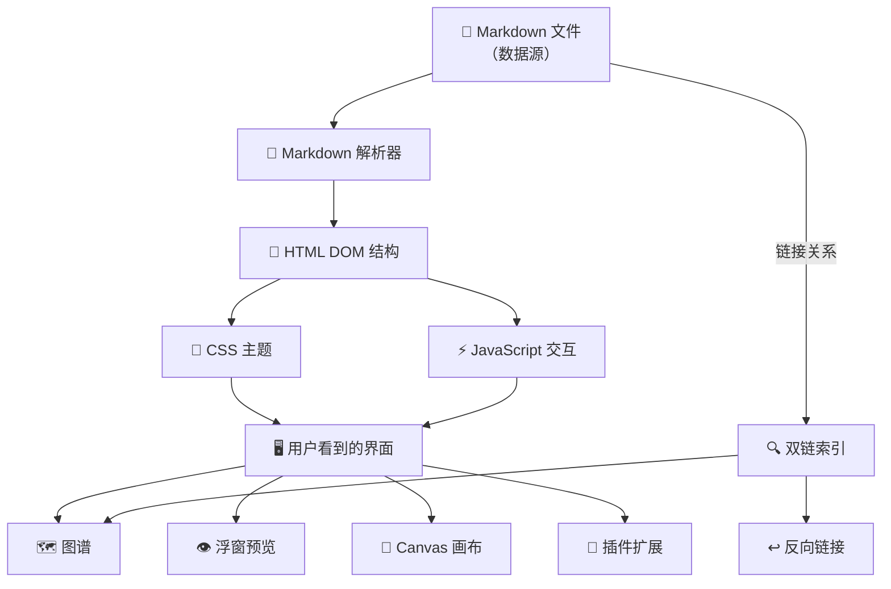

---
tags:
  - obsidian
  - markdown
  - html
  - ai
  - knowledge-management
  - architecture
created: 2026-05-26
aliases:
  - Obsidian的本质
  - Markdown与HTML的关系
  - AI时代的知识格式
---

# Obsidian 本质理解：Markdown、HTML 与 AI 时代的知识工作流

> [!abstract] 核心结论
> **Obsidian 不是单纯的 Markdown 编辑器，而是一个以 Markdown 为数据源、以 HTML/CSS/JS 为视觉与交互层、以双链和图谱为知识结构层的本地知识工作台。**
>
> 在 AI 时代，Markdown 不会消失，而是退居幕后，成为一种"知识中间协议"——人类提出想法，AI 负责整理扩写，Obsidian 负责组织渲染，网页或博客负责对外展示。

---

## 一、Obsidian 的来源与架构

### 1.1 它从哪里来

Obsidian 由 **Shida Li** 和 **Erica Xu** 创建，他们之前开发过大纲笔记工具 **Dynalist**。Obsidian 的 beta 版于 2020 年 3 月 30 日发布，1.0 正式版于 2022 年 10 月 13 日发布。

它的核心理念与其他笔记工具有本质区别：

> [!important] Obsidian vs 其他笔记工具
> **Obsidian 不把你的笔记锁在数据库里，而是直接使用本地 Markdown 文件。**
>
> 官方强调三个原则：
> 1. **数据在本地**——笔记保存在你的设备上
> 2. **开放格式**——使用纯文本 Markdown，不被任何软件绑定
> 3. **长期拥有**——你对自己的数据有完整的控制权

### 1.2 技术架构：Electron + Web 技术栈

从技术上说，Obsidian 桌面端的本质是：

```
┌─────────────────────────────────────────┐
│              Electron 壳                  │
│  ┌───────────────────────────────────┐  │
│  │        Chromium 渲染引擎           │  │
│  │  ┌─────────────────────────────┐  │  │
│  │  │   HTML + CSS + JavaScript   │  │  │
│  │  │   （界面、主题、插件、交互）    │  │  │
│  │  └─────────────────────────────┘  │  │
│  └───────────────────────────────────┘  │
│  ┌───────────────────────────────────┐  │
│  │     Node.js 后端层                 │  │
│  │  （文件系统、搜索索引、图谱计算）    │  │
│  └───────────────────────────────────┘  │
└─────────────────────────────────────────┘
         ↕ 读写
┌─────────────────────────────────────────┐
│          你的 Vault 文件夹               │
│  ├── A.md    ├── B.md    ├── 图片.png   │
│  └── .obsidian/ （插件、配置、主题）      │
└─────────────────────────────────────────┘
```

> [!note] Electron 的意义
> Electron 把一个"网页应用"打包成桌面应用。它可以理解为一个**内置的浏览器壳子**，但这个浏览器不只是打开网页，还能：
> - 访问本地文件系统，读写你的 Markdown 笔记
> - 加载插件，扩展功能
> - 控制窗口、菜单、快捷键
> - 运行后台索引和图谱计算

所以 Obsidian 的技术栈可以精确概括为：

**Electron × Markdown 解析器 × CSS 主题引擎 × JS 插件系统 × 本地文件系统**

### 1.3 关键澄清：Obsidian 不是"把 Markdown 转成 HTML 文件"

> [!warning] 常见误解
> Obsidian **不会**把 `.md` 文件永久转换成 `.html` 文件。

它的实际工作流程是：

```
本地 .md 文件（存储层）
    ↓  实时解析
Markdown → DOM 结构（解析层）
    ↓  即时渲染
HTML 视觉元素（结构层）
    ↓  主题注入
CSS 美化样式（表现层）
    ↓  插件注入
JavaScript 交互能力（交互层）
    ↓
你看到的阅读模式、图谱、callout、Canvas、插件界面
```

底层保存的**始终是 `.md` 文件**，不是 `.html` 文件。这也是为什么 Obsidian 可以在 **Source Mode（源码模式）** 和 **Live Preview（实时预览）** 之间切换——一个更接近原始 Markdown，一个更接近渲染后的视觉结果。

---

## 二、三层结构：Obsidian 的核心设计哲学

Obsidian 的设计可以理解为三层分离：

### 2.1 数据层：Markdown 作为"知识源代码"

Markdown 在 Obsidian 中承担的角色不是"最终界面"，而是**知识的底层表示**：

| 特性 | 说明 |
|------|------|
| **纯文本** | 不会被任何软件锁定，永远可读 |
| **结构化** | 标题、列表、链接、代码块语义清晰 |
| **可版本管理** | Git 可以轻松追踪 Markdown 的变化 |
| **可批量处理** | 脚本和 AI 可以批量读写、改写、提取 |
| **可转换** | 可转为 HTML、PDF、Word、PPT、电子书、网页 |

```markdown
# 示例：一篇典型 Obsidian 笔记的底层 Markdown

## 基本信息
- 地点：杭州
- 类型：景点
- 标签：#旅行 #杭州

## 推荐路线
从 [[断桥]] 出发，经过 [[白堤]]，到 [[苏堤]]。

## 攻略笔记
> [!tip] 最佳游览时间
> 春季（3-5月）和秋季（9-11月）是西湖最美的季节。


```

对 AI 来说，这比 Word 文档或截图**好读得多**——层级清晰、关系明确、无噪音格式。

### 2.2 表现层：HTML/CSS/JS 作为"人类友好界面"

Markdown 本身不负责"好看"和"好用"。Obsidian 的视觉美感来自：

| 层级 | 技术 | 负责内容 |
|------|------|----------|
| **结构层** | HTML | 把 Markdown 解析成 DOM 节点 |
| **样式层** | CSS | 主题、字体、颜色、间距、卡片、callout 样式 |
| **交互层** | JavaScript | 点击、搜索、图谱拖拽、浮窗预览、折叠、插件逻辑 |

你看到的漂亮界面——标题渐变色、卡片式 callout、Mermaid 流程图、Canvas 画布、图谱力导向图——**都不是 Markdown 本身的能力**，而是 Obsidian 在 HTML/CSS/JS 层叠上去的。



### 2.3 知识层：双链与图谱作为"知识关系网络"

这是 Obsidian **真正区别于普通 Markdown 编辑器**的地方：

```
[[角色A]] 认识 [[角色B]]
[[景点A]] 属于 [[杭州旅行]]
[[概念X]] 衍生自 [[理论Y]]
```

在普通 Markdown 编辑器里，这只是文本。在 Obsidian 里，它们变成了：

- **图谱中的节点与连线**
- **反向链接面板中的引用关系**
- **局部关系图中的上下文**
- **出链/入链分析数据**
- **插件（如 Dataview）可查询的结构化数据**

> [!important] Obsidian 的核心价值不只是 Markdown 编辑
> 而是把 Markdown 中的**标题、链接、标签、图片、代码块、流程图、callout、YAML 元数据**转化为一个**可交互的知识系统**。

---

## 三、Markdown 在 AI 时代的角色

### 3.1 Markdown 不是为 AI 设计的，但天然适合 AI

这是一个需要修正的认知：

| 错误理解 | 正确理解 |
|----------|----------|
| Markdown 是给 AI 读的格式 | Markdown 早在 AI 普及前就流行了（2004年创建），它一开始是为**人类写作者**设计的轻量标记语言 |
| Markdown 对人类不友好 | Markdown 对**普通用户**不如 Word 直观，但对**写作者/开发者/知识工作者**来说，它的简洁本身就是优势 |
| AI 时代 Markdown 会消亡 | 恰恰相反——AI 时代 Markdown 会变得更加重要，因为它是最好的"知识源格式" |

### 3.2 为什么 Markdown 是 AI 时代的"知识中间协议"

```
        人类创意
           ↓
    Markdown 结构化记录  ← 这里是"知识中间层"
           ↓
    AI 读取、理解、扩写、整理
           ↓
    Obsidian 渲染 + 组织 + 链接
           ↓
    网页 / 博客 / 文档 / 图谱  ← 这里是"对外展示层"
```

Markdown 在 AI 时代有不可替代的优势：

1. **清晰层级**——`#` `##` `###` 让 AI 可以精确理解文档结构
2. **纯文本可读**——不需要解析复杂二进制格式
3. **链接关系明确**——`[[wiki-link]]` 和 `[text](url)` 直接表达关系
4. **代码与文本分离**——` ``` ` 围栏让 AI 精确区分内容类型
5. **元数据支持**——YAML frontmatter 提供结构化标注
6. **版本管理友好**——Git diff 对纯文本极其高效
7. **批量处理方便**——脚本可以一次性改写几百个 .md 文件
8. **格式可转换**——一条命令就能从 Markdown 生成 HTML/PDF/网站

> [!tip] AI 阅读 Markdown vs AI 阅读 Word
> 让 AI 读一篇 Markdown 笔记：直接解析，语义清晰。
> 让 AI 读一张截图或 Word 文件：先 OCR 或解析格式，再推测结构，最后才是理解内容。
> **中间多出来的每一步，都是信息损耗和错误来源。**

### 3.3 未来的格局预测

在 AI 时代，Markdown 很可能的角色演变：

```
过去：Markdown = 一种"写作格式"
现在：Markdown = 一种"知识交换格式"
未来：Markdown = 一种"人-AI-机器三方通用知识协议"
```

**人不会直接面对裸 Markdown**——AI 和软件负责把 Markdown 变成漂亮界面。
**Markdown 继续作为底层知识格式存在**——就像数据库中的 SQL，用户不直接写 SQL，但它是数据可靠存储的基础。

---

## 四、Obsidian 为什么能把 Markdown 变得好看

Obsidian 的"美颜"机制可以分为五层：

### 4.1 语法翻译层

把 Markdown 符号翻译成视觉结构：

| Markdown 语法 | 视觉呈现 |
|---------------|----------|
| `## 标题` | 二级标题（带颜色、字号、间距） |
| `- 列表项` | 圆点列表 |
| `**加粗**` | 加粗文本 |
| `[[链接]]` | 可点击的内部链接（悬浮可预览） |
| `> [!note] 内容` | 彩色 callout 卡片 |
| ` ```mermaid ` | 渲染为可视化流程图 |
| `` | 嵌入显示图片 |

### 4.2 CSS 主题层

通过 CSS 主题，把 DOM 节点美化成：
- 渐变色标题
- 圆角卡片式 callout
- 代码块语法高亮
- 表格条纹样式
- 标签彩色徽章
- 暗色/亮色模式切换

### 4.3 交互增强层

JavaScript 提供的交互，远超 Markdown 本身的能力：
- 折叠标题与列表
- 悬浮预览内部链接
- 拖拽调整面板
- 图谱力导向布局
- Canvas 自由画布
- 命令面板快速操作
- 插件提供的无限扩展

### 4.4 知识关系可视化层

这是 Obsidian 独有的：

```
[[角色A]] 认识 [[角色B]]
[[景点A]] 属于 [[杭州旅行]]
```

这些链接在 Obsidian 中变成：
- **全局图谱**：所有笔记的节点-连线网络
- **局部图谱**：当前笔记的上下游关系
- **反向链接**：谁引用了我
- **出链**：我引用了谁

### 4.5 插件生态层

Obsidian 社区有 2000+ 插件，进一步扩展了"好看"的边界：

- **Dataview**：把笔记变成可查询的数据库
- **Kanban**：看板视图
- **Excalidraw**：手绘风格图表
- **Mermaid**：代码驱动的流程图
- **Canvas**：自由画布
- **各种主题**：Minimal、Blue Topaz、AnuPpuccin 等

---

## 五、对我的实际意义：博客空间 × WeaveInk × 知识工作流

### 5.1 博客空间可以借鉴 Obsidian 的分层思想

我目前做的博客页面、松果屋、星沙棋盘、图谱页，本质上也可以套用这个架构：

| 层级 | 博客空间对应 | Obsidian 对应 |
|------|-------------|---------------|
| **内容层** | Markdown 文章 | `.md` 笔记文件 |
| **结构层** | 分类、标签、双链 | YAML、Wiki-link、文件夹 |
| **表现层** | HTML/CSS/背景图/卡片 | 主题、CSS 片段 |
| **交互层** | Three.js/图谱/传送门/动画 | JS 插件、Canvas、图谱 |
| **AI 层** | Claudian 整理与生成 | AI 插件、模板系统 |

```
Obsidian = 内在知识宇宙（私有、深度、结构）
博客网站 = 外在展示世界（公开、精选、视觉）
Markdown = 地下根系（数据、结构、可迁移）
网页    = 森林冠层（展示、交互、美观）
```

### 5.2 WeaveInk 的架构正好对上了这套逻辑

[[WeaveInk：项目总览]] 的设计本身就体现了 Markdown 作为"知识源代码"的思维：

- **Markdown 编写规范** — 定义内容格式标准
- **YAML 元数据标准** — 结构化知识标注
- **Wiki-link 约定** — 节点间的显式关系
- **RAG 上下文注入** — AI 直接读取 Markdown 知识库
- **向量检索路由** — 基于 Markdown 内容的语义搜索
- **图谱剧情巡检** — 把链接关系转化为故事一致性检查

这正好印证了"Markdown 作为人-AI-机器三方通用知识协议"的理念。

### 5.3 面向 AI Agent 的笔记写法建议

基于以上理解，写 Obsidian 笔记时可以遵循这些原则：

1. **清晰的标题层级**
   - `#` 只用一次（页面标题）
   - `##` 用于大章节
   - `###` 用于小节
   - 不要跳级

2. **使用 YAML frontmatter**
   ```yaml
   ---
   tags: [标签1, 标签2]
   created: 2026-05-26
   aliases: [别名1, 别名2]
   status: draft / published / archived
   ---
   ```

3. **善用 Wiki-link**
   - `[[笔记名]]` 建立显式关系
   - `[[笔记名|显示文字]]` 自定义显示文本
   - `[[笔记名#章节]]` 精确引用

4. **使用 callout 标记信息类型**
   ```markdown
   > [!note] 普通笔记
   > [!tip] 提示/技巧
   > [!warning] 注意事项
   > [!important] 重要信息
   > [!abstract] 摘要/总结
   > [!question] 待解决问题
   ```

5. **保持每段聚焦一个主题**
   - AI 对"一段一意"的内容理解最准确
   - 避免在同一个段落里混入多个话题

6. **代码块标记语言类型**
   ```markdown
   ```python
   ```
   ```mermaid
   ```
   ```dataview
   ```
   ```

---

## 六、延伸思考：未来的人机知识协作

### 6.1 从"人读"到"人机共读"

传统写作工具（Word、Pages）的设计目标是**最优人类阅读体验**。
Markdown 的设计目标是**人类可读 + 机器可解析**的平衡。

在 AI 时代，这种平衡变得更加重要：

```
纯 Word 文档 → AI 理解需要先解析格式 → 有损耗
纯 Markdown  → AI 直接理解结构和语义 → 无损耗
```

### 6.2 Obsidian 是"知识操作系统"而非"笔记软件"

如果把普通笔记软件比作"文本编辑器"，Obsidian 就更像一个**知识操作系统**：

| 传统笔记软件 | Obsidian |
|-------------|----------|
| 文件是孤立的 | 文件通过双链形成网络 |
| 格式是封闭的 | 格式是开放的 Markdown |
| 功能是内置的 | 功能通过插件无限扩展 |
| 数据在云端 | 数据在本地，你完全拥有 |
| 只能阅读 | 可以查询（Dataview）、可以可视化（图谱/Canvas）、可以让 AI 操作 |

### 6.3 知识的三次飞跃

回顾个人知识管理工具的演进，可以看到三次飞跃：

```
第一代：纸质笔记 / Word 文档
  特征：线性、孤立、只适合人类阅读
  问题：无法关联、无法检索、无法被机器理解

第二代：云笔记（Notion / 语雀 / 飞书 / Evernote）
  特征：在线协作、富文本、数据库
  问题：数据锁定、格式封闭、依赖特定平台

第三代：知识操作系统（Obsidian / Logseq / Roam Research）
  特征：本地文件、开放格式、双链、图谱、AI 可操作
  优势：数据自有、格式开放、AI 原生友好、可编程扩展
```

Obsidian 正好站在第三代与 AI 时代的交叉点上。

---

> [!summary] 一句话总结
> **Markdown 是仓库里的原矿，Obsidian 是炼金炉，把它熔成网页、图谱、卡片、Canvas 和个人知识宇宙。在 AI 时代，Markdown 不是被淘汰的旧格式，而是成为"人- AI-机器"三方通用知识协议的最佳候选。**

---

## 相关笔记

- [[代号《织墨》(WeaveInk)]] — 基于 Markdown 知识库的 AI 写作引擎
- [[WeaveInk：项目总览]] — WeaveInk 的整体架构
- [[Markdown 编写规范]] — WeaveInk 中的 Markdown 规范
- [[YAML 元数据标准]] — WeaveInk 中的元数据标准
- [[Wiki-link 约定]] — WeaveInk 中的链接约定
- [[WeaveInk：技术架构]] — WeaveInk 的技术设计

---

*创建于 2026-05-26，基于对 Obsidian 本质、Markdown/HTML 关系、AI 时代知识工作流的系统性思考。*
