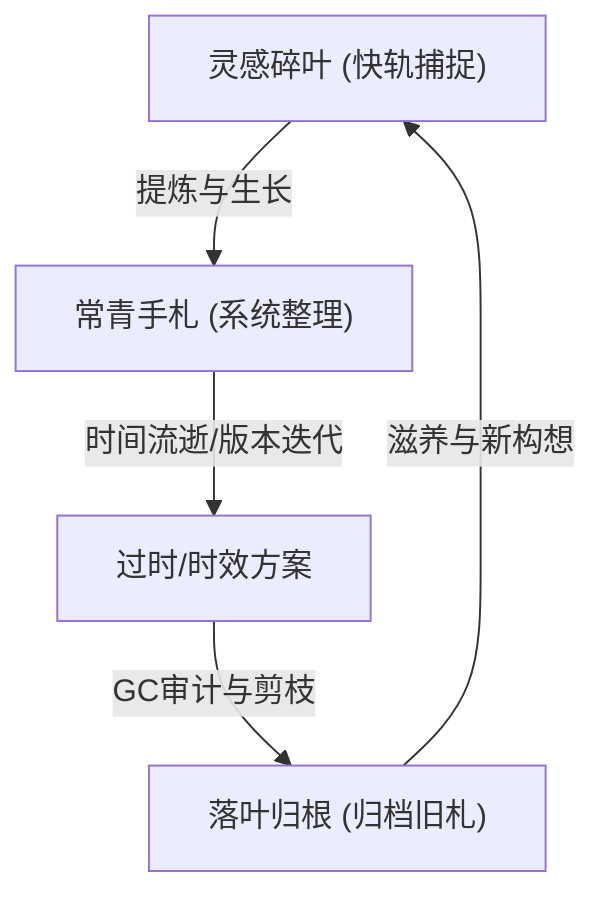

# 屋主札记：在林间对抗知识腐化

“笔记”这二字，涉及的维度实在是太广太广。

很多时候，人们在谈论知识管理（PKM）时，往往会陷入一种方法论的狂欢。我们热衷于讨论卡片盒（Zettelkasten）、讨论 PARA 框架、讨论双链的图谱结构。但作为一个在林间石路上行走的记录者，我渐渐发现：**笔记最难的关卡，从来都不是“如何动手整理”，而是“如何在念头闪过时，想着把它记下来”；以及，如何在一块生长的土壤里，对抗无法避免的“知识腐化”。**

---

## 🍂 一、 知识的半衰期与“腐化（Rot）”

在软件开发中，我们常说“代码会腐化（Code Rot）”——如果代码不经维护，就会随着依赖库升级、需求变更等外部环境变化而不可避免地“变质”。

知识也是如此。并非所有的手札都是常青树（Evergreen）。我们的笔记库里充斥着不同生命周期的碎片：
- **常青知识（岩石层）**：编译原理的算法推导、Linux 的核心机制、计算机系统结构的本质。这些是历久弥新的“岩石”，它们的半衰期长达数年甚至数十年。
- **时效知识（腐殖层）**：游戏节日的限时攻略、某次特定旅程的购票路线、某个临时项目的调试脚本、开发框架的短期 API 变动。这些知识在经历特定的时间节点后，价值会急速归零。

如果我们将所有信息不加区分地堆叠在大脑或本地 Vault 中，随着时间推移，过时的攻略会成为干扰搜索的“杂草”。**知识腐化最直观的表现，就是笔记系统信噪比的暴跌，导致每一次搜索都像是在垃圾堆里淘金。**

因此，对抗腐化的第一步，是**剪枝与归档**。将失效的计划与重制说明书移入「旧札柜」（Legacy Plans），不仅是为了腾出空间，更是为了维持这片叶间书林的信噪比，让真正常青的智慧拥有呼吸的空间。

---

## 🕯️ 二、 零摩擦力捕捉：灵感的生死线

正如开头所说，最难的永远是**在想法和生活琐屑流失前，想着去记录它**。

灵感像清晨草尖上的露珠，大脑一晒、外界一噪，便无影无踪。如果我们每一次记录，都需要打开复杂的分类文件夹、手动打上各种标签、遵循严格的排版模板，那么这种**“整理摩擦力”**会瞬间扼杀记录的冲动。

真正健康的笔记生态，应该提供多维度的接口，来解耦记录时的焦虑：
- **记录的“双轨制”**：
  - **快轨（乱石滩）**：允许混乱。大厅（Indoor）“碎叶墙”上的绿叶就是这一轨的化身。不需要它完美，甚至不需要它有排版，只需要一句话、一张截图，将那一瞬的闪光“钉住”。
  - **慢轨（修剪区）**：定期整理。当大脑处于空闲期，或者 AI 助手触发了整理建议时，再将快轨的乱石堆修剪成逻辑清晰的慢轨手札。
- **笔记最难的不是“怎么动笔”，而是“想起去记”**。当大脑建立了“万物皆可记，记下即无忧”的肌肉记忆时，笔记才真正成为了我们工作记忆的外部延展。

---

## 🛠️ 三、 AI 协作者：林间园丁的诞生

在这个对抗腐化的过程中，AI（如 Claude / Claudian）扮演了非常关键的**“林间园丁”**角色。

人脑是抗拒且不擅长做枯燥的整理工作的。面对堆积如山的过期日志，我们往往选择逃避。而 AI 的加入，在很大程度上降低了这种整理的阻尼感。
- **无痛审计**：AI 能够以极高的速度检索并理解上下文，帮我们标注出那些“已经失效的方案”或“已经实现的功能”，并在后台建议归档。
- **碎叶缝合**：它能够将我们在半梦半醒间记录的生活碎屑，缝合成逻辑清晰的备忘录，把混乱的思维线索整理成常青知识的毛坯。它充当了大半个自动化的“垃圾回收（Garbage Collection）”机制。

---

## 🌌 四、 笔记的多维图景：从“备忘录”到“外部意识”

随着思考的深入，我发现笔记在个人生命中扮演着三种截然不同的多维角色：

### 1. 它是时间的容器（时间流）
每一篇日记、碎叶，都是我们当下情绪与认知的切片。翻阅五年前的笔记，就像是与一个熟悉的陌生人对话。笔记在这个维度上是**自传性的**，记录了我们如何一步步成为今天的自己。

### 2. 它是思维的脚手架（空间网）
我们并不是“想好了才写下来”，而是“在写下来的过程中思考”。文字在纸面或屏幕上排布时，双链在图谱上交织时，大脑的认知负荷被卸载到了外部。**双链的本质不是分类，而是关联的重现**——那些看似风马牛不相及的领域（如嵌入式与旅行地图），在图谱的某个引力节点上产生交汇，这便是创意的温床。

### 3. 它是数字花园里的养分循环（生态圈）
健康的数字花园（Digital Garden）必须有生老病死：

如果只有生（不断记录）而没有死（剪枝归档），笔记库就会退化为荒芜的荒野。**只有当过时的知识成为“腐殖质”，常青的脉络才会更加清晰。**

做笔记，本质上是我们在数字世界里为自己建造的一座避难所。它记录的不单单是技术与干货，更是在这些琐屑中，我们对抗遗忘、对抗混乱、对抗时间腐化的真实痕迹。
