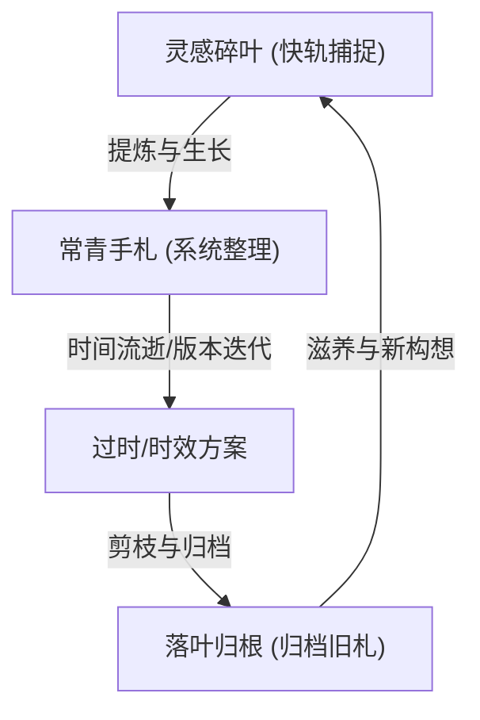
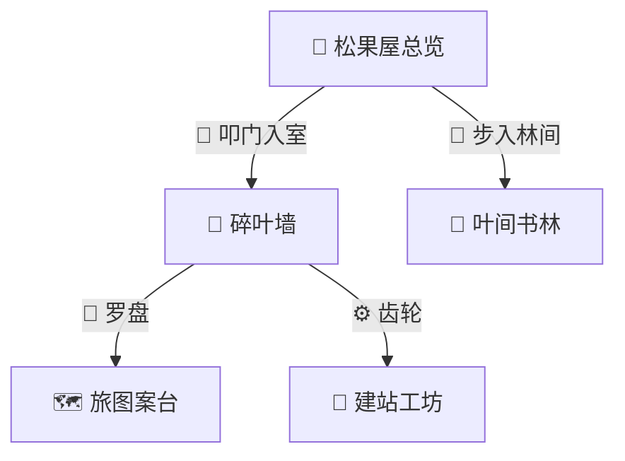

---
tags:
  - obsidian
  - markdown
  - 写作技巧
  - 笔记美化
  - 内功心法
aliases:
  - Obsidian可视化语法
  - 笔记修辞手法
  - Markdown排版技巧
created: 2026-05-28
status: evergreen
---

# Obsidian 修辞札记：让笔记从草稿变成园景的视觉语法

一篇笔记先要准确，然后呢？然后要好看。

不是花哨的那种好看——不是往空白处塞图、往标题上堆渐变色。是**读起来不累**的好看。眼睛扫过去，重点自己会跳出来；段落之间有呼吸，不用硬撑着读完整面墙的字。Obsidian 给了我们一套不复杂的工具，用好了，笔记就从草稿变成了可以逛的园子。

我在自己的 vault 里用久了，慢慢攒下了一套用得顺手的"视觉语法"。记在这里，既是备忘，也是给 Claudian 的一份风格参考——以后帮我写笔记时，该用哪种强调、哪种框图、哪种 callout，心里有数。

---

## 一、强调的三种力道

Markdown 给强调留了两级：斜体和粗体。但在我自己的笔记里，斜体几乎不用——它在中文里识别度太低，眼睛扫过去分不清"这个字斜了"和"字体渲染问题"。所以我只用粗体，但粗体也有轻有重。

### 第一级：轻强调（段落中凸出一个词）

```
对抗知识腐化的本质，是让每一条根都找得到它连着的那片土。
```

用 `**粗体**` 包裹一个词或一个短句，让它从周围文字中微微浮起来。不是喊叫，只是让人在扫读时视线稍停。

这级强调的特点是——**去掉它，句子仍然完整。** 它只是加了一点重力。

### 第二级：重强调（整句加粗，常配合引号）

```
"**林间园丁**"——这是我在心里给 AI 取的名字。
```

`"**粗体加引号**"` 的组合，适合给一个新概念"命名"的瞬间。引号说"这是个专有名词"，粗体说"这个词很重要"。两者合在一起，比单独用引号或单独用粗体都更有仪式感。

需要注意的是 `"` 在外面、`**` 在里面——先引号后粗体，不要反过来。反过来会让引号也被加粗，看起来笨重。

### 第三级：不留余地的强调（单独一行，不加解释）

```
**归档笔记的价值，从"指导行动"退到了"保存历史"。**
```

当某个观点是整段的落点时，我习惯让它单独成行、全句加粗、不加任何修饰语。它就在那里，像一个结论，像一个路标。读完前面的推演，视线在这里停一下，然后继续。

---

## 二、Callout：信息的六种容器

Obsidian 的 Callout 是我用得最多的视觉工具。它把一段文字装进一个有颜色、有左边框、有圆角的盒子里——信息不再是一视同仁的段落，而是有了类型和优先级。

### 我常用的几种

**`[!quote]` —— 引用一个判断**

> [!quote] 一句话总结
> 以前的黑客得懂汇编、懂内核、懂漏洞利用才算个技术活。现在？开个 API 中转站，在返回结果里多塞两行字，用户的 AI 自己就把木马装上去了。

适合放在笔记开篇或章节收尾。不是大段的引用，是一句话的提炼。"一句话总结"是标签，读者知道这里可以跳读。

**`[!warning]` —— 标注风险与边界**

> [!warning] 仅供娱乐，请勿当真
> 本文整理自一条 AI 生成的讽刺短剧。它可以启发你对技术的反思，但不是调查报告。

黄色左边框，心理暗示是"注意"。适合提醒读者这是段子不是新闻、这个方案还没验证、这个 API 有过期风险。

**`[!info]` —— 补充上下文**

> [!info] 视觉风格
> 和上一篇同一个系列——画面是 AI 生成的白发程序员老头日常。用老年人的脸演程序员的命，也是一种无声吐槽。

蓝色，中性。适合放"背景信息"——不影响理解主干，但想了解更多的人可以停下来读。

**`[!important]` —— 提高声量**

> [!important] 这个视频提出了一个全新概念
> 以前叫"社会工程学"——骗人点链接。现在叫"AI 工程学"——骗 AI 执行命令。

红色左边框，心理暗示是"别跳过"。适合放核心观点或概念定义。不要滥用——一篇笔记超过三个 `[!important]` 就等于没有重要的。

**`[!tip]` —— 提个醒**

> [!tip] 核心原则
> 一成不变的笔记是一潭死水。唯有时常修剪、时常更新的笔记，才有实践的意味。

绿色，轻量。适合放可操作的建议、一句话的方法论、让读者"带走"的东西。

**`[!success]` —— 标记已完成 / 已验证**

> [!success] 已修复
> 路径遍历已封堵。管理面板仅本机可访问。

在代码审查报告里用得最多。绿色 + 勾号的暗示，用来标记"这件事已经搞定了"。

**`[!danger]` —— 最严重的警告**

> [!danger] 修复方向
> 管理服务器不应在本地开发环境之外运行。

红色，比 `[!warning]` 更重一级。只在确实危险的时候用。

**`[!abstract]` —— 开篇定调**

> [!abstract] 核心结论
> Obsidian 不是一个 Markdown 编辑器。它是一个知识操作系统。

适合放在笔记最开头，告诉读者"这篇在讲什么"。蓝色，像摘要卡。

**`[!note]` —— 最轻的标注**

> [!note] 我不是在编码，我是在跟你聊天。

白色/浅灰背景，存在感最低。适合放一句无关紧要但想说的话。

### Callout 使用原则

- **一篇笔记的 callout 种类不要超过三种**。超过三种，读者就开始无视颜色了。
- **`[!important]` 和 `[!danger]` 各自每篇不超过一个**。它们是高潮，高潮多了就是噪音。
- **Callout 内部不要嵌套 callout**。Obsidian 虽然支持，但视觉上很乱。

---

## 三、Mermaid：当文字不够用的时候

有些关系，用文字写三行不如一张图看一眼。Mermaid 是 Obsidian 内置的图表语言——不是拖拽画布，是用代码描述结构。它的好处是**图和文字同源**：改了代码，图自动更新；复制到另一篇笔记，不改任何东西就能接着渲染。

### 我常用的三种

**流程图（graph TD）——画过程、画阶段、画循环**



适合画**有方向的流程**。节点的文字用 `[" "]` 包裹，边上的标注用 `| |` 夹住。方向有四种：`TD`（上到下）、`LR`（左到右）、`BT`（下到上）、`RL`（右到左）。

**场景关系图——画空间结构**



适合画**博主页那种有场景、有入口、有方向**的空间关系。emoji 放在节点名前面，能省掉很多文字描述。

**时序图（sequenceDiagram）——画对话、画交互**

```
sequenceDiagram
    树莓派->>网页端: 发送缩放参数 (WebSocket)
    网页端->>Three.js: 更新星球模型 scale
    Three.js-->>用户: 渲染新的星球大小
```

还没在我的笔记里实际用过，但碰到"两个系统之间怎么通信"这种话题时比流程图合适。

### Mermaid 使用原则

- **节点数控制在 10 个以内**。超过 10 个，任何流程图都变成毛线团。
- **不要为了画图而画图**。能一句话说清的关系，不需要一张图来证明它复杂。
- **边的标注尽量短**。超过五个字就考虑是不是该简化节点名。

---

## 四、检查清单：让事情可以被划掉

Obsidian 支持 Markdown 的任务列表语法。这是我最晚学会、但最实用的一个——它把"待办"变成了"已完成"。

```
- [ ] 未完成的任务
- [x] 已完成的任务
```

在阅读模式里，`- [ ]` 显示为空心方框，`- [x]` 显示为打勾的实心方框。可以点击切换。

我用在几个场景里：

**代码审查报告里的修复清单**

```
- [x] C1 路径遍历漏洞——已封堵
- [x] C2 管理面板鉴权——已绑定 127.0.0.1
- [ ] C3 Blog.jsx 巨型组件拆分
- [ ] H1 dangerouslySetInnerHTML 审查
```

**笔记末尾的延伸想法**

```
- [ ] 写一篇关于 Git 版本管理的"为什么"
- [ ] 研究 WeaveInk 的推荐逻辑——如何在"用户想要"和"用户需要"之间平衡
- [ ] 收集科技向善的实践案例
```

**设计方案的验证步骤**

```
- [ ] 访问 /blog，检查三个场景过渡
- [ ] 悬停在节点上，确认羊皮纸卡片浮出
- [ ] 点击节点，确认空间穿梭正常
```

这个语法看似简单，但它解决了一个很重要的问题：**笔记不再是"写完了就完了"，而是"有些事情还没做，记在这里，做完回来划掉"。** 笔记从静态文档变成了活的进度表。

---

## 五、其他值得留意的语法

### 代码块

```
```javascript
const full = path.join(manifest.vaultPath, collection.root, ...rel.split('/'));
```
```

指定语言后 Obsidian 会自动语法高亮。常用的：`javascript`、`python`、`bash`、`css`、`html`、`yaml`、`mermaid`、`dataview`。

### 表格

```
| 类型 | 行为 | 用途 |
|------|------|------|
| portal | 切换场景 | 纯导航 |
| gold | 叶片预览 | 单篇笔记 |
```

适合**三列以内、每列文字不超过十个字**的信息。超过这个量，表格就变成阅读理解题了。

### 删除线

```
~~已废弃的方案~~
```

我用在归档笔记的标题里——标记"这个方案不再执行了"，但文字仍然可读。

### 分割线

```
---
```

三个短横，一行留白。Obsidian 渲染成一条淡灰细线。我用在章节之间——不是每个小节标题都需要分割线，但每当话题出现了明显的转向，一条线比一个新标题更轻、更安静。

### 内嵌图片

```

```

图片放在 `临时素材/` 或 vault 的任意位置，一个叹号加双链语法就能嵌入。我在笔记里用得不多——我的笔记偏文字，图片只在"这个东西必须看图"的时候才放。

---

## 六、一份写给 Claudian 的简要约定

以后 Claudian 帮我生成或整理笔记时，默认遵循以下约定：

- **强调只用粗体**，不用斜体。分三级：词凸、句重、整段落点。
- **Callout 每篇不超过三种**。常用组合：`[!abstract]` 开篇 + `[!warning]`/`[!tip]` 中段 + `[!quote]` 收尾。
- **Mermaid 只在"文字说不清关系"时用**。节点不超过 10 个，边标注不超过 5 个字。
- **待办事项用 `- [ ]`**，完成项用 `- [x]`。
- **表格不超过三列**。超过三列的信息，用分节标题 + 段落重写。
- **分割线 `---` 不要连用**。两条分割线之间如果没有至少两个段落的内容，说明这个分割本身就不该存在。

---

*写于某个整理 vault 的下午。这些语法都不难，难的是克制——知道什么时候用一个 callout 就够了，知道什么时候该让文字安静地待着，什么都不加。*
