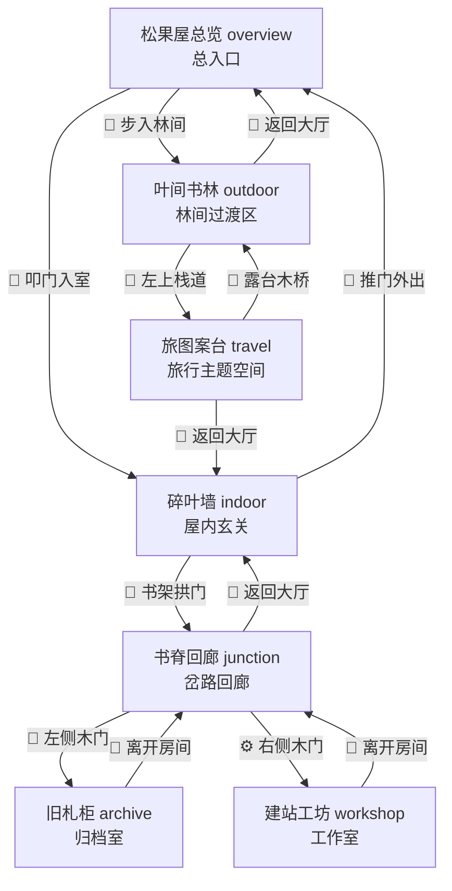

# 空间长廊 3.6：实景空间探险动线与星纬航图方案 (Implementation Plan)

根据道友整理的推荐路线与定位，我们将博客页面的空间探险网络和地图可视化方案重构如下：

---

## 1. 结构化空间地图与命名 (Refined Spatial Network)

我们将新路口命名为 **`junction`**（前端页面显示为 **`书脊回廊`**），整体走线形成清晰的“内外双主线”：



### 节点主题色调：
* `overview`：暖金 `#fbbf24`
* `indoor`：琥珀金 `#f59e0b`
* `outdoor`：青绿 `#10b981`
* `junction`：书脊紫蓝 `#818cf8`
* `travel`：地图棕金 `#d97706`
* `archive`：旧纸紫金 `#a78bfa`
* `workshop`：蓝紫奥术 `#6366f1`

---

## 2. 交互式“星纬航图”可视化设计 (Spatial Route Map Overlay)

新增一个交互式可视化地图弹窗，提供**古卷曼荼罗地图**的探索实感：
* **触发入口**：在底部快速传送栏左侧新增 `🗺️ 星纬航图` 标签按钮。
* **古卷背景**：弹窗居中浮起，背景使用古典羊皮纸卷轴，轻微变暗并不糊掉背后的 3D 视差房间。
* **脉动魔力线 (Mana Flow Paths)**：在地图中，所有关联场景节点之间以带有虚线流光动画（`dasharray` 与 `dashoffset` 循环）的 SVG 矢量线连接，指示空间可通行的路线。
* **星图节点 (Medallion Nodes)**：
  * 每个场景显示为精致圆形星盘徽章，包含各自专属的魔法 Icon 与名称。
  * **当前所在位置**：道友当前所处的场景节点会获得高亮外发光以及 `(道友所在)` 的琥珀色专属角标。
  * **即刻传送**：点击地图上的任何场景节点，可直接穿梭跳转至该场景。

---

## 3. 修改文件列表 (Proposed Modifications)

#### [MODIFY] [Blog.jsx](file:///d:/Yhx06/Documents/全栈学习模板/个人博客网站/personal-blog/src/pages/Blog.jsx)
* **重构场景 `portals` 路由结构**：按照上述双路径重构，简化单场景传送点数量。
* **新增 `junction` (书脊回廊) 场景**：
  * 使用 [bg-hallway.png](file:///d:/Yhx06/Documents/全栈学习模板/个人博客网站/personal-blog/src/assets/images/blog/bg-hallway.png) 作为背景图。
  * 配置其 portals 至 `indoor`、`archive` 及 `workshop`。
* **新增 Map Overlay 样式与 JSX 组件**：
  * 新增 `MapBackdrop`、`MapContainer`、`MapNode` 等样式组件。
  * 在 JSX 底部增加 `<AnimatePresence>` 包含的地图渲染，利用 SVG `<line>` 绘制节点流光通路。
  * 新增 state `isMapOpen` 控制开启/关闭。

---

## 4. 验证方案 (Verification Plan)

### 自动验证
* 运行项目构建验证以防任何语法死角：
  ```powershell
  npm run build
  ```

### 手动验证
* 访问 `/blog`，点击底栏的 `🗺️ 星纬航图` 展开地图，查看各节点连接线与发光流动特效。
* 验证节点的高亮状态是否与当前场景严格一致。
* 点击地图中的节点（如点击“书脊回廊”或“叶间书林”），验证是否能瞬间移动并关闭地图。
