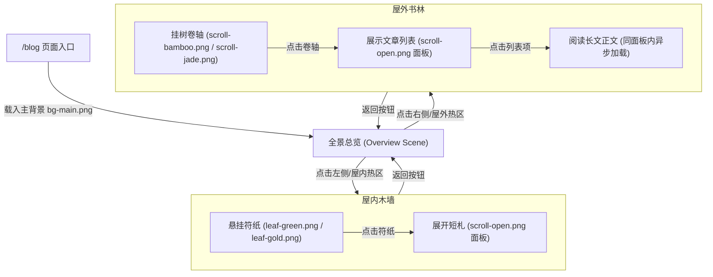

# 博客页（叶间书林与松果屋）重构设计方案

本方案旨在根据道友提供的简化图片资产，将原有的图书馆场景（`Blog.jsx`）完全重构为全新的**“松果屋室内（碎叶符纸区）”**与**“屋外叶间书林（灵木卷轴区）”**二元时空。

---

## 一、 核心视觉与交互设计 (Core Design & Flow)

我们要将整个博客页的交互流程整合为**一个大场景、两个深度近景、两种交互法宝、一张通用卷轴面板**：



### 1. 全景总览状态 (`sceneMode = 'overview'`)
- **背景贴图**：`bg-main.png`。展现松果屋与森林相交融的完整画卷。
- **互动热区**：
  - **左侧屋内区域**：鼠标悬停时，产生微弱暖黄烛光晕（CSS/Framer Motion Glow），并浮现气泡提示：`“叩门入室：松果屋的碎叶符纸区”`。点击进入**屋内近景模式**。
  - **右侧屋外区域**：鼠标悬停时，林间聚起萤火粒子（Canvas/CSS），浮现气泡提示：`“步入林间：叶间书林的灵木卷轴区”`。点击进入**屋外近景模式**。

### 2. 松果屋内：碎叶符纸状态 (`sceneMode = 'indoor'`)
- **背景贴图**：`bg-wall.png`（古木墙壁与暖光窗台）。
- **交互物件**：
  - 在木墙上布置若干片散落的**“碎叶符纸”**：
    - `leaf-green.png`（普通短札）：对应随笔感悟、生活小碎屑、建站记录日记。
    - `leaf-gold.png`（精选短札）：对应置顶想法、最近更新或屋主的座右铭。
  - **动态效果**：悬停时叶片微微发光、在风中摇曳摆动（使用 Framer Motion `rotate` 与 `scale` 动效），点击后直接以**展开的卷轴面板**（`scroll-open.png`）作为背景弹出，加载并阅读这篇短札内容。
  - **返回路径**：提供 `“返回屋外”` / `“返回全景”` 的古典木牌按钮。

### 3. 屋外书林：灵木卷轴状态 (`sceneMode = 'outdoor'`)
- **背景贴图**：`bg-fores.png`（巨树枝桠与深绿夜林）。
- **交互物件**：
  - 在发光的树枝上悬挂若干个**“竹简/玉简”**：
    - `scroll-bamboo.png`（竹简长文）：代表技术总结、建站指南、前端实验项目等硬核造物。
    - `scroll-jade.png`（玉简专题）：代表 Obsidian 知识库整理、系统性编译原理、代号《织墨》等设定文档。
  - **动态效果**：鼠标移近时卷轴上下浮动、发生轻微物理晃动。点击卷轴，会在屏幕中央横向拉开**卷轴面板**（`scroll-open.png`）。
  - **面板阅读机制**：
    - 面板首先展示该卷轴分类下的文章列表（包含标题、日期与分类小标签）。
    - 点击某一篇文章标题后，面板内页无缝加载该 Markdown 文件并使用 `ReactMarkdown` 渲染正文，支持纵向旧纸质感滚动条，保持浸入感，免去频繁跳页。

---

## 二、 拟修改与新增文件 (Proposed Changes)

### 1. [MODIFY] [blogAssets.js](file:///d:/Yhx06/Documents/全栈学习模板/个人博客网站/personal-blog/src/constants/blogAssets.js)
- 废弃原先碎碎的图书馆外景、内景贴图。
- 引入全新的 8 张博客核心图片资产：
  ```javascript
  import bgMain from '../assets/images/blog/bg-main.png';
  import bgWall from '../assets/images/blog/bg-wall.png';
  import bgFores from '../assets/images/blog/bg-fores.png';
  import leafGreen from '../assets/images/blog/leaf-green.png';
  import leafGold from '../assets/images/blog/leaf-gold.png';
  import scrollBamboo from '../assets/images/blog/scroll-bamboo.png';
  import scrollJade from '../assets/images/blog/scroll-jade.png';
  import scrollOpen from '../assets/images/blog/scroll-open.png';
  ```

### 2. [MODIFY] [Blog.jsx](file:///d:/Yhx06/Documents/全栈学习模板/个人博客网站/personal-blog/src/pages/Blog.jsx)
- **彻底重构渲染与布局逻辑**：
  - 移去原先 `exterior` / `interior` 下的 5 大区域与 3 只青蛙导游（青蛙已于联系页池塘团聚，此处专注于藏书阅读）。
  - 实现 `sceneMode` 的三态机控制：`overview` (全景) ➔ `indoor` (屋内墙壁) / `outdoor` (屋外树林)。
  - **位置配给配置**：在页面中为符纸和卷轴预配好相对于背景的绝对定位比例（`left`/`top`），确保在不同分辨率下法宝能妥善钉在木墙上和挂在树枝上。
  - **内建卷轴弹出阅读器 (ParchmentModal)**：
    - 使用 `scroll-open.png` 作为 Modal 的羊皮纸底图。
    - 采用 Framer Motion 实现类似 `BookFlipUI` 的古卷横向展开拉伸动效。
    - 整合本地 `/notes-index.json` 数据加载。点击不同法宝时，自动根据分类或标签过滤对应文章列表。
    - 整合 `ReactMarkdown` 与 `remarkGfm`，支持在 Modal 内页直接渲染 Markdown 正文。
- **降级与删除**：
  - 移除已经冗余的 `BookFlipUI` 引用（因为我们有了更符合设定且可容纳任意内容的 `scroll-open.png` 卷轴弹出面板）。

---

## 三、 数据过滤与映射规则

利用 `/notes-index.json` 中的数据结构，我们定义如下映射：

| 交互法宝 (UI Object) | 对应分类/标签过滤条件 (Notes Filter) | 对应数据集合描述 |
| :--- | :--- | :--- |
| **leaf-gold** (置顶/精选短札) | `collection === 'blog-design'` | 置顶展现博客屋的“建站与魔法设计思路” |
| **leaf-green** (随笔短札) | `collection === 'travel' && tags.includes('diary')` (或取最近5条随笔) | 记录旅途见闻、情感碎片与生活琐碎 |
| **scroll-bamboo** (竹简长文) | `collection === 'project' \|\| collection === 'linux-notes'` | 技术记录、建站流程与 Linux 学习档案 |
| **scroll-jade** (玉简专题) | `collection === 'compiler-theory' \|\| collection === 'weaveink'` | 编译原理法门、代号《织墨》世界观设定 |

---

## 四、 验证计划 (Verification Plan)

### 1. 编译构建测试
- 运行 `npm run build`，检验是否含有任何语法、组件未定义、或无效的资源 import 报错，确保构建成功。

### 2. 界面与交互测试
- 检查全景图下的两个热区过渡是否顺畅，各分辨率下木墙符纸、林间卷轴是否对齐。
- 测试点击符纸或卷轴时，`scroll-open.png` 卷轴展开的平滑过渡动画，以及文章列表与 Markdown 渲染字体的易读性。
