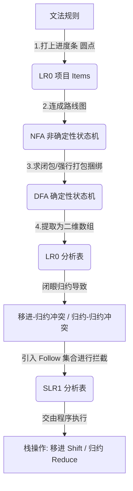

# 编译原理：自底向上语法分析 (核心梳理)

## 一、 核心推导链路 (流水线)

通过以下步骤，机器将抽象的语法规则转化为可执行的查表程序：

## 二、 关键概念对比与解析

### 1. 状态框内部：核心项 vs 闭包项

| 概念 | 来源 | 特征 | 作用 (大白话) |
| :--- | :--- | :--- | :--- |
| **核心项 (Kernel)** | 历史推导 / 始祖状态 | 进度条(圆点)不在开头 | 已经做过的事（老大哥/种子） |
| **闭包项 (Closure)** | 系统查字典递归展开 | 进度条(圆点)在最开头 | 马上需要做的事（被召唤的小弟） |

*注：为了节省内存，编译器底层只存储核心项，闭包项是临时算出来的。*

### 2. 算法升级：LR(0) vs SLR(1)

| 对比维度 | LR(0) (闭眼干活型) | SLR(1) (谨小慎微型) |
| :--- | :--- | :--- |
| **分析表状态图** | 相同 | 相同 (白嫖 LR0 的 DFA 图) |
| **对待 Shift (移进)** | 看到终结符箭头就移进 | 看到终结符箭头就移进 |
| **对待 Reduce (归约)** | **莽撞**：只要有完整项，整行填满 Reduce | **严谨**：下一个字符必须在 **Follow 集合** 内才允许 Reduce |
| **抗冲突能力** | 极弱，常发生移进-归约冲突 | 较强，用 Follow 集合剔除瞎归约 |

## 三、 动作术语解密

- **Shift (移进)**：吃掉一个真实字符，状态转移并压栈。
- **Reduce (归约)**：凑齐了小零件，合成大模块（非终结符）。把废牌弹栈，回到历史状态。
- **Goto (跳转)**：专属大模块（非终结符）的通道。归约完成后，拿着合成的大模块去查 Goto 表，决定下一步去哪。
- **Accept (接受)**：在起点状态拿到了终极目标，代码解析成功。